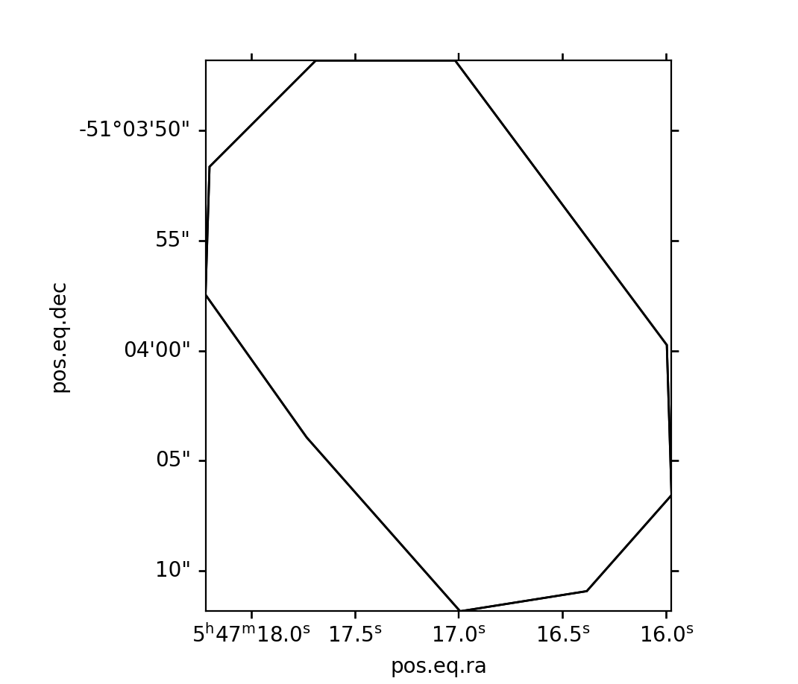

.. _astroquery.alma:

********************************
ALMA Queries (`astroquery.alma`)
********************************

Getting started
===============

`astroquery.alma` provides the astroquery interface to the ALMA archive.  It
supports object and region based querying and data staging and retrieval.

You can get interactive help to find out what keywords to query for:

.. code-block:: python

    >>> from astroquery.alma import Alma
    >>> Alma.help()  # doctest: +IGNORE_OUTPUT
    <BLANKLINE>
    Most common ALMA query keywords are listed below. These keywords are part of the ALMA ObsCore model, an IVOA standard for metadata representation (3rd column). They were also present in original ALMA Web form and, for backwards compatibility can be accessed with their old names (2nd column).
    More elaborate queries on the ObsCore model are possible with `query_sia` or `query_tap` methods
      Description                       Original ALMA keyword               ObsCore keyword
    -------------------------------------------------------------------------------------------------------
    <BLANKLINE>
    Position
      Source name (astropy Resolver)    source_name_resolver                SkyCoord.from_name
      Source name (ALMA)                source_name_alma                    target_name
      RA Dec (Sexagesimal)              ra_dec                              s_ra, s_dec
      Galactic (Degrees)                galactic                            gal_longitude, gal_latitude
      Angular resolution (arcsec)       spatial_resolution                  spatial_resolution
      Largest angular scale (arcsec)    spatial_scale_max                   spatial_scale_max
      Field of view (arcsec)            fov                                 s_fov
    <BLANKLINE>
    Energy
      Frequency (GHz)                   frequency                           frequency
      Bandwidth (Hz)                    bandwidth                           bandwidth
      Spectral resolution (KHz)         spectral_resolution                 em_resolution
      Band                              band_list                           band_list
    <BLANKLINE>
    Time
      Observation date                  start_date                          t_min
      Integration time (s)              integration_time                    t_exptime
    <BLANKLINE>
    Polarization
      Polarisation type (Single, Dual, Full) polarisation_type                   pol_states
    <BLANKLINE>
    Observation
      Line sensitivity (10 km/s) (mJy/beam) line_sensitivity                    sensitivity_10kms
      Continuum sensitivity (mJy/beam)  continuum_sensitivity               cont_sensitivity_bandwidth
      Water vapour (mm)                 water_vapour                        pvw
    <BLANKLINE>
    Project
      Project code                      project_code                        proposal_id
      Project title                     project_title                       obs_title
      PI name                           pi_name                             obs_creator_name
      Proposal authors                  proposal_authors                    proposal_authors
      Project abstract                  project_abstract                    proposal_abstract
      Publication count                 publication_count                   NA
      Science keyword                   science_keyword                     science_keyword
    <BLANKLINE>
    Publication
      Bibcode                           bibcode                             bib_reference
      Title                             pub_title                           pub_title
      First author                      first_author                        first_author
      Authors                           authors                             authors
      Abstract                          pub_abstract                        pub_abstract
      Year                              publication_year                    pub_year
    <BLANKLINE>
    Options
      Public data only                  public_data                         data_rights
      Science observations only         science_observations                calib_level
    <BLANKLINE>
    Examples of queries:
    Alma.query('proposal_id':'2011.0.00131.S'}
    Alma.query({'band_list': ['5', '7']}
    Alma.query({'source_name_alma': 'GRB021004'})
    Alma.query(payload=dict(project_code='2017.1.01355.L', source_name_alma='G008.67'))

Authentication
==============

Users can log in to acquire proprietary data products.  Login is performed
via the ALMA OIDC (OpenID Connect) service, Keycloak.

.. doctest-skip::

    >>> from astroquery.alma import Alma
    >>> alma = Alma()
    >>> # First example: TEST is not a valid username, it will fail
    >>> alma.login("TEST")
    TEST, enter your ALMA password:
    <BLANKLINE>
    Authenticating TEST on asa.alma.cl ...
    Authentication failed!
    >>> # Second example: pretend ICONDOR is a valid username
    >>> alma.login("ICONDOR", store_password=True)
    ICONDOR, enter your ALMA password:
    <BLANKLINE>
    Authenticating ICONDOR on asa.alma.cl...
    Successfully logged in to asa.alma.cl
    >>> # After the first login, your password has been stored
    >>> alma.login("ICONDOR")
    Authenticating ICONDOR on asa.alma.cl...
    Successfully logged in to asa.alma.cl

Your password will be stored by the `keyring
<https://pypi.org/project/keyring>`_ module.
You can choose not to store your password by passing the argument
``store_password=False`` to ``Alma.login``.  You can delete your password later
with the command ``keyring.delete_password('astroquery:asa.alma.cl',
'username')``.

Querying Targets and Regions
============================

You can query by object name or by circular region:

.. doctest-remote-data::

    >>> from astroquery.alma import Alma
    >>> alma = Alma()
    >>> alma.archive_url = 'https://almascience.eso.org'  # optional to make doctest work
    >>> m83_data = alma.query_object('M83')
    >>> m83_data.colnames  # doctest: +IGNORE_OUTPUT
    ['obs_publisher_did', 'obs_collection', 'facility_name', 'instrument_name',
    'obs_id', 'dataproduct_type', 'calib_level', 'target_name', 's_ra',
    's_dec', 's_fov', 's_region', 's_resolution', 't_min', 't_max',
    't_exptime', 't_resolution', 'em_min', 'em_max', 'em_res_power',
    'pol_states', 'o_ucd', 'access_url', 'access_format', 'proposal_id',
    'data_rights', 'gal_longitude', 'gal_latitude', 'band_list',
    'em_resolution', 'bandwidth', 'antenna_arrays', 'is_mosaic',
    'obs_release_date', 'spatial_resolution', 'frequency_support', 'frequency',
    'velocity_resolution', 'obs_creator_name', 'pub_title', 'first_author',
    'authors', 'pub_abstract', 'publication_year', 'proposal_abstract',
    'schedblock_name', 'proposal_authors', 'sensitivity_10kms',
    'cont_sensitivity_bandwidth', 'pwv', 'group_ous_uid', 'member_ous_uid',
    'asdm_uid', 'obs_title', 'type', 'scan_intent', 'science_observation',
    'spatial_scale_max', 'qa2_passed', 'bib_reference', 'science_keyword',
    'scientific_category', 'lastModified']


Region queries are just like any other in astroquery:


.. doctest-remote-data::

    >>> from astropy import coordinates
    >>> from astropy import units as u
    >>> galactic_center = coordinates.SkyCoord(0*u.deg, 0*u.deg,
    ...                                        frame='galactic')
    >>> alma = Alma()
    >>> alma.archive_url = 'https://almascience.eso.org'  # optional to make doctest work
    >>> gc_data = alma.query_region(galactic_center, 1*u.deg)
    >>> print(gc_data)  # doctest: +IGNORE_OUTPUT
         obs_publisher_did      obs_collection facility_name ...     scientific_category           lastModified
                                                             ...
    --------------------------- -------------- ------------- ... --------------------------- -----------------------
    ADS/JAO.ALMA#2012.1.00133.S           ALMA           JAO ...      ISM and star formation 2021-09-30T16:34:41.133


Querying by other parameters
============================

As of version 0.3.4, you can also query other fields by keyword. For example,
if you want to find all projects in a region with a particular PI, you could do:

.. Fix and remove skip with https://github.com/astropy/astroquery/issues/2584
.. .. doctest-remote-data::
.. doctest-skip::

    >>> Alma.query_region('W51', radius=25*u.arcmin, pi_name='*Ginsburg*')

or if you wanted all projects by a given PI:

.. Fix and remove skip with https://github.com/astropy/astroquery/issues/2584
.. .. doctest-remote-data::
.. doctest-skip::

    >>> Alma.query(payload=dict(pi_name='Ginsburg, Adam'))

Querying For Proprietary Data
-----------------------------

To query for proprietary (non-public) data, set ``public=False`` or ``public=None``.
If you want to download the products, you need to first authenticate using the ``login`` method.

.. doctest-skip::

    >>> from astroquery.alma import Alma
    >>> alma = Alma()
    >>> # First login to access proprietary data
    >>> alma.login("username")  # Will prompt for password
    >>> # include both public and proprietary data using public=None
    >>> proprietary_data = alma.query(payload=dict(project_code='2017.1.01355.L', public=None))
    >>> # restrict to only proprietary data with public=False
    >>> only_proprietary = alma.query_region('W51', radius=25*u.arcmin, public=False)

Setting ``public=False`` will include only proprietary data, while
``public=None`` will include both public and proprietary data.


The ``query_sia`` method offers another way to query ALMA using the IVOA SIA
subset of keywords returning results in 'ObsCore' format.  For example,
to query for all images that have ``'XX'`` polarization (note that this query is too large
to run, it is just shown as an example):

.. doctest-remote-data::

    >>> Alma.query_sia(pol='XX')  # doctest: +SKIP

Finally, the ``query_tap`` method is the most general way of querying the ALMA
metadata. This method is used to send queries to the service using the
``ObsCore`` columns as constraints. The returned result is also in ``ObsCore``
format.

.. doctest-remote-data::

    >>> Alma.query_tap("select * from ivoa.obscore where target_name like '%M83%'")  # doctest: +IGNORE_OUTPUT
    <Table length=364>
         obs_publisher_did      obs_collection facility_name ...       scientific_category         lastModified
                                                             ...
               str33                 str4           str3     ...              str200                  object
    --------------------------- -------------- ------------- ... ---------------------- -----------------------
    ADS/JAO.ALMA#2016.1.00164.S           ALMA           JAO ...        Active galaxies 2021-09-30T16:34:41.133

One can also query by keyword, spatial resolution, etc:

.. doctest-remote-data::

    >>> Alma.query_tap("select * from ivoa.obscore WHERE spatial_resolution<=0.1 AND science_keyword "
    ...                "in ('Disks around high-mass stars', 'Asymptotic Giant Branch (AGB) stars') "
    ...                "AND science_observation='T'")  # doctest: +IGNORE_OUTPUT

``query_tap`` also supports uploading temporary tables that can be used to join to in queries.
These temporary tables can be defined as ''astropy.table.Table'' instances or references to file names or
file like handles (`~io.StringIO` instances for example) of table definitions in IVOA VOTable format.
Below is a very simple example of using `~astropy.table.Table` temporary table with the ``proj_codes`` name.
Note that the table name must always be prefixed with the ``TAP_UPLOAD`` schema when referenced in queries.

.. doctest-remote-data::

    >>> from astropy.table import Table
    >>> tmp_table = Table([['2013.1.01365.S', '2013.A.00014.S']], names=['prop_id'], dtype=['S'])
    >>> Alma.query_tap('select distinct target_name from ivoa.ObsCore oc join TAP_UPLOAD.proj_codes pc on oc.proposal_id=pc.prop_id order by target_name',
    ...                uploads={'proj_codes': tmp_table})
    <DALResultsTable length=13>
    target_name
       str256
    ------------
           Ceres
      J0042-4030
      J0334-4008
       J1733-130
      J1751+0939
       J1751+096
      J1851+0035
      J1924-2914
         Neptune
    SGP-UR-54092
           Titan
          Uranus
         W43-MM1

Use the ``help_tap`` method to learn about the ALMA ``ObsCore`` keywords and
their types.

.. doctest-remote-data::

    >>> Alma.help_tap()  # doctest: +IGNORE_OUTPUT
    Table to query is "voa.ObsCore".
    For example: "select top 1 * from ivoa.ObsCore"
    The scheme of the table is as follows.
    <BLANKLINE>
      Name                 Type            Unit       Description
    ------------------------------------------------------------------------------------------
      access_estsize       int            kbyte       Estimated size of datasets in kilobytes
      access_format        char(9)                    Content format of the data
      access_url           char(72*)                  URL to download the data
      antenna_arrays       char(660*)                 Blank-separated list of Pad:Antenna pairs, i.e., A109:DV09 J504:DV02 J505:DV05 for antennas DV09, DV02 and DV05 sitting on pads A109, J504, and J505, respectively.
      asdm_uid             char(32*)                  UID of the ASDM containing this Field.
      authors              char(4000*)                Full list of first author and all co-authors
      band_list            char(30*)                  Space delimited list of bands
      bandwidth            double          GHz        Total Bandwidth
      bib_reference        char(4000*)                 Bibliography code
      calib_level          int                        calibration level (2 or 3). 2 if product_type = MOUS, 3 if product_type = GOUS
      cont_sensitivity_bandwidth double          mJy/beam   Estimated noise in the aggregated continuum bandwidth. Note this is an indication only, it does not include the effects of flagging or dynamic range limitations.
      data_rights          char(11)                   Access to data.
      dataproduct_type     char(5*)                   type of product
      em_max               double          m          stop spectral coordinate value
      em_min               double          m          start spectral coordinate value
      em_res_power         double                     typical spectral resolution
      em_resolution        double          m          Estimated frequency resolution from all the spectral windows, using median values of channel widths.
      em_xel		           int	                      Number of elements along the spectral axis
      facility_name        char(3)                    telescope name
      first_author         char(256*)                 The first author as provided by <a href="http://telbib.eso.org">telbib.eso.org</a>.
      frequency            double          GHz        Observed (tuned) reference frequency on the sky.
      frequency_support    char(4000*)     GHz        All frequency ranges used by the field
      gal_latitude         double          deg        Galactic latitude of the observation for RA/Dec. Estimated using PyEphem and RA/Dec.
      gal_longitude        double          deg        Galactic longitude of the observation for RA/Dec. Estimated using PyEphem and RA/Dec.
      group_ous_uid        char(64*)                  Group OUS ID
      instrument_name      char(4)                    instrument name
      is_mosaic            char(1)                    Flag to indicate if this ASDM represents a mosaic or not.
      lastModified         char(*)                    Time stamp of last modification of the metadata
      member_ous_uid       char(64*)                  Member OUS ID
      o_ucd                char(35)                   UCD describing the observable axis (pixel values)
      obs_collection       char(4)                    short name for the data collection
      obs_creator_name     char(256*)                 case-insensitive partial match over the full PI name. Wildcards can be used
      obs_id               char(64*)                  internal dataset identifier
      obs_publisher_did    char(33*)                  publisher dataset identifier
      obs_release_date     char(*)                    timestamp of date the data becomes publicly available
      obs_title            char(256*)                 Case-insensitive search over the project title
      pol_states           char(64*)                  polarization states present in the data
      pol_xel              int                        Number of polarization samples
      proposal_abstract    char(4000*)                Text search on the proposal abstract. Only abstracts will be returned which contain the given text. The search is case-insensitive.
      proposal_authors     char(2000*)                Full name of CoIs .
      proposal_id          char(64*)                  Identifier of proposal to which NO observation belongs.
      pub_abstract         char(4000*)                Case insensitive text search through the abstract of the publication.
      pub_title            char(256*)                 Case insensitive search through the title of the publication.
      publication_year     int                        The year the publication did appear in the printed version of the refereed journal.
      pwv                  float           mm         Estimated precipitable water vapour from the XML_CALWVR_ENTITIES table.
      qa2_passed           char(1)                    Quality Assessment 2 status: does the Member / Group OUS fulfil the PI's requirements?
      s_dec                double          deg        DEC of central coordinates
      s_fov                double          deg        size of the region covered (~diameter of minimum bounding circle)
      s_ra                 double          deg        RA of central coordinates
      s_region             char(*)         deg        region bounded by observation
      s_resolution         double          deg        typical spatial resolution
      s_xel1               int                        Number of elements along the first spatial axis
      s_xel2               int                        Number of elements along the second spatial axis
      scan_intent          char(256*)                 Scan intent list for the observed field.
      schedblock_name      char(128*)                 Name of the Scheduling Block used as a template for executing the ASDM containing this Field.
      science_keyword      char(200*)                 None
      science_observation  char(1)                    Flag to indicate whether this is a science observation.
      scientific_category  char(200*)                 None
      sensitivity_10kms    double          mJy/beam   Estimated noise in an nominal 10km/s bandwidth. Note this is an indication only, it does not include the effects of flagging or Hanning smoothing, and a 10km/s bandwidth may not be achievable with the data as taken.
      spatial_resolution   double          arcsec     Average of the maximum and minimum spatial resolution values of all spectral windows
      spatial_scale_max    double          arcsec     Due to the fact that radio antennas can not be placed infinitely close, measurements do have a smallest separation which translates into a maximal angular distance beyond which features can not be resolved reliably any more. Adding observations with the ALMA Total Power array can add those missing largest scales.
      t_exptime            double          s          exposure time of observation
      t_max                double          d          end time of observation (MJD)
      t_min                double          d          start time of observation (MJD)
      t_resolution         double          s          typical temporal resolution
      t_xel                int                        Number of elements along the time axis
      target_name          char(256*)                 name of intended target
      type                 char(16*)                  Type flags.
      velocity_resolution  double          m/s        Estimated velocity resolution from all the spectral windows, from frequency resolution.


Query Results
=============

Results of queries are returned in tabular format. For convenience,
the `~astroquery.alma.get_enhanced_table` function can be used to have the initial result
in a more useful format, i.e., turn values into quantities, footprint into
shape, etc. (Note: this require the `regions` Python package to be installed.


.. doctest-remote-data::

    >>> from astroquery.alma import Alma, get_enhanced_table
    >>> alma = Alma()
    >>> alma.archive_url = 'https://almascience.eso.org'  # optional to make doctest work
    >>> res = alma.query_tap("select top 1 * from ivoa.ObsCore where obs_publisher_did='ADS/JAO.ALMA#2011.0.00087.S'")
    >>> enhanced_res = get_enhanced_table(res)
    >>> enhanced_res[0]['s_ra']
        <MaskedQuantity 86.82119735 deg>
    >>> enhanced_res[0]['s_region']
        <PolygonSkyRegion(vertices=<SkyCoord (ICRS): (ra, dec) in deg
        [(86.823884, -51.067761), (86.820804, -51.069956),
         (86.818262, -51.069702), (86.81656 , -51.068489),
         (86.816655, -51.066594), (86.820904, -51.063002),
         (86.823701, -51.063002), (86.825834, -51.064343),
         (86.825915, -51.065959)]>)>

To further draw the footprint:

.. doctest-skip::

    >>> from astropy import wcs
    >>> import matplotlib.pyplot as plt
    >>> # Create a WCS; for plotting, all that matters is that it is centered on our target region
    >>> ww = wcs.WCS(naxis=2)
    >>> ww.wcs.crpix = [250.0, 250.0]
    >>> ww.wcs.cdelt = [-7.500000005754e-05, 7.500000005754e-05]
    >>> ww.wcs.ctype = ['RA---SIN', 'DEC--SIN']
    >>> ww.wcs.crval = [enhanced_res[0]['s_ra'].value, enhanced_res[0]['s_dec'].value]
    >>> pix_region = enhanced_res[0]['s_region'].to_pixel(ww)
    >>> artist = pix_region.as_artist()
    >>> axes = plt.subplot(projection=ww)
    >>> axes.set_aspect('equal')
    >>> axes.add_artist(artist)
    >>> axes.axis(pix_region.bounding_box.extent)
    >>> pix_region.plot()
    >>> plt.show()





The above footprint could be transformed into a pixel region and have the mask
extracted or combined with other regions. Refer to the Astropy affiliated
''regions'' package for more details.


Downloading Data
================

You can download ALMA data with astroquery, but be forewarned, many data sets
are >100 GB!


.. doctest-remote-data::

    >>> import numpy as np
    >>> from astroquery.alma import Alma
    >>> alma = Alma()
    >>> alma.archive_url = 'https://almascience.eso.org'  # optional to make doctest work
    >>> m83_data = alma.query_object('M83')
    >>> uids = np.unique(m83_data['member_ous_uid'])
    >>> print(uids)
         member_ous_uid
    -----------------------
        uid://A001/X11f/X30
        uid://A001/X122/Xf3
        ...

The new ```get_data_info``` method can be used to get information about the
data such as the file names, their urls, sizes etc.

.. doctest-remote-data::

    >>> alma = Alma()
    >>> alma.archive_url = 'https://almascience.eso.org'  # optional to make doctest work
    >>> link_list = alma.get_data_info(uids[:3])

By default, ALMA data is delivered as tarball files. However, the content of
some of these files can be listed and accessed individually. To get information
on the individual files:


.. doctest-remote-data::

    >>> alma = Alma()
    >>> alma.archive_url = 'https://almascience.eso.org'  # optional to make doctest work
    >>> link_list = alma.get_data_info(uids[:3], expand_tarfiles=True)

You can then go on to download those files.  The download will be cached so
that repeat queries of the same file will not re-download the data.  The
default cache directory is ``~/.astropy/cache/astroquery/Alma/``, but this can
be changed by changing the ``cache_location`` variable:


.. doctest-skip::

   >>> 1/0
   >>> myAlma = Alma()
   >>> myAlma.cache_location = '/big/external/drive/'
   >>> myAlma.download_files(link_list, cache=True)

You can also do the downloading all in one step:

.. code-block:: python

   >>> myAlma.retrieve_data_from_uid(uids[0])  # doctest: +SKIP

If you have huge files, sometimes the transfer fails, so you will need to
restart the download.  By default, the module will resume downloading where the
failure occurred.  You can check whether the downloads all succeeded before
triggering a new download by using the ``verify_only`` keyword, which will not
download but will return useful information about the state of your downloads:

.. code-block:: python

   >>> myAlma.download_files(link_list, cache=True, verify_only=True)  # doctest: +SKIP


Downloading FITS data
=====================

If you want just the QA2-produced FITS files, you can directly access the FITS
files:

.. doctest-remote-data::

    >>> from astroquery.alma.core import Alma
    >>> from astropy import coordinates
    >>> from astropy import units as u
    >>> s255ir = coordinates.SkyCoord(93.26708333, 17.97888889, frame='fk5',
    ...                               unit=(u.deg, u.deg))
    >>> alma = Alma()
    >>> alma.archive_url = 'https://almascience.eso.org'  # optional to make doctest work
    >>> result = alma.query_region(s255ir, radius=0.034*u.deg)
    >>> uid_url_table = alma.get_data_info(result['member_ous_uid'][0], expand_tarfiles=True)
    >>> # downselect to just the FITSf files
    >>> fits_urls = [url for url in uid_url_table['access_url'] if '.fits' in url]
    >>> filelist = alma.download_files(fits_urls[:5])  # doctest: +SKIP

You might want to look at the READMEs from a bunch of files so you know what
kind of S/N to expect:

.. doctest-remote-data::

    >>> readmes = [url for url in uid_url_table['access_url'] if 'README' in url]
    >>> filelist = Alma.download_files(readmes)  # doctest: +IGNORE_OUTPUT


Notebooks
=========

A set of ALMA-maintained Jupyter Notebooks that showcase further examples of how to programmatically access
the archive can be found `here
<https://almascience.nrao.edu/alma-data/archive/archive-notebooks>`_.


Reference/API
=============

.. automodapi:: astroquery.alma
    :no-inheritance-diagram:

.. automodapi:: astroquery.alma.utils
    :no-inheritance-diagram:
