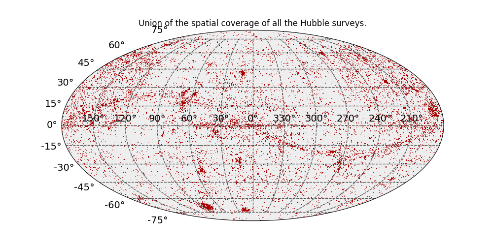
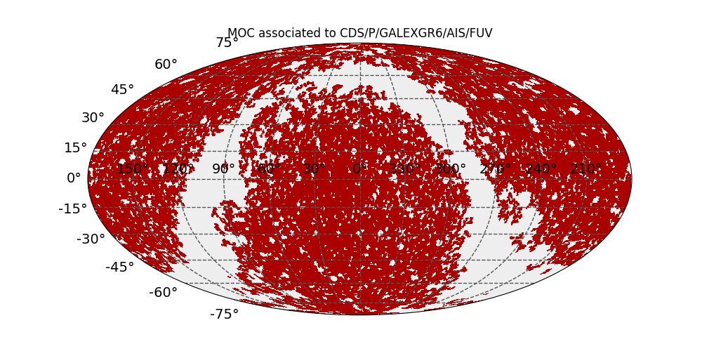

.. doctest-skip-all

.. _astroquery.cds:

**********************************
CDS MOC Service (`astroquery.cds`)
**********************************

Getting started
===============

This module provides a python interface for querying the `CDS MOCServer`_.

MOC is an `IVOA standard`_ enabling description of arbitrary sky regions. Based on the HEALPix sky tessellation, it maps
regions on the sky into hierarchically grouped predefined cells. It corresponds to a set of HEALPix cells at different
orders.

For those wanting to know more about MOCs, please refer to this `IVOA paper
<http://ivoa.net/documents/MOC/20140602/REC-MOC-1.0-20140602.pdf>`_ and the `MOCPy's documentation
<https://github.com/cds-astro/mocpy>`_ developed by the CDS.

CDS has set up a server known as the `MOCServer <http://alasky.unistra.fr/MocServer/query?>`_ storing data-set names
each associated with a MOC spatial coverage and some meta-datas giving a more detailed explanation of the data-set.

The MOCServer aims at returning the data-sets having at least one source lying in a specific sky region defined by the
user. Internally the MOCServer performs the intersection between the given sky region and the MOCs associated with each
data-sets. Because the MOC associated to a data-set describes its sky coverage, if the above intersection is not null
then the MOCServer knows that some sources of this data-set are in the user defined sky region.

To be aware of what the MOCServer returns, please refers to this `link
<http://alasky.unistra.fr/MocServer/query?RA=10.8&DEC=32.2&SR=1.5&intersect=overlaps&get=record&fmt=html>`_.
We have queried the MOCServer with a cone region of center ra, dec = (10.8, 32.2) deg and radius = 1.5 deg. In return,
the MOCServer gives a list of data-sets each tagged with an unique ID along with some other meta-datas too e.g.
``obs_title``, ``obs_description``, ``moc_access_url`` (url for accessing the MOC associated with the data-set. Usually
a FITS file storing a list of HEALPix cells).

It is also possible to ask the MOCServer for retrieving data-sets based on their meta-data values. `Here
<http://alasky.unistra.fr/MocServer/query?RA=10.8&DEC=32.2&SR=1.5&intersect=overlaps&get=record&fmt=html&expr=(dataproduct_type=image)>`_
we have queried the MOCServer for only the image data-sets being in the cone defined above (``dataproduct_type``
meta-data equals to ``"image"``).

This package implements two methods:

* :meth:`~astroquery.cds.CdsClass.query_region` retrieving data-sets (their associated MOCs and meta-datas) having sources in a given region.
* :meth:`~astroquery.cds.CdsClass.find_datasets` retrieving data-sets (their associated MOCs and meta-datas) based on the
  values of their meta-datas.

Requirements
----------------------------------------------------
The following packages are required for the use of this module:

* `astropy-healpix`_
* `mocpy`_
* `regions`_

Examples
========

Performing a CDS MOC query on a cone region
-------------------------------------------

The first thing to do is to import the `regions`_ package and the ``cds`` module.

.. code-block:: python

    >>> from astropy import coordinates
    >>> from regions import CircleSkyRegion
    >>> from astroquery.cds import cds

``cds`` implements the method :meth:`~astroquery.cds.CdsClass.query_region` and this is what we will use.
First, we need to define a cone region. For that purpose we will instantiate a `regions.CircleSkyRegion` object:

.. code-block:: python

    >>> center = coordinates.SkyCoord(10.8, 32.2, unit='deg')
    >>> radius = coordinates.Angle(1.5, unit='deg')

    >>> cone = CircleSkyRegion(center, radius)

And basically call the :meth:`~astroquery.cds.CdsClass.query_region` method with the cone and that's all.

.. code-block:: python

    >>> cds.query_region(region=cone)
    <Table masked=True length=1317>
    hips_service_url_8        hips_status         hips_status_7 ...   hipsgen_date_5                                  hips_master_url                                  moc_sky_fraction
          object                 object               object    ...       object                                           object                                          float64
    ------------------ -------------------------- ------------- ... ----------------- -------------------------------------------------------------------------------- ----------------
                    --                         --            -- ...                --                                                                               --           0.0588
                    --                         --            -- ...                --                                                                               --        2.066e-06
                    --                         --            -- ...                --                                                                               --         0.002134
                    --                         --            -- ...                --                                                                               --         0.003107
                    --                         --            -- ...                --                                                                               --        0.0001764
                    --                         --            -- ...                --                                                                               --         0.008365
                    --                         --            -- ...                --                                                                               --        0.0009891
                    --                         --            -- ...                --                                                                               --        0.0004252
                    --                         --            -- ...                --                                                                               --        0.0006163
                    --                         --            -- ...                --                                                                               --        0.0008544
                    --                         --            -- ...                --                                                                               --        0.0009243
                    --                         --            -- ...                --                                                                               --          0.00016
                    --                         --            -- ...                --                                                                               --         0.000729
                    --                         --            -- ...                --                                                                               --        2.998e-05
                    --                         --            -- ...                --                                                                               --          0.01136
                    --                         --            -- ...                --                                                                               --        0.0006112
                    --                         --            -- ...                --                                                                               --        6.632e-05
                    --                         --            -- ...                --                                                                               --        0.0001141
                    --                         --            -- ...                --                                                                               --        0.0008666
                    --                         --            -- ...                --                                                                               --         0.001025
                    --                         --            -- ...                --                                                                               --         0.008088
                    --                         --            -- ...                --                                                                               --         0.000282
                    --                         --            -- ...                --                                                                               --         0.002413
                    --                         --            -- ...                --                                                                               --        0.0001468
                    -- public master clonableOnce            -- ...                --                                                                               --           0.3164
                    -- public master clonableOnce            -- ...                --                                                                               --              1.0
                    --                         --            -- ...                --                                                                               --        4.444e-05
                    --                         --            -- ...                --                                                                               --        4.641e-05
                    --                         --            -- ...                --                                                                               --          0.00044
                   ...                        ...           ... ...               ...                                                                              ...              ...
                    --   public master unclonable            -- ...                --                                                                               --              1.0
                    --   public master unclonable            -- ...                --    http://cade.irap.omp.eu/documents/Ancillary/4Aladin/DRAO-VillaElisa_21cm_POLQ              1.0
                    --   public master unclonable            -- ...                --    http://cade.irap.omp.eu/documents/Ancillary/4Aladin/DRAO-VillaElisa_21cm_POLU              1.0
                    --   public master unclonable            -- ...                --                   http://cade.irap.omp.eu/documents/Ancillary/4Aladin/DRAO_22MHz           0.7283
                    --   public master unclonable            -- ... 2017-02-09T13:48Z                                                                               --           0.5723
                    --   public master unclonable            -- ...                --                                                                               --           0.5468
                    --   public master unclonable            -- ...                --                                                                               --              1.0
                    --   public master unclonable            -- ...                --                http://cade.irap.omp.eu/documents/Ancillary/4Aladin/GAURIBIDANUR/           0.8623
                    --   public master unclonable            -- ...                --                                                                               --              1.0
                    --   public master unclonable            -- ...                --                                                                               --              1.0
                    --   public master unclonable            -- ...                --                                                                               --              1.0
                    --   public master unclonable            -- ...                --                                                                               --              1.0
                    --   public master unclonable            -- ...                --                                                                               --              1.0
                    --   public master unclonable            -- ...                --                                                                               --           0.9635
                    --   public master unclonable            -- ...                --                                                                               --           0.4284
                    --   public master unclonable            -- ...                --                                                                               --              1.0
                    --   public master unclonable            -- ...                --                                                                               --              1.0
                    --   public master unclonable            -- ...                --                                                                               --              1.0
                    --   public master unclonable            -- ...                --                                                                               --              1.0
                    --   public master unclonable            -- ...                -- http://cade.irap.omp.eu/documents/Ancillary/4Aladin/STOCKERT+VILLAELISA_1420MHz/              1.0
                    --   public master unclonable            -- ...                --                                                                               --            0.181
                    --   public master unclonable            -- ...                --                                                                               --           0.1918
                    --   public master unclonable            -- ... 2017-05-15T12:44Z                                                                               --              1.0
                    --                         --            -- ...                --                                                                               --           0.1553
                    --                         --            -- ...                --                                                                               --           0.2373
                    -- public master clonableOnce            -- ...                --                                                                               --          0.08287
                    -- public master clonableOnce            -- ...                --                                                                               --          0.02227
                    -- public master clonableOnce            -- ...                --                                                                               --          0.02227
                    -- public master clonableOnce            -- ...                --                                                                               --          0.02227

You can also query the MOCServer on a `regions.PolygonSkyRegion` or even an `mocpy.MOC` following the same pattern i.e. just
by replacing ``cone`` with a polygon or a MOC object.

By default, :meth:`~astroquery.cds.CdsClass.query_region` returns an `astropy.table.Table` object storing the data-sets
as rows and their meta-datas as columns. Data-sets might have no information for a specific meta-data. If so, the value
associated with this meta-data for this data-set is set to "-". The above astropy table looks like :

Retrieve only a subset of meta-datas
------------------------------------

This table refers to a lot of meta-datas whereas we could only use a few of them. In fact, it is possible to ask the
MOCServer to give us a reduced set of meta-datas for the resulting data-sets. The table returned by the MOCServer
will be lighter and thus faster to retrieve.

The parameter ``fields`` of :meth:`~astroquery.cds.CdsClass.query_region` allows us to provide the list of meta-datas we
want to get. Let's say we would like only the ``ID``, the ``moc_sky_fraction`` and the ``moc_access_url`` of the
resulting data-sets:

.. code-block:: python

    >>> cds.query_region(region=cone, fields=['ID', 'moc_sky_fraction', 'moc_access_url'])
    <Table masked=True length=1317>
                                       moc_access_url                                                     ID                  moc_sky_fraction
                                           object                                                       str48                     float64
    ------------------------------------------------------------------------------------ ------------------------------------ ----------------
    http://alasky.unistra.fr/footprints/tables/vizier/B_assocdata_obscore/MOC?nside=2048              CDS/B/assocdata/obscore           0.0588
          http://alasky.unistra.fr/footprints/tables/vizier/B_cb_lmxbdata/MOC?nside=2048                    CDS/B/cb/lmxbdata        2.066e-06
            http://alasky.unistra.fr/footprints/tables/vizier/B_cfht_cfht/MOC?nside=2048                      CDS/B/cfht/cfht         0.002134
         http://alasky.unistra.fr/footprints/tables/vizier/B_cfht_obscore/MOC?nside=2048                   CDS/B/cfht/obscore         0.003107
      http://alasky.unistra.fr/footprints/tables/vizier/B_chandra_chandra/MOC?nside=2048                CDS/B/chandra/chandra        0.0001764
          http://alasky.unistra.fr/footprints/tables/vizier/B_eso_eso_arc/MOC?nside=2048                    CDS/B/eso/eso_arc         0.008365
        http://alasky.unistra.fr/footprints/tables/vizier/B_gcvs_gcvs_cat/MOC?nside=2048                  CDS/B/gcvs/gcvs_cat        0.0009891
         http://alasky.unistra.fr/footprints/tables/vizier/B_gcvs_nsv_cat/MOC?nside=2048                   CDS/B/gcvs/nsv_cat        0.0004252
       http://alasky.unistra.fr/footprints/tables/vizier/B_gemini_obscore/MOC?nside=2048                 CDS/B/gemini/obscore        0.0006163
           http://alasky.unistra.fr/footprints/tables/vizier/B_hst_hstlog/MOC?nside=2048                     CDS/B/hst/hstlog        0.0008544
          http://alasky.unistra.fr/footprints/tables/vizier/B_hst_obscore/MOC?nside=2048                    CDS/B/hst/obscore        0.0009243
            http://alasky.unistra.fr/footprints/tables/vizier/B_hst_wfpc2/MOC?nside=2048                      CDS/B/hst/wfpc2          0.00016
         http://alasky.unistra.fr/footprints/tables/vizier/B_jcmt_obscore/MOC?nside=2048                   CDS/B/jcmt/obscore         0.000729
        http://alasky.unistra.fr/footprints/tables/vizier/B_merlin_merlin/MOC?nside=2048                  CDS/B/merlin/merlin        2.998e-05
           http://alasky.unistra.fr/footprints/tables/vizier/B_mk_mktypes/MOC?nside=2048                     CDS/B/mk/mktypes          0.01136
        http://alasky.unistra.fr/footprints/tables/vizier/B_pastel_pastel/MOC?nside=2048                  CDS/B/pastel/pastel        0.0006112
             http://alasky.unistra.fr/footprints/tables/vizier/B_sb9_main/MOC?nside=2048                       CDS/B/sb9/main        6.632e-05
             http://alasky.unistra.fr/footprints/tables/vizier/B_sn_sncat/MOC?nside=2048                       CDS/B/sn/sncat        0.0001141
       http://alasky.unistra.fr/footprints/tables/vizier/B_subaru_suprimc/MOC?nside=2048                 CDS/B/subaru/suprimc        0.0008666
       http://alasky.unistra.fr/footprints/tables/vizier/B_swift_swiftlog/MOC?nside=2048                 CDS/B/swift/swiftlog         0.001025
              http://alasky.unistra.fr/footprints/tables/vizier/B_vsx_vsx/MOC?nside=2048                        CDS/B/vsx/vsx         0.008088
           http://alasky.unistra.fr/footprints/tables/vizier/B_wd_catalog/MOC?nside=2048                     CDS/B/wd/catalog         0.000282
              http://alasky.unistra.fr/footprints/tables/vizier/B_wds_wds/MOC?nside=2048                        CDS/B/wds/wds         0.002413
           http://alasky.unistra.fr/footprints/tables/vizier/B_xmm_xmmlog/MOC?nside=2048                     CDS/B/xmm/xmmlog        0.0001468
                                                                                      --                 CDS/C/GALFAHI/Narrow           0.3164
                                                                                      --                       CDS/C/HI4PI/HI              1.0
             http://alasky.unistra.fr/footprints/tables/vizier/I_100A_w10/MOC?nside=2048                       CDS/I/100A/w10        4.444e-05
             http://alasky.unistra.fr/footprints/tables/vizier/I_100A_w25/MOC?nside=2048                       CDS/I/100A/w25        4.641e-05
             http://alasky.unistra.fr/footprints/tables/vizier/I_100A_w50/MOC?nside=2048                       CDS/I/100A/w50          0.00044
                                                                                     ...                                  ...              ...
                                                                                      --                 ov-gso/P/DIRBE/ZSMA9              1.0
                                                                                      --   ov-gso/P/DRAO-VillaElisa/21cm/POLQ              1.0
                                                                                      --   ov-gso/P/DRAO-VillaElisa/21cm/POLU              1.0
                                                                                      --                  ov-gso/P/DRAO/22MHz           0.7283
                                                                                      --            ov-gso/P/DWINGELOO/820MHz           0.5723
                                                                                      --                       ov-gso/P/EBHIS           0.5468
                                                                                      --                  ov-gso/P/GASS+EBHIS              1.0
                                                                                      --                ov-gso/P/GAURIBIDANUR           0.8623
                                                                                      --                      ov-gso/P/IRIS/1              1.0
                                                                                      --                      ov-gso/P/IRIS/2              1.0
                                                                                      --                      ov-gso/P/IRIS/3              1.0
                                                                                      --                      ov-gso/P/IRIS/4              1.0
                                                                                      --                         ov-gso/P/LAB              1.0
                                                                                      --                    ov-gso/P/MAIPU-MU           0.9635
                                                                                      --                      ov-gso/P/MITEoR           0.4284
                                                                                      --                        ov-gso/P/RASS              1.0
                                                                                      --                    ov-gso/P/RASS/EXP              1.0
                                                                                      --               ov-gso/P/RASS/HardBand              1.0
                                                                                      --               ov-gso/P/RASS/SoftBand              1.0
                                                                                      -- ov-gso/P/STOCKERT+VILLAELISA/1420MHz              1.0
                                                                                      --                   ov-gso/P/VTSS/CONT            0.181
                                                                                      --                     ov-gso/P/VTSS/Ha           0.1918
                                                                                      --                        ov-gso/P/WHAM              1.0
                                                                                      --                   svo.cab/cat/catlib           0.1553
                                                                                      --                    svo.cab/cat/miles           0.2373
                                                                                      --                xcatdb/P/XMM/PN/color          0.08287
                                                                                      --                  xcatdb/P/XMM/PN/eb2          0.02227
                                                                                      --                  xcatdb/P/XMM/PN/eb3          0.02227
                                                                                      --                  xcatdb/P/XMM/PN/eb4          0.02227

This astropy table now have only 3 columns and can be manipulated much faster.

Retrieving data-sets based on their meta-data values
----------------------------------------------------

As expressed in the last paragraph of the Getting Started section, we can ask the MOCServer to do some filtering tasks for us
at the server side. The ``meta_data`` parameter of :meth:`~astroquery.cds.CdsClass.query_region` allows the user to
write an algebraic expression on the meta-datas. Let's query the MOCServer for retrieving what we have done using the
web interface in the Getting Started section i.e. retrieving only the image data-sets that lie in the previously defined cone.

.. code-block:: python

    >>> cds.query_region(region=cone,
    ...                  fields=['ID', 'dataproduct_type', 'moc_sky_fraction', 'moc_access_url'],
    ...                  meta_data="dataproduct_type=image")
    <Table masked=True length=279>
                                 moc_access_url                                                 ID                   dataproduct_type moc_sky_fraction
                                     object                                                   str48                        str5           float64
    ------------------------------------------------------------------------ --------------------------------------- ---------------- ----------------
                                 http://alasky.u-strasbg.fr/2MASS/H/Moc.fits                           CDS/P/2MASS/H            image              1.0
                                 http://alasky.u-strasbg.fr/2MASS/J/Moc.fits                           CDS/P/2MASS/J            image              1.0
                                 http://alasky.u-strasbg.fr/2MASS/K/Moc.fits                           CDS/P/2MASS/K            image              1.0
                             http://alasky.u-strasbg.fr/2MASS/Color/Moc.fits                       CDS/P/2MASS/color            image              1.0
                    http://alasky.u-strasbg.fr/AKARI-FIS/ColorLSN60/Moc.fits                   CDS/P/AKARI/FIS/Color            image              1.0
                          http://alasky.u-strasbg.fr/AKARI-FIS/N160/Moc.fits                    CDS/P/AKARI/FIS/N160            image           0.9988
                           http://alasky.u-strasbg.fr/AKARI-FIS/N60/Moc.fits                     CDS/P/AKARI/FIS/N60            image           0.9976
                         http://alasky.u-strasbg.fr/AKARI-FIS/WideL/Moc.fits                   CDS/P/AKARI/FIS/WideL            image           0.9989
                         http://alasky.u-strasbg.fr/AKARI-FIS/WideS/Moc.fits                   CDS/P/AKARI/FIS/WideS            image           0.9976
                                                                          --                     CDS/P/Ariel/Voyager            image              1.0
                                      http://alasky.u-strasbg.fr/CO/Moc.fits                                CDS/P/CO            image              1.0
                                                                          -- CDS/P/Callisto/Voyager-Galileo-simp-1km            image              1.0
                                                                          --        CDS/P/Charon/NewHorizon-PIA19866            image              1.0
                                                                          --            CDS/P/DM/flux-Bp/I/345/gaia2            image              1.0
                                                                          --             CDS/P/DM/flux-G/I/345/gaia2            image              1.0
                                                                          --            CDS/P/DM/flux-Rp/I/345/gaia2            image              1.0
                                                                          -- CDS/P/DM/flux-color-Rp-G-Bp/I/345/gaia2            image              1.0
                                                                          --                          CDS/P/DSS2/NIR            image           0.9943
                      http://alasky.u-strasbg.fr/DSS/DSS2-blue-XJ-S/Moc.fits                         CDS/P/DSS2/blue            image           0.9956
                            http://alasky.u-strasbg.fr/DSS/DSSColor/Moc.fits                        CDS/P/DSS2/color            image              1.0
                          http://alasky.u-strasbg.fr/DSS/DSS2Merged/Moc.fits                          CDS/P/DSS2/red            image              1.0
                                                                          --            CDS/P/Dione/Cassini-PIA12577            image              1.0
       http://alasky.u-strasbg.fr/EGRET/EGRET-dif/EGRET_dif_100-150/Moc.fits                 CDS/P/EGRET/Dif/100-150            image              1.0
     http://alasky.u-strasbg.fr/EGRET/EGRET-dif/EGRET_dif_1000-2000/Moc.fits               CDS/P/EGRET/Dif/1000-2000            image              1.0
       http://alasky.u-strasbg.fr/EGRET/EGRET-dif/EGRET_dif_150-300/Moc.fits                 CDS/P/EGRET/Dif/150-300            image              1.0
     http://alasky.u-strasbg.fr/EGRET/EGRET-dif/EGRET_dif_2000-4000/Moc.fits               CDS/P/EGRET/Dif/2000-4000            image              1.0
         http://alasky.u-strasbg.fr/EGRET/EGRET-dif/EGRET_dif_30-50/Moc.fits                   CDS/P/EGRET/Dif/30-50            image              1.0
       http://alasky.u-strasbg.fr/EGRET/EGRET-dif/EGRET_dif_300-500/Moc.fits                 CDS/P/EGRET/Dif/300-500            image              1.0
    http://alasky.u-strasbg.fr/EGRET/EGRET-dif/EGRET_dif_4000-10000/Moc.fits              CDS/P/EGRET/Dif/4000-10000            image              1.0
                                                                         ...                                     ...              ...              ...
                                                                          --                    ov-gso/P/DIRBE/ZSMA7            image              1.0
                                                                          --                    ov-gso/P/DIRBE/ZSMA8            image              1.0
                                                                          --                    ov-gso/P/DIRBE/ZSMA9            image              1.0
                                                                          --      ov-gso/P/DRAO-VillaElisa/21cm/POLQ            image              1.0
                                                                          --      ov-gso/P/DRAO-VillaElisa/21cm/POLU            image              1.0
                                                                          --                     ov-gso/P/DRAO/22MHz            image           0.7283
                                                                          --               ov-gso/P/DWINGELOO/820MHz            image           0.5723
                                                                          --                          ov-gso/P/EBHIS            image           0.5468
                                                                          --                     ov-gso/P/GASS+EBHIS            image              1.0
                                                                          --                   ov-gso/P/GAURIBIDANUR            image           0.8623
                                                                          --                         ov-gso/P/IRIS/1            image              1.0
                                                                          --                         ov-gso/P/IRIS/2            image              1.0
                                                                          --                         ov-gso/P/IRIS/3            image              1.0
                                                                          --                         ov-gso/P/IRIS/4            image              1.0
                                                                          --                            ov-gso/P/LAB            image              1.0
                                                                          --                       ov-gso/P/MAIPU-MU            image           0.9635
                                                                          --                         ov-gso/P/MITEoR            image           0.4284
                                                                          --                           ov-gso/P/RASS            image              1.0
                                                                          --                       ov-gso/P/RASS/EXP            image              1.0
                                                                          --                  ov-gso/P/RASS/HardBand            image              1.0
                                                                          --                  ov-gso/P/RASS/SoftBand            image              1.0
                                                                          --    ov-gso/P/STOCKERT+VILLAELISA/1420MHz            image              1.0
                                                                          --                      ov-gso/P/VTSS/CONT            image            0.181
                                                                          --                        ov-gso/P/VTSS/Ha            image           0.1918
                                                                          --                           ov-gso/P/WHAM            image              1.0
                                                                          --                   xcatdb/P/XMM/PN/color            image          0.08287
                                                                          --                     xcatdb/P/XMM/PN/eb2            image          0.02227
                                                                          --                     xcatdb/P/XMM/PN/eb3            image          0.02227
                                                                          --                     xcatdb/P/XMM/PN/eb4            image          0.02227

Looking at the ``dataproduct_type`` column, all the data-sets seem to be images. We could have been done that using
numpy operations on `astropy.table.Table` objects but here the MOCServer made it for us.

`This page <http://alasky.unistra.fr/MocServer/example>`_ on the web interface of the MOCServer gives examples of some filtering expressions.

Alternatively, the method :meth:`~astroquery.cds.CdsClass.find_datasets` searches data-sets on the whole sky. If you want
to get the MOCs or meta-datas from some specific data-sets this is the method to use. The next example retrieves all the
``moc_access_url`` of the Hubble surveys:

.. code-block:: python

    >>> cds.find_datasets(meta_data="ID=*HST*",
    ...                   fields=['ID', 'moc_access_url'])
    <Table masked=True length=42>
                       moc_access_url                             ID
                           object                               str21
    --------------------------------------------------- ---------------------
                                                     --           CDS/P/HST/B
                                                     --          CDS/P/HST/CO
         http://alasky.unistra.fr/GOODS/GOODSb/Moc.fits     CDS/P/HST/GOODS/b
    http://alasky.unistra.fr/GOODS/GOODS-color/Moc.fits CDS/P/HST/GOODS/color
         http://alasky.unistra.fr/GOODS/GOODSi/Moc.fits     CDS/P/HST/GOODS/i
         http://alasky.unistra.fr/GOODS/GOODSv/Moc.fits     CDS/P/HST/GOODS/v
         http://alasky.unistra.fr/GOODS/GOODSz/Moc.fits     CDS/P/HST/GOODS/z
                                                     --           CDS/P/HST/H
                                                     --         CDS/P/HST/H2O
                                                     --      CDS/P/HST/Halpha
                                                     --       CDS/P/HST/Hbeta
                                                     --           CDS/P/HST/I
                                                     --           CDS/P/HST/J
                                                     --         CDS/P/HST/NII
                                                     --         CDS/P/HST/OII
                                                     --        CDS/P/HST/OIII
         http://alasky.u-strasbg.fr/PHAT/F110W/Moc.fits  CDS/P/HST/PHAT/F110W
         http://alasky.u-strasbg.fr/PHAT/F160W/Moc.fits  CDS/P/HST/PHAT/F160W
         http://alasky.u-strasbg.fr/PHAT/F275W/Moc.fits  CDS/P/HST/PHAT/F275W
         http://alasky.u-strasbg.fr/PHAT/F336W/Moc.fits  CDS/P/HST/PHAT/F336W
         http://alasky.u-strasbg.fr/PHAT/F475W/Moc.fits  CDS/P/HST/PHAT/F475W
         http://alasky.u-strasbg.fr/PHAT/F814W/Moc.fits  CDS/P/HST/PHAT/F814W
                                                     --      CDS/P/HST/Palpha
                                                     --    CDS/P/HST/Palpha_c
                                                     --           CDS/P/HST/R
                                                     --       CDS/P/HST/SDSSg
                                                     --       CDS/P/HST/SDSSr
                                                     --       CDS/P/HST/SDSSz
                                                     --        CDS/P/HST/SIII
                                                     --           CDS/P/HST/U
                                                     --          CDS/P/HST/UV
                                                     --           CDS/P/HST/V
                                                     --           CDS/P/HST/Y
                                                     --       CDS/P/HST/other
                                                     --      CDS/P/HST/wideUV
                                                     --       CDS/P/HST/wideV
                                                     --  ESAVO/P/HST/ACS-blue
                                                     --       ESAVO/P/HST/FOC
                                                     --    ESAVO/P/HST/NICMOS
                                                     --      ESAVO/P/HST/WFC3
                                                     --      ESAVO/P/HST/WFPC
                                                     --     ESAVO/P/HST/WFPC2

Misc
----

Limiting the number of returned data-sets
^^^^^^^^^^^^^^^^^^^^^^^^^^^^^^^^^^^^^^^^^

Another parameter called ``max_rec`` specifies an upper limit for the number of data-sets to be returned:

.. code-block:: python

    >>> cds.query_region(region=cone, max_rec=3)
    <Table masked=True length=3>
    publisher_id                 obs_description_url                                                     moc_access_url                                    ...    TIMESTAMP    obs_label moc_sky_fraction
        str9                            str52                                                                str84                                         ...     float64        str8       float64
    ------------ ---------------------------------------------------- ------------------------------------------------------------------------------------ ... --------------- --------- ----------------
       ivo://CDS http://cdsarc.u-strasbg.fr/viz-bin/Cat?B%2Fassocdata http://alasky.unistra.fr/footprints/tables/vizier/B_assocdata_obscore/MOC?nside=2048 ... 1531742659000.0   obscore           0.0588
       ivo://CDS        http://cdsarc.u-strasbg.fr/viz-bin/Cat?B%2Fcb       http://alasky.unistra.fr/footprints/tables/vizier/B_cb_lmxbdata/MOC?nside=2048 ... 1531742660000.0  lmxbdata        2.066e-06
       ivo://CDS      http://cdsarc.u-strasbg.fr/viz-bin/Cat?B%2Fcfht         http://alasky.unistra.fr/footprints/tables/vizier/B_cfht_cfht/MOC?nside=2048 ... 1531742660000.0      cfht         0.002134

This astropy table has only 3 rows although we know more data-sets match the query. It's useful if you do not need
to retrieve all the data-sets matching a query but only a few. Again, the result will come faster from the MOCServer because
this operation is done at the server side.

Returning a `~mocpy.MOC` object as a result
^^^^^^^^^^^^^^^^^^^^^^^^^^^^^^^^^^^^^^^^^^^

Some users might want the union of all the MOCs from the data-sets matching the query. You can get a `mocpy.MOC` object
instead of an `astropy.table.Table` by setting the parameter ``return_moc`` to True. An additional parameter ``max_norder``
allows the user to set the resolution/precision of the returned MOC that he wants.

As an example, we would like to obtain the union of the spatial coverage of all the Hubble surveys:

.. code-block:: python

    >>> from mocpy import MOC
    >>> # We want to retrieve all the HST surveys i.e. the HST surveys covering any region of the sky.
    >>> allsky = CircleSkyRegion(coordinates.SkyCoord(0, 0, unit="deg"), coordinates.Angle(180, unit="deg"))
    >>> moc = cds.query_region(region=allsky,
    ... # We want a mocpy object instead of an astropy table
    ...                        return_moc=True,
    ... # The order of the MOC
    ...                         max_norder=7,
    ... # Expression on the ID meta-data
    ...                        meta_data="ID=*HST*")
    >>> moc.plot(title="Union of the spatial coverage of all the Hubble surveys.")

Retrieve the `~mocpy.MOC` of a specific data-set
^^^^^^^^^^^^^^^^^^^^^^^^^^^^^^^^^^^^^^^^^^^^^^^^

Finally, if you want to retrieve the MOC of a specific data-set, please consider using the `~astroquery.cds.CdsClass.find_datasets`
method with the ID of the data-set you want to retrieve the MOC along with the ``return_moc`` parameter set to True.
The last example will show you how to get the MOC (i.e. a `mocpy.MOC` object) of the ``GALEXGR6/AIS/FUV`` survey.

.. code-block:: python

    >>> from mocpy import MOC
    >>> moc_galex=cds.find_datasets(meta_data="ID=CDS/P/GALEXGR6/AIS/FUV", return_moc=True)
    >>> moc_galex.plot("MOC associated to CDS/P/GALEXGR6/AIS/FUV.")

The ``cds`` package can therefore be used in complementarity with `mocpy`_. We can now retrieve `mocpy.MOC` objects
coming from the MOCServer and manipulate them in a python session with `mocpy`_.

Reference/API
=============

.. automodapi:: astroquery.cds
    :no-inheritance-diagram:

.. _CDS MOCServer: http://alasky.unistra.fr/MocServer/query
.. _IVOA standard: http://ivoa.net/documents/MOC/20140602/REC-MOC-1.0-20140602.pdf
.. _astropy-healpix: http://astropy-healpix.readthedocs.io/en/latest/
.. _regions: https://github.com/astropy/regions
.. _mocpy: https://github.com/cds-astro/mocpy
