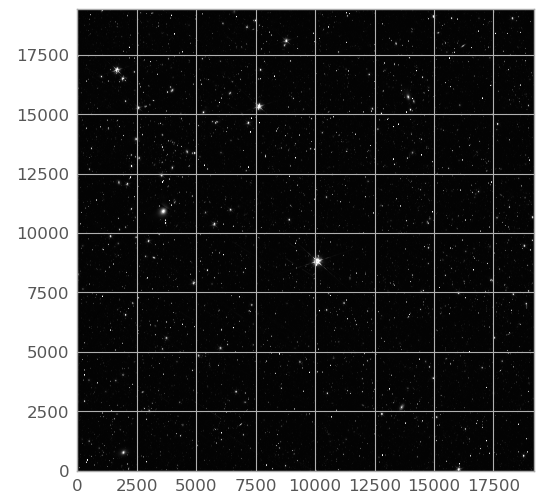
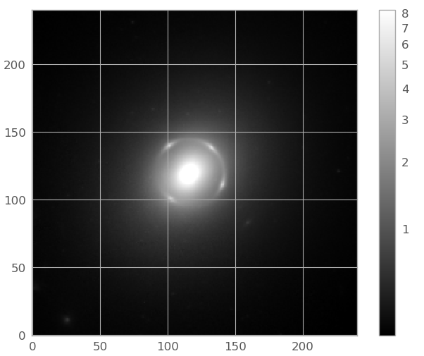

.. _astroquery.esa.euclid:

********************************************
ESA EUCLID Archive (`astroquery.esa.euclid`)
********************************************

Euclid is an ESA mission to map the geometry of the dark Universe. The mission investigates the distance-redshift
relationship and the evolution of cosmic structures. The space telescope creates a great map of the large-scale
structure of the Universe across space and time by observing billions of galaxies out to 10 billion light-years, across
more than a third of the sky. It achieves this by measuring shapes and redshifts of galaxies and clusters of galaxies
out to redshifts ~2, or equivalently to a look-back time of 10 billion years. It therefore explores how the Universe has
expanded and how structure has formed over cosmic history, revealing more about the role of gravity and the nature of
dark energy and dark matter.

This package allows access to the European Space Agency Euclid Archive (https://eas.esac.esa.int/).

The Euclid Survey is done in a 'step-and-stare' mode, where the telescope points to a position on the sky and then
imaging and spectroscopic measurements are performed on an area of ~0.48 deg\ :sup:`2` around this position. The telescope
consists of two cameras, the visible instrument (VIS) and the Near Infrared Spectrometer and Photometer (NISP)
instrument that observe simultaneously using a light splitting dichroic.

For the survey standard operating mode, the telescope undertakes a 4-point dither pattern. At each position VIS and NISP
each take a 560s exposure, consisting of a direct visible image and a red grism exposure. This is followed by further
NISP exposures in the Y, J, and H band filters (87 seconds each). The telescope is then dithered, and the sequence is
repeated starting with a different grism position angle. There are actually two operational grisms oriented 180 degrees
from each other. Each grism will be used twice in this sequence, but with slight angular offsets (+/- 4 degrees),
effectively creating the four different grism angles (Scaramella et al. 2022, A&A 662, A112).

This standard four-dithers operating mode sequence is called a single observation and all the individual exposures
associated with each observation are organized by Observation ID in the archive. The SGS also processes all of its
imaging into merged mosaics, which can contain multiple different observations. All products associated with these
mosaics are organized by Tile ID in the archive.

`astroquery.esa.euclid` provides the astroquery interface to the metadata and datasets provided by the European Space
Agency EUCLID Archive using a TAP+ REST service. TAP+ is an extension of Table Access Protocol (TAP: http://www.ivoa.net/documents/TAP/)
specified by the International Virtual Observatory Alliance (IVOA: http://www.ivoa.net).

The TAP query language is Astronomical Data Query Language
(ADQL: https://www.ivoa.net/documents/ADQL/20231215/index.html ), which is similar to Structured Query Language (SQL),
widely used to query databases.

TAP provides two operation modes: Synchronous and Asynchronous:

* Synchronous: the response to the request will be generated as soon as the request received by the server.
  (Do not use this method for queries that generate a large amount of results.)
* Asynchronous: the server starts a job that will execute the request.
  The first response to the request is the required information (a link) to obtain the job status.
  Once the job is finished, the results can be retrieved.

ESA EUCLID TAP+ server provides two access modes: public and authenticated:

* Public: this is the standard TAP access.
  A user can execute ADQL queries and upload tables to be used in a query 'on-the-fly' (these tables will be removed
  once the query is executed). The results are available to any other user, and they will remain in the server for a
  limited space of time.

* Authenticated: some functionalities are restricted to authenticated users only.
  The results are saved in a private user space and they will remain in the server forever (they can be removed by the
  user).

  * ADQL queries and results are saved in a user private area.

  * Persistence of uploaded tables: a user can upload a table in a private space.
    These tables can be used in queries as well as in cross-matches operations.

If you use public Euclid data in your paper, please take note of our guide_ on how to acknowledge and cite Euclid data.

.. _guide: https://www.cosmos.esa.int/web/euclid/data-credits-acknowledgements

This python module provides an Astroquery API access.

========
Examples
========

It is highly recommended checking the status of Euclid TAP before executing this module. To do this:

.. doctest-remote-data::

  >>> from astroquery.esa.euclid import Euclid
  >>> Euclid.get_status_messages()

This method will retrieve the same warning messages shown in EUCLID Science Archive with information about service degradation.

0. Euclid science archive systems
---------------------------------

The Euclid Science Archive has several environments serving different purposes for the Euclid Consortium members.

1. The OTF ("on-the-fly") environment of the Euclid science archive, first started at the start of science operation exposed data as processed by
the SGS (Science Ground Segment) soon after acquisition to provide an access as soon as possible. In this environment
the data will not be reprocessed and the processing is therefore heterogeneous.

2. The REG (for non-regression testing) environment of the Euclid science archive, where a large area in the sky is processed with the same version for
all data products. The first campaign was run in September 2024, for area of about 500 square degrees (~1000
observations), the next campaign shall be run in March-April 2025.

3. The IDR (Internal Data Release) environment of the Euclid science archive holds the data that will then become public. The first release Q1
opened on the 6th of November 2024, with a first pass on the three Euclid deep fields (EDFN, EDFS and EDFF) as well as
observations on the Lynds Dark Nebula LDN1641.

4. The PDR (Public Data Release) environment of the Euclid science archive holds the public data. Euclid Q1 data was publicly released on March 19,
2025. The main component of the Q1 data contains Level 2 data of a single visit (at the depth of the Euclid Wide
Survey) over the Euclid Deep Fields (EDFs): 20 deg\ :sup:`2` of the EDF North, 10 deg\ :sup:`2` of EDF Fornax, and
23 deg\ :sup:`2` of the EDF South. The deep fields will be visited multiple times during the mission.

The description of these data products can be found on the Data Product Definition Document (DPDD_)

.. _DPDD: http://st-dm.pages.euclid-sgs.uk/data-product-doc/dm10/

.. _TAP: https://www.ivoa.net/documents/TAP/
.. _IVOA: https://www.ivoa.net
.. _REST: https://en.wikipedia.org/wiki/Representational_state_transfer

By default, the object *Euclid*

.. doctest-remote-data::

  >>> from astroquery.esa.euclid import Euclid

makes use of the *PDR* environment. In order to make use of a different one, it is necessary to instantiate the class EuclidClass

.. doctest-remote-data::

  >>> from astroquery.esa.euclid import EuclidClass
  >>> euclid = EuclidClass(environment='IDR')

The parameter *environment* is limited to *IDR*, *OTF*, *PDR* or *REG*.

1. Non authenticated access
---------------------------

1.1. Getting public tables metadata
^^^^^^^^^^^^^^^^^^^^^^^^^^^^^^^^^^^

Table and column metadata are specified by IVOA TAP_ recommendation (to access to the actual data, an ADQL query must be executed).

To load only table names metadata (TAP+ capability):

.. doctest-remote-data::

  >>> from astroquery.esa.euclid import Euclid
  >>> tables = Euclid.load_tables(only_names=True, include_shared_tables=True)
  INFO: Retrieving tables... [astroquery.utils.tap.core]
  INFO: Parsing tables... [astroquery.utils.tap.core]
  INFO: Done. [astroquery.utils.tap.core]
  >>> print("Found", len(tables), "tables") # doctest: +IGNORE_OUTPUT
  Found 34 tables
  >>> print(*(table.name for table in tables), sep="\n")  # doctest: +IGNORE_OUTPUT
  ivoa.obscore
  public.dual
  sedm.raw_detector
  sedm.raw_frame
  sedm.raw_quadrant
  sedm.aux_calibrated
  sedm.aux_mosaic
  sedm.aux_stacked
  sedm.basic_download_data
  sedm.calibrated_detectors
  sedm.calibrated_frame
  sedm.column_values
  sedm.combined_spectra
  ...
  tap_config.coord_sys
  tap_config.properties
  ...

To load all table metadata (TAP compatible):

.. doctest-remote-data::

  >>> from astroquery.esa.euclid import Euclid
  >>> tables = Euclid.load_tables()
  INFO: Retrieving tables... [astroquery.utils.tap.core]
  INFO: Parsing tables... [astroquery.utils.tap.core]
  INFO: Done. [astroquery.utils.tap.core]
  >>> print(tables[0]) # doctest: +IGNORE_OUTPUT
  TAP Table name: ivoa.obscore
  Description: None
  Size (bytes): 0
  Num. columns: 34

To load only a table (TAP+ capability) and inspect its columns:

.. doctest-remote-data::

  >>> from astroquery.esa.euclid import Euclid
  >>> raw_detector_table = Euclid.load_table('sedm.raw_detector')
  >>> print(raw_detector_table) # doctest: +SKIP
  TAP Table name: sedm.raw_detector
  Description: None
  Size (bytes): 0
  Num. columns: 12
  >>> print(*(column.name for column in raw_detector_table.columns), sep="\n")  # doctest: +IGNORE_OUTPUT
  crpix1
  crpix2
  crval1
  crval2
  detector_id
  detector_oid
  l1_raw_frame_oid
  q1_oid
  q2_oid
  q3_oid
  q4_oid
  to_be_published

To get the list of products associated with a given Euclid observation_id or tile_index (for mosaic):

.. Skipping authentication requiring examples
.. doctest-skip::

  >>> from astroquery.esa.euclid import Euclid
  >>> product_list_results = Euclid.get_product_list(tile_index="102018211", product_type="DpdMerBksMosaic")
  >>> print("Found", len(product_list_results), "results")
  Found 12 results
  >>> print(product_list_results)
                                      file_name                                      mosaic_product_oid tile_index instrument_name filter_name category second_type     ra       dec   technique
                                        str255                                             int64          int64         str255        str255    str255     str255    float64   float64   str255
  ---------------------------------------------------------------------------------- ------------------ ---------- --------------- ----------- -------- ----------- ---------- ------- ---------
  EUC_MER_BGSUB-MOSAIC-DES-I_TILE102018211-31E2C9_20241018T143048.358037Z_00.00.fits               1399  102018211           DECAM     DECAM_i  SCIENCE         SKY 57.9990741   -51.5     IMAGE
    EUC_MER_BGSUB-MOSAIC-VIS_TILE102018211-ACBD03_20241018T142710.276838Z_00.00.fits               1395  102018211             VIS         VIS  SCIENCE         SKY 57.9990741   -51.5     IMAGE
  EUC_MER_BGSUB-MOSAIC-DES-G_TILE102018211-D9D163_20241018T143010.768685Z_00.00.fits               1394  102018211           DECAM     DECAM_g  SCIENCE         SKY 57.9990741   -51.5     IMAGE
  EUC_MER_BGSUB-MOSAIC-NIR-H_TILE102018211-42F1AD_20241018T142558.469987Z_00.00.fits               1396  102018211            NISP       NIR_H  SCIENCE         SKY 57.9990741   -51.5     IMAGE
  EUC_MER_BGSUB-MOSAIC-NIR-J_TILE102018211-E044A1_20241018T142600.459089Z_00.00.fits               1393  102018211            NISP       NIR_J  SCIENCE         SKY 57.9990741   -51.5     IMAGE
  EUC_MER_BGSUB-MOSAIC-NIR-Y_TILE102018211-E5CAE1_20241018T142558.172837Z_00.00.fits               1397  102018211            NISP       NIR_Y  SCIENCE         SKY 57.9990741   -51.5     IMAGE
  EUC_MER_BGSUB-MOSAIC-DES-R_TILE102018211-1078B7_20241018T142927.232351Z_00.00.fits               1401  102018211           DECAM     DECAM_r  SCIENCE         SKY 57.9990741   -51.5     IMAGE
  EUC_MER_BGSUB-MOSAIC-DES-Z_TILE102018211-83C32F_20241018T143526.104818Z_00.00.fits               1398  102018211           DECAM     DECAM_z  SCIENCE         SKY 57.9990741   -51.5     IMAGE

The method returns a list of products as an `~astropy.table.Table`. It is also possible to search by observation_id, but not by both parameters simultaneously.

It is possible to retrieve LE3 data (scientific data) by observation_id or tile_index (but not by both simultaneously) and/or for different categories, groups and product types. The available values
for these parameters are summarized in section :ref:`appendix`.

.. Skipping authentication requiring examples
.. doctest-skip::

  >>> from astroquery.esa.euclid import Euclid
  >>> le3_product_list = Euclid.get_scientific_product_list(tile_index=22)
  >>> print("Found", len(le3_product_list), "results")
  Found 3 results
  >>> print(le3_product_list)
  basic_download_data_oid  product_type                            product_id                          observation_id_list tile_index_list patch_id_list filter_name
  ----------------------- -------------- ------------------------------------------------------------- ------------------- --------------- ------------- -----------
                    47191 DpdLE3clCLTile       PPO_REGREPROC1_R2_CLTEST_R0_CLTILING_R5-output_tiles-27                  {}            {22}            {}
                    47132 DpdLE3clCLTile PPO_REGREPROC1_R2_CLTEST_R0_CLTILINGPOLYHR_R2-output_tiles-27                  {}            {22}            {}
                    47233 DpdLE3clCLTile       PPO_REGREPROC1_R2_CLTEST_R0_CLTILING_R6-output_tiles-27                  {}            {22}            {}

In the following example, for the Clusters of Galaxies category, and the group GrpCatalog, we retrieve all the DET-CL AMICO auxiliary Data Product products (DpdLE3clAmicoAux):

.. Skipping authentication requiring examples
.. doctest-skip::

  >>> from astroquery.esa.euclid import Euclid
  >>> results = euclid.get_scientific_product_list(category='Clusters of Galaxies', group='GrpCatalog', product_type='DpdLE3clAmicoAux')
  >>> print("Found", len(le3_product_list), "results")
  Found 2 results
  >>> print(le3_product_list)
  basic_download_data_oid   product_type                      product_id                    observation_id_list tile_index_list patch_id_list filter_name
  ----------------------- ---------------- ------------------------------------------------ ------------------- --------------- ------------- -----------
                    47257 DpdLE3clAmicoAux PPO_REGREPROC1_R2_CLTEST_R0_CLDET_R3-amico_aux-0                  {}              {}            {}
                    47258 DpdLE3clAmicoAux PPO_REGREPROC1_R2_CLTEST_R0_CLDET_R7-amico_aux-0                  {}              {}            {}

1.2. Cone search
^^^^^^^^^^^^^^^^

This query performs a cone search centered at the specified ra/dec coordinates with the provided radius argument.

.. Skipping authentication requiring examples
.. doctest-skip::

  >>> #example cone search for source NGC6505
  >>> from astroquery.esa.euclid import Euclid
  >>> from astropy.coordinates import SkyCoord
  >>> import astropy.units as u
  >>> coord = SkyCoord("17h51m07.4s +65d31m50.8s", frame='icrs')
  >>> radius = u.Quantity(0.5, u.deg)
  >>> job = Euclid.cone_search(coordinate=coord, radius=radius, table_name="sedm.mosaic_product", ra_column_name="ra", dec_column_name="dec", columns="*", async_job=True)
  INFO: Query finished. [astroquery.utils.tap.core]
  >>> cone_results = job.get_results()
  >>> print("Found", len(cone_results), "results")
  Found 27 results
  >>> cone_results['tile_index', 'creation_date', 'ra', 'dec', 'file_name', 'file_path', 'datalabs_path', 'filter_name', 'dist'][:5]
  <Table length=5>
  tile_index      creation_date           ra       dec                                         file_name                                                              file_path                                       datalabs_path                filter_name         dist
    int64             str23            float64   float64                                         str88                                                                  str55                                             str43                       str11          float64
  ---------- ----------------------- ----------- ------- ------------------------------------------------------------------------------------- ------------------------------------------------------- ------------------------------------------- ----------- -------------------
   102158889 2024-10-26T14:01:21.038 267.3807789 65.4983   EUC_MER_BGSUB-MOSAIC-CFIS-R_TILE102158889-4366B7_20241024T203624.450577Z_00.00.fits /euclid/repository_idr/iqr1/Q1_R1/MER/102158889/MEGACAM /data/euclid_q1/Q1_R1/MER/102158889/MEGACAM   MEGACAM_r 0.16895922479034217
   102158889 2024-10-26T13:50:13.676 267.3807789 65.4983 EUC_MER_BGSUB-MOSAIC-WISHES-G_TILE102158889-3DC3C3_20241024T205647.635112Z_00.00.fits     /euclid/repository_idr/iqr1/Q1_R1/MER/102158889/HSC     /data/euclid_q1/Q1_R1/MER/102158889/HSC       HSC_g 0.16895922479034217
   102158889 2024-10-26T13:37:09.628 267.3807789 65.4983    EUC_MER_BGSUB-MOSAIC-NIR-Y_TILE102158889-AC6585_20241024T225321.344048Z_00.00.fits    /euclid/repository_idr/iqr1/Q1_R1/MER/102158889/NISP    /data/euclid_q1/Q1_R1/MER/102158889/NISP       NIR_Y 0.16895922479034217
   102158889  2024-10-26T14:05:09.98 267.3807789 65.4983    EUC_MER_BGSUB-MOSAIC-CFIS-U_TILE102158889-9E97F_20241024T204431.839748Z_00.00.fits /euclid/repository_idr/iqr1/Q1_R1/MER/102158889/MEGACAM /data/euclid_q1/Q1_R1/MER/102158889/MEGACAM   MEGACAM_u 0.16895922479034217
   102158889 2024-10-26T13:10:32.453 267.3807789 65.4983    EUC_MER_BGSUB-MOSAIC-NIR-H_TILE102158889-ED035A_20241024T212936.705156Z_00.00.fits    /euclid/repository_idr/iqr1/Q1_R1/MER/102158889/NISP    /data/euclid_q1/Q1_R1/MER/102158889/NISP       NIR_H 0.16895922479034217

Queries return a limited number of rows controlled by ``Euclid.ROW_LIMIT``. To change the default behaviour set this appropriately.

.. Skipping authentication requiring examples
.. doctest-skip::

  >>> Euclid.ROW_LIMIT = 2
  >>> job = Euclid.cone_search(coordinate=coord, radius=radius, table_name="sedm.mosaic_product", ra_column_name="ra", dec_column_name="dec", columns="*", async_job=True)
  >>> cone_results = job.get_results()
  >>> print("Found", len(cone_results), "results")
  Found 2 results

To return an unlimited number of rows set ``Euclid.ROW_LIMIT`` to -1.

1.3. Query object
^^^^^^^^^^^^^^^^^

This query searches for all the objects contained in an arbitrary rectangular projection of the sky.

WARNING: This method implements the ADQL BOX function that is deprecated in the latest version of the standard
(ADQL 2.1,  see: https://ivoa.net/documents/ADQL/20231107/PR-ADQL-2.1-20231107.html#tth_sEc4.2.9).

The following example searches for all the sources contained in an squared region of side = 0.1 degrees around a specific point in ra/dec coordinates. The results are sorted by distance (``dist``) in ascending order.

The method returns the job results as astropy.table

.. Skipping authentication requiring examples
.. doctest-skip::

  >>> # Search for objects around a given position with the default catalog catalogue.mer_catalogue
  >>> from astroquery.esa.euclid import Euclid
  >>> from astropy.coordinates import SkyCoord
  >>> import astropy.units as u
  >>> coord = SkyCoord(ra=60.3372780005097, dec=-49.93184727724773, unit=(u.degree, u.degree), frame='icrs')
  >>> table = Euclid.query_object(coordinate=coord, width=u.Quantity(0.1, u.deg), height= u.Quantity(0.1, u.deg))
  >>> print("Found a total of", len(table), "query results")
  Found a total of 2000 query results
  >>> print(table)
           dist         avg_trans_wave_g_ext_decam avg_trans_wave_g_ext_hsc avg_trans_wave_g_ext_jpcam avg_trans_wave_g_ext_lsst avg_trans_wave_h avg_trans_wave_i_ext_decam ... sersic_fract_z_ext_panstarrs_disk_sersic sersic_fract_z_ext_panstarrs_disk_sersic_err she_flag spurious_flag     spurious_prob      variable_flag vis_det
  --------------------- -------------------------- ------------------------ -------------------------- ------------------------- ---------------- -------------------------- ... ---------------------------------------- -------------------------------------------- -------- ------------- ---------------------- ------------- -------
  3.566798805594703e-06            4826.7998046875                       --                         --                        --               --             7826.669921875 ...                                       --                                           --       --             0    0.15743961930274963            --       1
  0.0004459918667892947            4826.7998046875                       --                         --                        --               --             7826.669921875 ...                                       --                                           --       --             0   0.004427384119480848            --       1
  0.0011813971416470212            4826.7998046875                       --                         --                        --               --             7826.669921875 ...                                       --                                           --       --             0     0.1833316683769226            --       1
  0.0015542789169486976            4826.7998046875                       --                         --                        --               --             7826.669921875 ...                                       --                                           --       --             0    0.12239421904087067            --       0
  0.0015885047273778879            4826.7998046875                       --                         --                        --               --             7826.669921875 ...                                       --                                           --       --             0 0.00021384040883276612            --       1
                    ...                        ...                      ...                        ...                       ...              ...                        ... ...                                      ...                                          ...      ...           ...                    ...           ...     ...
    0.03958455791235079            4826.7998046875                       --                         --                        --               --             7826.669921875 ...                                       --                                           --       --             0     0.1343534141778946            --       0
    0.03958823626200475            4826.7998046875                       --                         --                        --               --             7826.669921875 ...                                       --                                           --       --             0 0.00015592691488564014            --       1
    0.03959898295410331            4826.7998046875                       --                         --                        --               --             7826.669921875 ...                                       --                                           --       --             0     0.0365927591919899            --       1
   0.039605684988334174            4826.7998046875                       --                         --                        --               --             7826.669921875 ...                                       --                                           --       --             0     0.0831669270992279            --       0
    0.03960602180308949            4826.7998046875                       --                         --                        --               --             7826.669921875 ...                                       --                                           --       --             1     0.6376287937164307            --       1
   0.039606556762811496            4826.7998046875                       --                         --                        --               --             7826.669921875 ...                                       --                                           --       --             0   0.012528697960078716            --       1
    0.03962541836711639            4826.7998046875                       --                         --                        --               --             7826.669921875 ...                                       --                                           --       --             0   0.003399776993319392            --       1
  Length = 2000 rows

Synchronous queries like this one return a limited number of rows -> 2000

The previous query can be executed as an asynchronous version:

.. Skipping authentication requiring examples
.. doctest-skip::

  >>> from astroquery.esa.euclid import Euclid
  >>> from astropy.coordinates import SkyCoord
  >>> import astropy.units as u
  >>> coord = SkyCoord(ra=60.3372780005097, dec=-49.93184727724773, unit=(u.degree, u.degree), frame='icrs')
  >>> width=u.Quantity(0.1, u.deg)
  >>> height= u.Quantity(0.1, u.deg)
  >>> table_async = Euclid.query_object(coordinate=coord, width=width, height=height, async_job=True)
  INFO: Query finished. [astroquery.utils.tap.core]
  >>> print("Found a total of", len(table_async), "query results")
  Found a total of 2895 query results
  >>> print(table_async)
           dist         avg_trans_wave_g_ext_decam avg_trans_wave_g_ext_hsc avg_trans_wave_g_ext_jpcam avg_trans_wave_g_ext_lsst avg_trans_wave_h avg_trans_wave_i_ext_decam ... sersic_fract_z_ext_panstarrs_disk_sersic sersic_fract_z_ext_panstarrs_disk_sersic_err she_flag spurious_flag     spurious_prob      variable_flag vis_det
  --------------------- -------------------------- ------------------------ -------------------------- ------------------------- ---------------- -------------------------- ... ---------------------------------------- -------------------------------------------- -------- ------------- ---------------------- ------------- -------
  3.566798805594703e-06            4826.7998046875                       --                         --                        --               --             7826.669921875 ...                                       --                                           --       --             0    0.15743961930274963            --       1
  0.0004459918667892947            4826.7998046875                       --                         --                        --               --             7826.669921875 ...                                       --                                           --       --             0   0.004427384119480848            --       1
  0.0011813971416470212            4826.7998046875                       --                         --                        --               --             7826.669921875 ...                                       --                                           --       --             0     0.1833316683769226            --       1
  0.0015542789169486976            4826.7998046875                       --                         --                        --               --             7826.669921875 ...                                       --                                           --       --             0    0.12239421904087067            --       0
  0.0015885047273778879            4826.7998046875                       --                         --                        --               --             7826.669921875 ...                                       --                                           --       --             0 0.00021384040883276612            --       1
                    ...                        ...                      ...                        ...                       ...              ...                        ... ...                                      ...                                          ...      ...           ...                    ...           ...     ...
    0.03958455791235079            4826.7998046875                       --                         --                        --               --             7826.669921875 ...                                       --                                           --       --             0     0.1343534141778946            --       0
    0.03958823626200475            4826.7998046875                       --                         --                        --               --             7826.669921875 ...                                       --                                           --       --             0 0.00015592691488564014            --       1
    0.03959898295410331            4826.7998046875                       --                         --                        --               --             7826.669921875 ...                                       --                                           --       --             0     0.0365927591919899            --       1
   0.039605684988334174            4826.7998046875                       --                         --                        --               --             7826.669921875 ...                                       --                                           --       --             0     0.0831669270992279            --       0
    0.03960602180308949            4826.7998046875                       --                         --                        --               --             7826.669921875 ...                                       --                                           --       --             1     0.6376287937164307            --       1
   0.039606556762811496            4826.7998046875                       --                         --                        --               --             7826.669921875 ...                                       --                                           --       --             0   0.012528697960078716            --       1
    0.03962541836711639            4826.7998046875                       --                         --                        --               --             7826.669921875 ...                                       --                                           --       --             0   0.003399776993319392            --       1
  Length = 2000 rows

1.4. Synchronous query
^^^^^^^^^^^^^^^^^^^^^^

The results of a synchronous query are stored at the user side (i.e., they are not saved in the server). These queries
can only be used when the amount of data to be retrieved (number of rows) is small, otherwise, a timeout error can be raised.
The output of the synchronous queries is limited to 2000 rows. If you need more than that, you must use asynchronous queries.
The results of asynchronous queries can be saved in memory (default) or in a file but are also stored on the server/archive
so you can access the results by logging in on the archive website too.

Query without saving results in a file:

.. Skipping authentication requiring examples
.. doctest-skip::

  >>> from astroquery.esa.euclid import Euclid
  >>> #query content: getting some galaxies from the mer catalogue
  >>> job = Euclid.launch_job("SELECT right_ascension, declination, segmentation_area, fluxerr_vis_1fwhm_aper, ellipticity, kron_radius FROM catalogue.mer_catalogue  WHERE ellipticity > 0 ORDER BY ellipticity ASC")
  >>> source_results_table = job.get_results()
  >>> print("Found", len(source_results_table), " query results")
  Found 2000  query results
  >>> print("The results table includes the following", len(source_results_table.colnames), "columns: ", source_results_table.colnames)
  The results table includes the following 6 columns:  ['right_ascension', 'declination', 'segmentation_area', 'fluxerr_vis_1fwhm_aper', 'ellipticity', 'kron_radius']
  >>> print(source_results_table[:15])
   right_ascension       declination     segmentation_area fluxerr_vis_1fwhm_aper      ellipticity          kron_radius
  ------------------ ------------------- ----------------- ---------------------- ---------------------- ------------------
    60.3372780005097  -49.93184727724773                45   0.024313488975167274 1.1569118214538321e-05 10.145233154296875
   59.92581284609097 -48.117835930359156               165   0.035201895982027054 4.3500345782376826e-05 10.814051628112793
   62.91963955425831  -45.60370330289406             43783                    nan  5.609192521660589e-05  884.3989868164062
   54.38946012012026 -28.843720993232775               213    0.03697587549686432  6.897230923641473e-05  11.36937141418457
   267.3583266451287  63.994872950197674                31    0.01883346401154995  8.067921589827165e-05 10.564066886901855
  52.507667893100944 -29.445192357858655                44   0.020872678607702255 0.00010451683920109645 10.120616912841797
   61.43102565450044  -48.13296805386111                53   0.023762457072734833 0.00010995510092470795 10.149212837219238
  274.03172675714404   65.86352270374569               134    0.03499231114983559 0.00011172338417964056 10.804966926574707
   271.4749139468259   68.66799925831447               725    0.07235158979892731 0.00013952785229776055 15.325024604797363
   64.08716465009101  -47.39574129846509                21   0.025711175054311752  0.0001506721746409312  8.137764930725098
   62.46388138426946 -48.771499634650795               293    0.04792384058237076  0.0001519227953394875  12.14012336730957
   59.12696116576496  -50.70917518433447                35   0.021673062816262245 0.00015204095689114183  13.88205337524414
   64.00922297351093 -47.458008931760105               221     0.0443091057240963 0.00015916737902443856 11.836610794067383
   63.12619441593158  -46.21602917569897                36   0.023102710023522377 0.00016669274191372097  9.809906959533691
     270.19726289254   68.13460591203628               157    0.03000682406127453 0.00018387728778179735 10.963176727294922

The method returns a Job object.

Query saving results in a file (you may use 'output_format' to specify the results' data format. Available formats are:
'votable', 'votable_plain', 'fits', 'csv' and 'json', default is 'votable'):

.. Skipping authentication requiring examples
.. doctest-skip::

  >>> from astroquery.esa.euclid import Euclid
  >>> job = Euclid.launch_job("SELECT right_ascension, declination, segmentation_area, fluxerr_vis_1fwhm_aper, ellipticity, kron_radius FROM catalogue.mer_catalogue  WHERE ellipticity > 0 ORDER BY ellipticity ASC", dump_to_file=True, output_format='votable')
  >>> print(job.outputFile)
  1668863838419O-result.vot.gz
  >>> r = job.get_results()
  >>> print(r)
  <Table length=2000>
   right_ascension       declination     segmentation_area fluxerr_vis_1fwhm_aper      ellipticity          kron_radius
       float64             float64             int32              float64                float64              float64
  ------------------ ------------------- ----------------- ---------------------- ---------------------- ------------------
    60.3372780005097  -49.93184727724773                45   0.024313488975167274 1.1569118214538321e-05 10.145233154296875
   59.92581284609097 -48.117835930359156               165   0.035201895982027054 4.3500345782376826e-05 10.814051628112793
   62.91963955425831  -45.60370330289406             43783                     --  5.609192521660589e-05  884.3989868164062
   54.38946012012026 -28.843720993232775               213    0.03697587549686432  6.897230923641473e-05  11.36937141418457
   267.3583266451287  63.994872950197674                31    0.01883346401154995  8.067921589827165e-05 10.564066886901855
                 ...                 ...               ...                    ...                    ...                ...
   274.4463705921747   64.52235051000498               139     0.0359811969101429  0.0021674882154911757 11.007905006408691
  275.12508717512287   65.27789133746404                89   0.017870161682367325  0.0021674996241927147  9.524261474609375
  62.343396630172755  -49.57660112316788               164   0.023227984085679054   0.002168711507692933  21.94918441772461
   60.42143918751039 -47.698201261387545               124    0.03315594792366028  0.0021696146577596664 10.711515426635742
    59.5694307527783  -47.00910465608437               162   0.030248118564486504  0.0021698300261050463 11.478931427001953

You can inspect the status of the job by typing:

.. Skipping authentication requiring examples
.. doctest-skip::

  >>> print(job)
  <Table length=2000>
           name           dtype  n_bad
  ---------------------- ------- -----
         right_ascension float64     0
             declination float64     0
       segmentation_area   int32     0
  fluxerr_vis_1fwhm_aper float64    67
             ellipticity float64     0
             kron_radius float64     0
  Jobid: None
  Phase: COMPLETED
  Owner: None
  Output file: 1

Note: to obtain the current location, type:

.. doctest-skip::

  >>> import os
  >>> print(os.getcwd())

1.5. Asynchronous query
^^^^^^^^^^^^^^^^^^^^^^^

Asynchronous queries save all results on the server side, which means they take up the user’s file quota in the archive.
These queries can be accessed at any time on the archive website. For anonymous users, results are kept for three days.
For authenticated users, the asynchronous results are kept at the server side forever (until the user decides to remove them).
Make sure to delete the results you don’t need anymore every once in a while to make sure you don’t reach the archive user
quota. When that happens, all future jobs/queries will start failing. You can delete the jobs on the archive website
(and soon through python too).

The results of the execution of the queries can be stored locally in memory (by default) or in a file. The following
command stores the result in memory:

.. Skipping authentication requiring examples
.. doctest-skip::

  >>> from astroquery.esa.euclid import Euclid
  >>> # query content: getting the mosaic file name corresponding to the first source in the last query
  >>> output_folder="my_temp_folder"
  >>> query = "SELECT file_name, file_path, datalabs_path, mosaic_product_oid, tile_index, instrument_name, filter_name, ra, dec FROM sedm.mosaic_product WHERE (instrument_name='VIS') AND (((mosaic_product.fov IS NOT NULL AND INTERSECTS(CIRCLE('ICRS', 60.3372780005097, -49.93184727724773,"+ str(0.5/60) + "), mosaic_product.fov)=1))) ORDER BY mosaic_product.tile_index ASC"
  >>> job_async = Euclid.launch_job_async(query, dump_to_file=True, output_file=output_folder + "async_result.csv", output_format="csv", verbose=False)
  >>> print("Started async job with id:", job_async.jobid)
  Started async job with id: 1738523825791TIDR
  >>> #to check on the status of the async job
  >>> print(job_async)
  Jobid: 1738523825791TIDR
  Phase: COMPLETED
  Owner: None
  Output file: example_outputs/async_result.csv
  Results: None
  >>> mosaic_file_results_table = job_async.get_results()
  >>> print("Found", len(mosaic_file_results_table), " query results")
  Found 1  query results
  >>> print(mosaic_file_results_table)
                                     file_name                                                          file_path                                   datalabs_path              mosaic_product_oid tile_index instrument_name filter_name     ra      dec
  -------------------------------------------------------------------------------- --------------------------------------------------- --------------------------------------- ------------------ ---------- --------------- ----------- ---------- -----
  EUC_MER_BGSUB-MOSAIC-VIS_TILE102019591-BDF6EF_20241018T164804.324145Z_00.00.fits /euclid/repository_idr/iqr1/Q1_R1/MER/102019591/VIS /data/euclid_q1/Q1_R1/MER/102019591/VIS               1081  102019591             VIS         VIS 60.0509927 -50.0

To get all the asynchronous jobs:

.. Skipping authentication requiring examples
.. doctest-skip::

  >>> from astroquery.esa.euclid import Euclid
  >>> joblist = Euclid.list_async_jobs()
  >>> for j in joblist:
  ...     print(j, "\n")
  Jobid: 1730889961292TIDR
  Phase: COMPLETED
  Owner: None
  Output file: None
  Results: None

  Jobid: 1730889844173TIDR
  Phase: COMPLETED
  Owner: None
  Output file: None
  Results: None

To remove asynchronous jobs:

.. Pseudo code with ``job_id`` list ellipsis, skipping test
.. doctest-skip::

  >>> from astroquery.esa.euclid import Euclid
  >>> job = Euclid.remove_jobs(["job_id_1", "job_id_2", ...])

1.6. Synchronous query on an 'on-the-fly' uploaded table
^^^^^^^^^^^^^^^^^^^^^^^^^^^^^^^^^^^^^^^^^^^^^^^^^^^^^^^^

'On-the-fly' queries allow you to submit a votable and perform a query using that table all in one command; unlike tables
uploaded with the methods described in section :ref:`uploading_table_to_user_space`, these tables will be deleted after the query is complete.

You have to provide the local path to the file you want to upload. In the following example, the file 'my_table.xml' is
located to the relative location where your python program is running. See note below.

.. TODO: a local file need to be added for this example
.. doctest-skip::

  >>> from astroquery.esa.euclid import Euclid
  >>> upload_resource = 'my_table.xml'
  >>> j = Euclid.launch_job(query="select * from tap_upload.table_test",
  ... upload_resource=upload_resource, upload_table_name="table_test", verbose=True)
  >>> r = j.get_results()
  >>> r.pprint()
  source_id alpha delta
  --------- ----- -----
          a   1.0   2.0
          b   3.0   4.0
          c   5.0   6.0

Note: to obtain the current location, type:

.. doctest-skip::

  >>> import os
  >>> print(os.getcwd())
  /Current/directory/path

2. Authenticated access
-----------------------

Authenticated users are able to access to TAP+ capabilities (shared tables, persistent jobs, etc.) In order to
authenticate a user, ``login`` method must be called. After a successful authentication, the user will be authenticated
until the ``logout`` method is called.

All previous methods (``query_object``, ``cone_search``, ``load_table``, ``load_tables``, ``launch_job``) explained for
non authenticated users are applicable for authenticated ones.

The main differences are:

* Asynchronous results are kept at the server side forever (until the user decides to remove one of them).
* Users can access to share tables.

2.1. Login/Logout
^^^^^^^^^^^^^^^^^

There are several ways to log in to the Euclid archive.

**Login through graphic interface**

*Note: The Python Tkinter module is required to use the login_gui method.*

.. Skipping authentication requiring examples
.. doctest-skip::

  >>> from astroquery.esa.euclid import Euclid
  >>> Euclid.login_gui()

**Login through command line**

.. Skipping authentication requiring examples
.. doctest-skip::

  >>> from astroquery.esa.euclid import Euclid
  >>> Euclid.login()
  >>> User: user
  >>> Password: pwd (not visible)

or

.. Skipping authentication requiring examples
.. doctest-skip::

  >>> from astroquery.esa.euclid import Euclid
  >>> Euclid.login(user='userName', password='userPassword')

It is possible to use a file where the credentials are stored:

*The file must contain user and password in two different lines.*

.. Skipping authentication requiring examples
.. doctest-skip::

  >>> from astroquery.esa.euclid import Euclid
  >>> Euclid.login(credentials_file='my_credentials_file')

To perform a logout:

.. Skipping authentication requiring examples
.. doctest-skip::

  >>> Euclid.logout()

2.2. Getting public tables metadata
^^^^^^^^^^^^^^^^^^^^^^^^^^^^^^^^^^^

To get the list of products associated with a given EUCLID observation_id or tile_index (for mosaic):

.. Skipping authentication requiring examples
.. doctest-skip::

  >>> from astroquery.esa.euclid import Euclid
  >>> product_list_results = Euclid.get_product_list(tile_index="102018211", product_type="DpdMerBksMosaic")
  >>> print("Found", len(product_list_results), "results")
  Found 12 results
  >>> print(product_list_results)
                                      file_name                                      mosaic_product_oid tile_index instrument_name filter_name category second_type     ra       dec   technique
                                        str255                                             int64          int64         str255        str255    str255     str255    float64   float64   str255
  ---------------------------------------------------------------------------------- ------------------ ---------- --------------- ----------- -------- ----------- ---------- ------- ---------
  EUC_MER_BGSUB-MOSAIC-DES-I_TILE102018211-31E2C9_20241018T143048.358037Z_00.00.fits               1399  102018211           DECAM     DECAM_i  SCIENCE         SKY 57.9990741   -51.5     IMAGE
    EUC_MER_BGSUB-MOSAIC-VIS_TILE102018211-ACBD03_20241018T142710.276838Z_00.00.fits               1395  102018211             VIS         VIS  SCIENCE         SKY 57.9990741   -51.5     IMAGE
  EUC_MER_BGSUB-MOSAIC-DES-G_TILE102018211-D9D163_20241018T143010.768685Z_00.00.fits               1394  102018211           DECAM     DECAM_g  SCIENCE         SKY 57.9990741   -51.5     IMAGE
  EUC_MER_BGSUB-MOSAIC-NIR-H_TILE102018211-42F1AD_20241018T142558.469987Z_00.00.fits               1396  102018211            NISP       NIR_H  SCIENCE         SKY 57.9990741   -51.5     IMAGE
  EUC_MER_BGSUB-MOSAIC-NIR-J_TILE102018211-E044A1_20241018T142600.459089Z_00.00.fits               1393  102018211            NISP       NIR_J  SCIENCE         SKY 57.9990741   -51.5     IMAGE
  EUC_MER_BGSUB-MOSAIC-NIR-Y_TILE102018211-E5CAE1_20241018T142558.172837Z_00.00.fits               1397  102018211            NISP       NIR_Y  SCIENCE         SKY 57.9990741   -51.5     IMAGE
  EUC_MER_BGSUB-MOSAIC-DES-R_TILE102018211-1078B7_20241018T142927.232351Z_00.00.fits               1401  102018211           DECAM     DECAM_r  SCIENCE         SKY 57.9990741   -51.5     IMAGE
  EUC_MER_BGSUB-MOSAIC-DES-Z_TILE102018211-83C32F_20241018T143526.104818Z_00.00.fits               1398  102018211           DECAM     DECAM_z  SCIENCE         SKY 57.9990741   -51.5     IMAGE

The method returns a list of products as an `~astropy.table.Table`.

It is possible to download a product given its file name or product id:

.. Skipping authentication requiring examples
.. doctest-skip::

  >>> #makeing a folder for the output files
  >>> import os
  >>> from astroquery.esa.euclid import Euclid
  >>> output_folder= 'example_outputs/'
  >>> if not os.path.exists(output_folder):
         os.makedirs(output_folder)
  >>>
  >>> example_file_name = "EUC_MER_BGSUB-MOSAIC-NIR-H_TILE102158889-ED035A_20241024T212936.705156Z_00.00.fits"
  >>> print("Getting file:", example_file_name)
  Getting file: EUC_MER_BGSUB-MOSAIC-NIR-H_TILE102158889-ED035A_20241024T212936.705156Z_00.00.fits
  >>> path = Euclid.get_product(file_name=example_file_name, output_file=output_folder + example_file_name,verbose=True)
  Retrieving data.
  Data request: TAPCLIENT=ASTROQUERY&RELEASE=sedm&FILE_NAME=EUC_MER_BGSUB-MOSAIC-NIR-H_TILE102158889-ED035A_20241024T212936.705156Z_00.00.fits&RETRIEVAL_TYPE=FILE
  ------>https
  host = easidr.esac.esa.int:443
  context = /sas-dd/data
  Content-type = application/x-www-form-urlencoded
  200
  Reading...
  Done.
  >>> #display the downloaded product (since this is a calibrated frame the different detectors are stored as different extensions - we are displaying only one extension)
  >>> from astropy.io import fits
  >>> import matplotlib.pyplot as plt
  >>> from astropy.visualization import astropy_mpl_style, ImageNormalize, PercentileInterval, AsinhStretch, LogStretch
  >>> hdul = fits.open(path[0])
  >>> print(fits.info(path[0]))
  WARNING: File may have been truncated: actual file length (103579232) is smaller than the expected size (1474565760) [astropy.io.fits.file]
  Filename: example_notebook_outputs/EUC_MER_BGSUB-MOSAIC-DES-I_TILE102018211-31E2C9_20241018T143048.358037Z_00.00.fits
  No.    Name      Ver    Type      Cards   Dimensions   Format
    0  PRIMARY       1 PrimaryHDU      48   (19200, 19200)   float32
  None
  >>> image_data = hdul[0].data
  >>>
  >>> plt.figure()
  <Figure size 800x600 with 0 Axes>
  <Figure size 800x600 with 0 Axes>
  >>> plt.imshow(image_data, cmap='gray', origin='lower', norm=ImageNormalize(image_data, interval=PercentileInterval(99.9), stretch=AsinhStretch()))
  >>> colorbar = plt.colorbar()

The method downloads the fits file(s) and returns the local path where the product(s) is saved.

To download the products for a given EUCLID observation_id (observations) or tile_index (mosaics):

.. Skipping authentication requiring examples
.. doctest-skip::

  >>> #downloading all products for observation id: 102018211
  >>> from astroquery.esa.euclid import Euclid
  >>> mos_id = 1399
  >>> path = Euclid.get_observation_products(id=mos_id, product_type='mosaic', filter="VIS", output_file=f"{output_folder}/products_{mos_id}.fits", verbose=True)

  For big files the download may require a long time.

2.3. Cutout search
^^^^^^^^^^^^^^^^^^

To download a cutout given its file path, instrument and obs_id, and the cutout region, the method downloads the fits file of the cutout and returns a list containing the local path where the cutout is saved:

.. Skipping authentication requiring examples
.. doctest-skip::

  >>> # the map cone_results was previously obtained by the query executed in section 2.1
  >>> from astroquery.esa.euclid import Euclid
  >>> from astropy.coordinates import SkyCoord
  >>> import astropy.units as u
  >>> example_file = cone_results[cone_results['instrument_name'] == 'VIS'][0]
  >>> # getting the arguments from the cone search result table automatically
  >>> file_path=example_file["file_path"] + "/" + example_file["file_name"]
  >>> instrument=example_file["instrument_name"]
  >>> obs_id=example_file["tile_index"]
  >>> radius= 0.2 * u.arcmin
  >>> coord = SkyCoord("17h51m07.4s +65d31m50.8s", frame='icrs')
  >>> output_folder= 'example_outputs/'
  >>> if not os.path.exists(output_folder):
         os.makedirs(output_folder)
  >>> output_file=output_folder + 'cutouts/astroquery_cutout_example.fits'
  >>> saved_cutout_filepath = Euclid.get_cutout(file_path=file_path, instrument=instrument, id=obs_id, coordinate=coord, radius=radius, output_file=output_file)
  >>> print("Cutout saved at", saved_cutout_filepath)
  Cutout saved at ['example_outputs/cutouts/astroquery_cutout_example.fits']
  >>>
  >>> #looking at the cutout we made
  >>> hdul = fits.open(saved_cutout_filepath[0])
  >>> print(fits.info(saved_cutout_filepath[0]))
  Filename: example_notebook_outputs/cutouts/astroquery_cutout_example.fits
  >>> image_data = hdul[0].data
  No.    Name      Ver    Type      Cards   Dimensions   Format
  0  PRIMARY       1 PrimaryHDU      49   (241, 241)   float32
  None
  >>> plt.imshow(image_data, interpolation='nearest', cmap='gray', origin='lower', norm=ImageNormalize(image_data, interval=PercentileInterval(99.5), stretch=AsinhStretch()))
  >>> plt.colorbar()

Below is the equivalent version but copying arguments manually (for clarity).

.. Skipping authentication requiring examples
.. doctest-skip::

  >>> file_path="EUC_MER_BGSUB-MOSAIC-VIS_TILE101158889-D08FBD_20240113T021028.995617Z_00.00.fits"
  >>> saved_cutout_filepath = Euclid.get_cutout(file_path=file_path, instrument="VIS", id="101158889", coordinate=coord, radius=radius, output_file='example_outputs/test_cutout_example.fits')
  >>> print("Cutout saved at", saved_cutout_filepath)
  Cutout saved at ['example_outputs/cutouts/astroquery_cutout_example.fits']

2.4. Listing shared tables
^^^^^^^^^^^^^^^^^^^^^^^^^^

In the Euclid archive user tables can be shared among user groups.

To obtain a list of the tables shared to a user type the following:

.. Skipping authentication requiring examples
.. doctest-skip::

  >>> from astroquery.esa.euclid import Euclid
  >>> tables = Euclid.load_tables(only_names=True, include_shared_tables=True)
  >>> for table in tables:
  ...   print(table.get_qualified_name())

.. _uploading_table_to_user_space:

2.5. Uploading table to user space
^^^^^^^^^^^^^^^^^^^^^^^^^^^^^^^^^^

It is now possible to store a table in the private user space. The table to be uploaded can
be in a VOTable_ located at a given URL, a table stored in a local file in the user machine,
a pre-computed Astropy table file or a job executed in the Euclid archive.

.. _VOTable: https://www.ivoa.net/documents/VOTable/

Each user has a database schema described as: 'user_<user_login_name>'. For instance, if a
login name is 'joe', the database schema is 'user_joe'. Your uploaded table can be
referenced as 'user_joe.table_name'

2.5.1. Uploading table from URL
^^^^^^^^^^^^^^^^^^^^^^^^^^^^^^^

An already generated VOTable, accessible through a URL, can be uploaded to Euclid archive.

The following example launches a query to Vizier TAP ('url' parameter). The result is a
VOTable that can be uploaded to the user's private area.

Your schema name will be automatically added to the provided table name:

.. Skipping authentication requiring examples
.. doctest-skip::

  >>> from astroquery.esa.euclid import Euclid
  >>> Euclid.login()
  >>> # Provide a URL pointing to valid VOTable resource
  >>> url = ("https://tapvizier.cds.unistra.fr/TAPVizieR/tap/sync/?"
  ...        "REQUEST=doQuery&lang=ADQL&FORMAT=votable&"
  ...        "QUERY=select+*+from+TAP_SCHEMA.columns+where+table_name='II/336/apass9'")
  >>> job = Euclid.upload_table(upload_resource=url, table_name="table_test_from_url",
  ... table_description="Some description")
  Job '1539932326689O' created to upload table 'table_test_from_url'.

Now, you can query your table as follows (a full qualified table name must be provided,
i.e.: *user_<your_login_name>.<table_name>*. Note that if the <table_name> contains capital letters, it must be
surrounded by quotation marks, i.e.: *user_<your_login_name>."<table_name>"*):

.. Skipping authentication requiring examples
.. doctest-skip::

  >>> from astroquery.esa.euclid import Euclid
  >>> full_qualified_table_name = 'user_<your_login_name>.table_test_from_url'
  >>> query = 'select * from ' + full_qualified_table_name
  >>> job = Euclid.launch_job(query=query)
  >>> results = job.get_results()

2.5.2. Uploading table from file
^^^^^^^^^^^^^^^^^^^^^^^^^^^^^^^^

A file containing a table can be uploaded to the user private area. Only a file associated to any of the formats described in
https://docs.astropy.org/en/stable/io/unified.html#built-in-table-readers-writers, and automatically identified by its suffix
or content can be used. Note that for a multi-extension fits file with multiple tables, the first table found will be used.
For any other format, the file can be transformed into an astropy Table (https://docs.astropy.org/en/stable/io/unified.html#getting-started-with-table-i-o)
and passed to the method.

The parameter 'format' must be provided when the input file is not a votable file.

Your schema name will be automatically added to the provided table name.

.. Skipping authentication requiring examples
.. doctest-skip::

  >>> from astroquery.esa.euclid import Euclid
  >>> Euclid.login()
  >>> job = Euclid.upload_table(upload_resource="1535553556177O-result.vot", table_name="table_test_from_file", format="votable")
  Sending file: 1535553556177O-result.vot
  Uploaded table 'table_test_from_file'.

Now, you can query your table as follows (a full qualified table name must be provided,
i.e.: *user_<your_login_name>.<table_name>*. Note that if the <table_name> contains capital letters, it must be
surrounded by quotation marks, i.e.: *user_<your_login_name>."<table_name>"*):

.. Skipping authentication requiring examples
.. doctest-skip::

  >>> from astroquery.esa.euclid import Euclid
  >>> full_qualified_table_name = 'user_<your_login_name>.table_test_from_file'
  >>> query = 'select * from ' + full_qualified_table_name
  >>> job = Euclid.launch_job(query=query)
  >>> results = job.get_results()

2.5.3. Uploading table from an astropy Table
^^^^^^^^^^^^^^^^^^^^^^^^^^^^^^^^^^^^^^^^^^^^

A votable can be uploaded to the server in order to be used in a query. Your schema name will be automatically added to the provided table name.

.. Skipping authentication requiring examples
.. doctest-skip::

  >>> from astroquery.esa.euclid import Euclid
  >>> from astropy.table import Table
  >>> a=[1,2,3]
  >>> b=['a','b','c']
  >>> table = Table([a,b], names=['col1','col2'], meta={'meta':'first table'})
  >>> # Upload
  >>> Euclid.login()
  >>> Euclid.upload_table(upload_resource=table, table_name='table_test_from_astropy')

Now, you can query your table as follows (a full qualified table name must be provided,
i.e.: *user_<your_login_name>.<table_name>*. Note that if the <table_name> contains capital letters, it must be
surrounded by quotation marks, i.e.: *user_<your_login_name>."<table_name>"*):

.. Skipping authentication requiring examples
.. doctest-skip::

  >>> from astroquery.esa.euclid import Euclid
  >>> full_qualified_table_name = 'user_<your_login_name>.table_test_from_astropy'
  >>> query = 'select * from ' + full_qualified_table_name
  >>> job = Euclid.launch_job(query=query)
  >>> results = job.get_results()

2.5.4. Uploading table from job
^^^^^^^^^^^^^^^^^^^^^^^^^^^^^^^

The results generated by an *asynchronous* job (from a query executed in the Euclid archive) can be
ingested in a table in the user's private area.

The following example generates a job in the Euclid archive and then, the results are ingested in a
table named: user_<your_login_name>.'t'<job_id>:

.. Skipping authentication requiring examples
.. doctest-skip::

  >>> from astroquery.esa.euclid import Euclid
  >>> Euclid.login()
  >>> job_1 = Euclid.launch_job_async("select top 10 * from Eucliddr3.Euclid_source")
  >>> Euclid.upload_table_from_job(job=job_1)
  Created table 't1539932994481O' from job: '1539932994481O'.

Now, you can query your table as follows (a full qualified table name must be provided,
i.e.: *user_<your_login_name>."t<job_id>"*. Note that the previous table name must be
surrounded by quotation marks since it contains capital letters.):

.. Skipping authentication requiring examples
.. doctest-skip::

  >>> from astroquery.esa.euclid import Euclid
  >>> full_qualified_table_name = 'user_<your_login_name>."t1710251325268O"'
  >>> query = 'select * from ' + full_qualified_table_name
  >>> job = Euclid.launch_job(query=query)
  >>> results = job.get_results()

2.6. Deleting table
^^^^^^^^^^^^^^^^^^^

A table from the user's private area can be deleted as follows:

.. Skipping authentication requiring examples
.. doctest-skip::

  >>> from astroquery.esa.euclid import Euclid
  >>> Euclid.login_gui()
  >>> job = Euclid.delete_user_table(table_name="table_test_from_file")
  Table 'table_test_from_file' deleted.

2.7. Updating table metadata
^^^^^^^^^^^^^^^^^^^^^^^^^^^^

It can be useful for the user to modify the metadata of a given table. For example, a user
might want to change the description (UCD) of a column, or the flags that give extra information
about a certain column. This is possible using:

.. Skipping authentication requiring examples
.. doctest-skip::
  >>> from astroquery.esa.euclid import Euclid
  >>> Euclid.login_gui()
  >>> Euclid.update_user_table(table_name, list_of_changes)

where the list of changes is a list of 3 items:

["column name to be changed", "metadata parameter to be changed", "new value"]

The metadata parameter to be changed can be 'utype', 'ucd', 'flags' or 'indexed':

* values for 'utype' and 'ucd' are free text. See VOTable_ specification (sections UType and UCD), UCD_ specification and UTypes_ usage.

* value for 'flags' can be 'Ra', 'Dec', 'Mag', 'Flux' and 'PK'.

* value for 'indexed' is a boolean indicating whether the column is indexed or not.

.. _UCD: https://www.ivoa.net/documents/latest/UCD.html
.. _UTypes: https://www.ivoa.net/documents/Notes/UTypesUsage/index.html

It is possible to apply multiple changes at once.
This is done by putting each of the changes in a list. See example below.

In this case, we have a table (user_joe.table), with several columns: 'recno', 'nobs', 'raj2000' and 'dej2000'.

We want to set:

* 'ucd' of 'recno' column to 'ucd sample'
* 'utype' of 'nobs' column to 'utype sample'
* 'flags' of 'raj2000' column to 'Ra'
* 'flags' of 'dej2000' column to 'Dec'

We can type the following:

.. Skipping authentication requiring examples
.. doctest-skip::

  >>> from astroquery.esa.euclid import Euclid
  >>> Euclid.login_gui()
  >>> Euclid.update_user_table(table_name="user_joe.table",
  ...                        list_of_changes=[["recno", "ucd", "ucd sample"],
  ...                                         ["nobs","utype","utype sample"],
  ...                                         ["raj2000","flags","Ra"],
  ...                                         ["dej2000","flags","Dec"]])
  Retrieving table 'user_joe.table'
  Parsing table 'user_joe.table'...
  Done.
  Table 'user_joe.table' updated.

2.8. Tables sharing
^^^^^^^^^^^^^^^^^^^

It is possible to share tables with other users. You have to create a group, populate that
group with users, and share your table to that group. Then, any user belonging to that group
will be able to access your shared table in a query.

2.8.1. Creating a group
^^^^^^^^^^^^^^^^^^^^^^^

.. Skipping authentication requiring examples
.. doctest-skip::

  >>> from astroquery.esa.euclid import Euclid
  >>> Euclid.login()
  >>> Euclid.share_group_create(group_name="my_group", description="description")

2.8.2. Removing a group
^^^^^^^^^^^^^^^^^^^^^^^

.. Skipping authentication requiring examples
.. doctest-skip::

  >>> from astroquery.esa.euclid import Euclid
  >>> Euclid.login()
  >>> Euclid.share_group_delete(group_name="my_group")

2.8.3. Listing groups
^^^^^^^^^^^^^^^^^^^^^

.. Skipping authentication requiring examples
.. doctest-skip::

  >>> from astroquery.esa.euclid import Euclid
  >>> Euclid.login()
  >>> groups = Euclid.load_groups()
  >>> for group in groups:
  ...     print(group.title)

2.8.4. Adding users to a group
^^^^^^^^^^^^^^^^^^^^^^^^^^^^^^

.. Skipping authentication requiring examples
.. doctest-skip::

  >>> from astroquery.esa.euclid import Euclid
  >>> Euclid.login()
  >>> Euclid.share_group_add_user(group_name="my_group",user_id="<user_login_name")

2.8.5. Removing users from a group
^^^^^^^^^^^^^^^^^^^^^^^^^^^^^^^^^^

.. Skipping authentication requiring examples
.. doctest-skip::

  >>> from astroquery.esa.euclid import Euclid
  >>> Euclid.login()
  >>> Euclid.share_group_delete_user(group_name="my_group",user_id="<user_login_name>")

2.8.6. Sharing a table to a group
^^^^^^^^^^^^^^^^^^^^^^^^^^^^^^^^^

.. Skipping authentication requiring examples
.. doctest-skip::

  >>> from astroquery.esa.euclid import Euclid
  >>> Euclid.login()
  >>> Euclid.share_table(group_name="my_group",
  ...                  table_name="user_<user_login_name>.my_table",
  ...                  description="description")

2.8.7. Stop sharing a table
^^^^^^^^^^^^^^^^^^^^^^^^^^^

.. Skipping authentication requiring examples
.. doctest-skip::

  >>> from astroquery.esa.euclid import Euclid
  >>> Euclid.login()
  >>> Euclid.share_table_stop(table_name="user_<user_login_name>.my_table", group_name="my_group")

3. Datalink service (Authenticated)
-----------------------------------

DataLink_ is a data access protocol compliant with the IVOA_ architecture that provides a linking mechanism between
datasets offered by different services. In practice, it can be seen and used as a web service providing the list of additional
data products available for each object outside the main catalogue(s). For more information about the products served via
DataLink in the Euclid ESA Archive we recommend reading the Archive DataLink tutorials available at https://eas.esac.esa.int/sas/.

The DataLink products are restricted to authenticated users via the `~astroquery.utils.tap.TapPlus.load_data` method.
From SAS the Datalink service can be used to access and download 1D Spectra data.

To find out the resources associated with a given source:

.. Skipping authentication requiring examples
.. doctest-skip::

  >>> from astroquery.esa.euclid import Euclid
  >>> Euclid.login()
  >>> ids=["2707008224650763513"]
  >>> datalink = Euclid.get_datalinks(ids=ids)
  >>> print(datalink)
             ID            linking_parameter                                          access_url                                         service_def error_message semantics     description     content_type content_length
                                                                                                                                                                                                                   byte
  ------------------------ ----------------- ------------------------------------------------------------------------------------------- ----------- ------------- --------- ------------------- ------------ --------------
  sedm 2707008224650763513         SOURCE_ID https://eas.esac.esa.int/sas-dd/data?ID=sedm+2707008224650763513&RETRIEVAL_TYPE=SPECTRA_RGS                               #this  Spectra Red Source                          --
  sedm 2707008224650763513         SOURCE_ID https://eas.esac.esa.int/sas-dd/data?ID=sedm+2707008224650763513&RETRIEVAL_TYPE=SPECTRA_BGS                               #this Spectra Blue Source                          --

The query below retrieves a random sample of Euclid sources having spectra.

.. Skipping authentication requiring examples
.. doctest-skip::

  >>> from astroquery.esa.euclid import Euclid
  >>> query = f"SELECT TOP 2000 * FROM catalogue.spectra_source"
  >>> job = Euclid.launch_job_async(query)
  >>> results = job.get_results()
  >>> print(f'Table size (rows): {len(results)}')
  Table size (rows): 2000
  >>> print(results)
  combined_spectra_fk combined_spectra_product_fk            datalabs_path                 dec_obj      dith_num                           file_name                           ... hdu_index      ra_obj           source_id      spectra_source_oid to_be_published
  ------------------- --------------------------- ----------------------------------- ----------------- -------- ------------------------------------------------------------- ... --------- ---------------- ------------------- ------------------ ---------------
                  161                        6170 /data/euclid_q1/Q1_R1/SIR/102159190  66.2272115578693        3 EUC_SIR_W-COMBSPEC_102159190_2024-11-05T16:27:45.906227Z.fits ...       355 267.261146414289 2672611464662272115              66161               1
                  161                        6170 /data/euclid_q1/Q1_R1/SIR/102159190   66.230432248046        4 EUC_SIR_W-COMBSPEC_102159190_2024-11-05T16:27:45.906227Z.fits ...       557 267.319331443563 2673193314662304322              66179               1
                  161                        6170 /data/euclid_q1/Q1_R1/SIR/102159190  66.2259968885041        4 EUC_SIR_W-COMBSPEC_102159190_2024-11-05T16:27:45.906227Z.fits ...       679  267.39974379438 2673997437662259968              66185               1
                  161                        6170 /data/euclid_q1/Q1_R1/SIR/102159190  66.2258832168495        4 EUC_SIR_W-COMBSPEC_102159190_2024-11-05T16:27:45.906227Z.fits ...      1132 267.610835873887 2676108358662258832              66216               1
                  161                        6170 /data/euclid_q1/Q1_R1/SIR/102159190  66.2267511367135        4 EUC_SIR_W-COMBSPEC_102159190_2024-11-05T16:27:45.906227Z.fits ...      1561  267.82310164423 2678231016662267511              66245               1
                  161                        6170 /data/euclid_q1/Q1_R1/SIR/102159190  66.2306295177874        4 EUC_SIR_W-COMBSPEC_102159190_2024-11-05T16:27:45.906227Z.fits ...      1608 267.840533186228 2678405331662306295              66249               1
                  161                        6170 /data/euclid_q1/Q1_R1/SIR/102159190  66.2258188827905        4 EUC_SIR_W-COMBSPEC_102159190_2024-11-05T16:27:45.906227Z.fits ...      1672 267.868196199085 2678681961662258188              66254               1
                  161                        6170 /data/euclid_q1/Q1_R1/SIR/102159190  66.2302887578947        3 EUC_SIR_W-COMBSPEC_102159190_2024-11-05T16:27:45.906227Z.fits ...      2121 268.121362468449 2681213624662302887              66283               1
                  161                        6168 /data/euclid_q1/Q1_R1/SIR/102159190  66.2180692869346        3 EUC_SIR_W-COMBSPEC_102159190_2024-11-05T16:27:08.615108Z.fits ...       320 267.232306764858 2672323067662180692              65811               1
                  161                        6168 /data/euclid_q1/Q1_R1/SIR/102159190  66.2163449302499        4 EUC_SIR_W-COMBSPEC_102159190_2024-11-05T16:27:08.615108Z.fits ...       678 267.390646814535 2673906468662163449              65836               1
                  161                        6168 /data/euclid_q1/Q1_R1/SIR/102159190  66.2177524156252        4 EUC_SIR_W-COMBSPEC_102159190_2024-11-05T16:27:08.615108Z.fits ...       787 267.444077136233 2674440771662177524              65843               1
                  ...                         ...                                 ...               ...      ...                                                           ... ...       ...              ...                 ...                ...             ...
                  180                        7517 /data/euclid_q1/Q1_R1/SIR/102042287 -29.5639947358353        2 EUC_SIR_W-COMBSPEC_102042287_2024-11-05T17:42:15.562399Z.fits ...        58 54.5720898250079 -545720898295639947             264701               1
                  161                        6203 /data/euclid_q1/Q1_R1/SIR/102159190  66.2431257852549        2 EUC_SIR_W-COMBSPEC_102159190_2024-11-05T16:34:19.265698Z.fits ...        88 267.227375121186 2672273751662431257              67437               1
  Length = 2000 rows
  >>> print("source ids:")
  >>> print(results['source_id'])
  <Column name='source_id' dtype='int64' length=200>
  2672611464662272115
  2673193314662304322
  2673997437662259968
  2676108358662258832
                  ...
  2671568248661962869
  2673081407661969815
  2673195636661993590

The following example shows how to retrieve the DataLink products (1D Spectra) associated with the previous sources (IDs).

.. Skipping authentication requiring examples
.. doctest-skip::

  >>> files = Euclid.get_spectrum(retrieval_type='SPECTRA_BGS', source_id='2675005060662306333')
  >>> from astropy.io import fits
  >>> print(fits.info(files[0]))  # doctest: +IGNORE_OUTPUT
  Filename: /home/astroquery/temp_20250225_204959/2675005060662306333.fits
  No.    Name      Ver    Type      Cards   Dimensions   Format
    0  PRIMARY       1 PrimaryHDU       4   ()
    1  2675005060662306333    1 BinTableHDU     35   531R x 6C   [1E, 1E, 1J, 1E, 1E, 1I]
  None

A fits file is made if no file name is provided.

.. _DataLink: https://www.ivoa.net/documents/DataLink/

.. _appendix:

========
Appendix
========

The following table summarises the available values of the parameters of the method get_scientific_product_list.

.. csv-table:: Valid values for the parameters of the method get_scientific_product_list
    :file: table_values.csv
    :header-rows: 1
    :widths: auto

=============
Reference/API
=============

.. automodapi:: astroquery.esa.euclid
    :no-inheritance-diagram:
