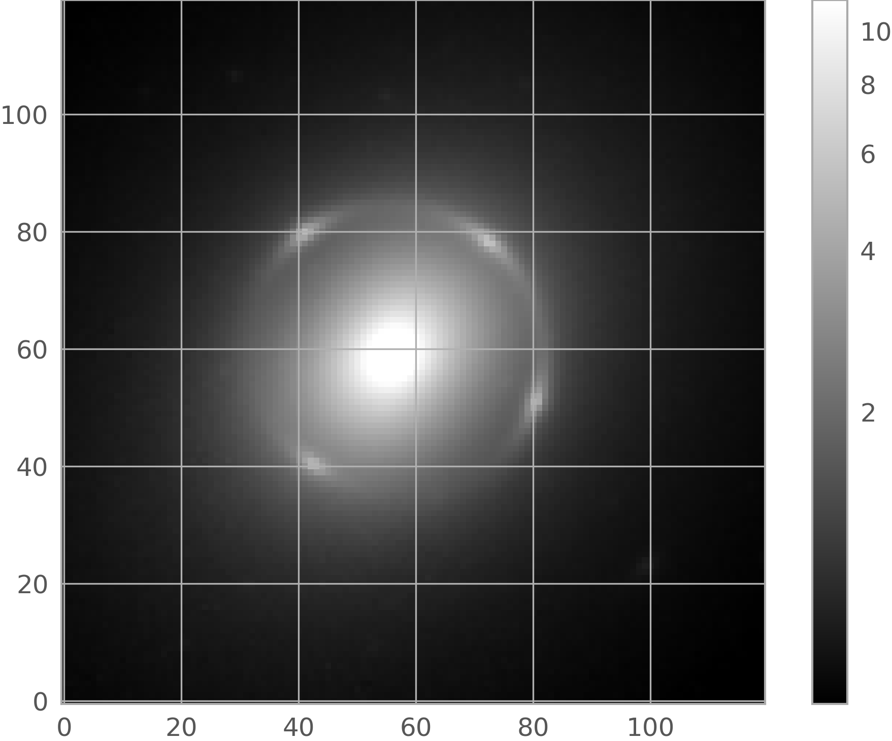
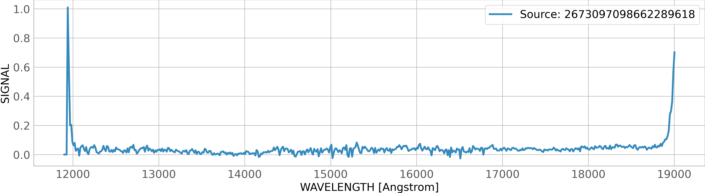

.. _astroquery.esa.euclid:

.. almost all code examples require remote-data access, thus only using this one at the very top
.. doctest-remote-data-all::

********************************************
ESA EUCLID Archive (`astroquery.esa.euclid`)
********************************************

The Euclid mission
##################

`Euclid <https://www.cosmos.esa.int/web/euclid>`_ is a Medium class ESA mission to map the geometry of the dark Universe.
The mission investigates the distance-redshift relationship and the evolution of cosmic structures. The space telescope is
creating a detailed map of the large-scale structure of the Universe across space and time by observing billions of galaxies
out to 10 billion light-years, across more than a third of the sky. It achieves this by measuring shapes and redshifts of
galaxies and clusters of galaxies out to redshifts ~2, or equivalently to a look-back time of 10 billion years. It therefore
explores how the Universe has expanded and how structure has formed over cosmic history, revealing more about the role of
gravity and the nature of dark energy and dark matter.

Please take note of our `guide <https://www.cosmos.esa.int/web/euclid/data-credits-acknowledgements>`_ on how
to acknowledge and cite Euclid data if you use public Euclid data in your paper.

The PDR (Public Data Release) environment of the Euclid science archive holds the public data. Euclid Q1_ data was publicly released on March 19,
2025. The main component of the Q1_ data contains Level 2 data of a single visit (at the depth of the Euclid Wide
Survey) over the Euclid Deep Fields (EDFs): 20 deg\ :sup:`2` of the EDF North, 10 deg\ :sup:`2` of EDF Fornax, and
23 deg\ :sup:`2` of the EDF South. The deep fields will be visited multiple times during the mission.

By default, the object *Euclid* below makes use of the *PDR* environment:

  >>> from astroquery.esa.euclid import Euclid

Astroquery.esa.euclid
#####################

This Python module provides an Astroquery API to access to the metadata and datasets provided by the
`European Space Agency Euclid Archive <https://eas.esac.esa.int/sas/>`_ using a `TAP+ <https://astroquery.readthedocs.io/en/latest/utils/tap.html>`_ REST service.
`TAP+ <https://astroquery.readthedocs.io/en/latest/utils/tap.html>`_ is an extension of Table Access Protocol (TAP_)
specified by the International Virtual Observatory Alliance (IVOA_) that incorporates dedicated user space capabilities (see Sect. 2 below).
The TAP_ query language is Astronomical Data Query Language (ADQL_). TAP_ provides two operation modes:

* Synchronous: the server response is generated as soon as the request is received.

* Asynchronous: the server starts a job that will execute the request. The first response to the request is a link with information about the job status.

On top of that, this package provides two access modes:

* Public (default): The results generated by the anonymous ADQL_ queries are public, and deleted from the Archive 72 hours.

* Authenticated: The ADQL_ queries and their outcomes remain in the user space until the user deletes them. In addition, authenticated users benefit from dedicated functionalities (see Sect 2 below).

There are limitations to the execution time and total output size that depend on the combination of operation and access modes - see the Gaia Archive FAQ:
`Why does my query time out after 90 minutes? Why is my query limited to 3 million rows? <https://www.cosmos.esa.int/web/gaia/faqs#account-limits-2020>`_ for details.

To reduce the verbosity (as well as complexity) of this document, the output of the code examples below has been trimmed
and only the most relevant output lines are displayed. Whenever possible, the documentation points
to the `Astroquery.Gaia package <https://astroquery.readthedocs.io/en/latest/gaia/gaia.html>`_ that
shares a similar architecture and methods with this module. For information about how to install the latest version of the Astroquery package, please visit the
`Astroquery page in PyPI <https://pypi.org/project/astroquery/>`_.

Euclid data and data access
###########################

Euclid Q1_ contains different types of data, like catalogues (data tables), images, and (only the red part of the NISP) spectra. For details, please refer to the `Data products in the science archive <https://s2e2.cosmos.esa.int/www/euclid_iscience/Data_products_in_the_science_archive.html>`_ in the `Euclid Archive Help <https://s2e2.cosmos.esa.int/www/euclid_iscience/Public_User_Guide.html>`_ , as well as the Q1 Data Product Definition Document (DPDD_).

This Astroquery package is mostly geared to query and retrieve the data stored in the catalogues, but it also includes dedicated methods to retrieve the images and spectra (both stored as large FITS files). The latter are served via the DataLink_ IVOA_ protocol - see Sect. 3 below). It is also possible to directly access to these products (without having to retrieve them) using the "Euclid Q1" datalab that is publicly available in the ESA Datalabs_ e-science platform. Users aiming to analyse large Euclid datasets are encouraged to use this platform.

Table of contents:

.. contents::
   :local:
   :depth: 3

========
Examples
========

It is recommended checking the status of Euclid TAP_ before executing this module. To do this:

  >>> from astroquery.esa.euclid import Euclid
  >>> Euclid.get_status_messages()

1. Public access
----------------

This is the access mode for non-registered (also known as "anonymous" in this document) users.

1.1. Metadata
^^^^^^^^^^^^^

It is possible to access to the metadata (e.g., table names, sizes, descriptions, column names, etc.) of all the TAP_ tables stored in the Archive using the load_tables_ method. This feature allows to have a broad overview of the Archive content. To load only table names:

  >>> tables = Euclid.load_tables(only_names=True, include_shared_tables=True)
  >>> print(f'* Found {len(tables)} tables')
  >>> print(*(table.name for table in tables), sep="\n")  # doctest: +IGNORE_OUTPUT
  ivoa.obscore
  public.dual
  sedm.raw_detector
  sedm.raw_frame
  sedm.raw_quadrant
  ...

To load only one table and inspect its columns:

  >>> raw_detector_table = Euclid.load_table('sedm.raw_detector')
  >>> print(raw_detector_table)
  TAP Table name: sedm.raw_detector
  Description: None
  Size (bytes): 0
  Num. columns: 12
  >>> print(*(column.name for column in raw_detector_table.columns), sep="\n")  # doctest: +IGNORE_OUTPUT
  crpix1
  crpix2
  crval1
  ...

1.2. Cone search
^^^^^^^^^^^^^^^^

The cone_search_ method allows to easily retrieve data around a projected circular region in a given sky location from a given catalogue.
The example below shows how to launch a 0.5 degrees radius cone search around `NGC 6505 <https://simbad.cds.unistra.fr/simbad/sim-id?Ident=NGC+6505>`_. By default, this method targets
the "mer_catalogue" and its outcome is restricted to 50 rows.

  >>> from astropy.coordinates import SkyCoord
  >>> import astropy.units as u
  >>> coord  = SkyCoord("17h51m07.4s +65d31m50.8s", frame='icrs')
  >>> radius = u.Quantity(0.5, u.deg)
  >>> job    = Euclid.cone_search(coordinate=coord, radius=radius, columns="*", async_job=True)
  >>> res    = job.get_results()
  >>> print(f"Found {len(cone_results)} results")
  basic_download_data_oid to_be_published      object_id       right_ascension   ...       gaia_id        gaia_match_quality           dist
  ----------------------- --------------- ------------------- ------------------ ... ------------------- -------------------- ----------------------
                      281               1 2677813028655307424 267.78130284070573 ...                  --                   -- 0.00019012520229516453
                      281               1 2677926210655368830  267.7926210570132 ... 1441085261522268928  0.05010449141263962   0.007807472554918013
                      281               1 2677747417655202562  267.7747417649051 ... 1441085055363835648 0.002425010548904538   0.010827275337244202

To remove the row limitation one can set the Euclid.ROW_LIMIT to "-1". The following example shows how to do this, as well as how to specify a target table. It also shows that the cone_search method accepts target names of coordinates, provided
that the name is recognised by the Simbad, VizieR, or NED services.

  >>> radius           = u.Quantity(0.2, u.deg)
  >>> Euclid.ROW_LIMIT = -1
  >>> job              = Euclid.cone_search(coordinate='NGC 6505', radius=radius, table_name="sedm.calibrated_frame", ra_column_name="ra", dec_column_name="dec", async_job=True, columns = ['ra', 'dec', 'datalabs_path', 'file_path', 'file_name', 'observation_id', 'instrument_name'])
  >>> res              = job.get_results()
  >>> print(f"* Found {len(res)} results")
  >>> print(res)
       ra          dec                datalabs_path                               file_path                                                file_name                             observation_id instrument_name         dist
  ------------ ----------- ----------------------------------- ----------------------------------------------- ----------------------------------------------------------------- -------------- --------------- -------------------
  267.99354663 65.60351547 /data/euclid_q1/Q1_R1/VIS_QUAD/2704 /euclid/repository_idr/iqr1/Q1_R1/VIS_QUAD/2704 EUC_VIS_SWL-DET-002704-00-2-0000000__20241017T042759.344384Z.fits           2704             VIS 0.11414714851731637
  267.99354663 65.60351547      /data/euclid_q1/Q1_R1/NIR/2704      /euclid/repository_idr/iqr1/Q1_R1/NIR/2704         EUC_NIR_W-CAL-IMAGE_H-2704-0_20240930T191946.868701Z.fits           2704            NISP 0.11414714851731637
    ...

.. note::
    * Once the table_name, and/or ra_column_name, and/or dec_column_name arguments are set, the default values are erased - this is a known issue.
    * Users are encouraged to use the cone_search_ instead of the query_object_ method. The latter makes use of the ADQL_ BOX function that is deprecated and can yield misleading results due to geometric projection effects.

1.3. Synchronous query
^^^^^^^^^^^^^^^^^^^^^^

This is the recommended access mode for queries that do not require excessive computation time and/or generate tables with less than 2,000 rows.
The example below shows how to extract a subset of three sources with ellipticity larger than zero from the "mer_catalogue":

  >>> query = f"SELECT TOP 3 object_id, right_ascension, declination, segmentation_area, ellipticity, kron_radius FROM {mer_cat_name} WHERE ellipticity > 0"
  >>> job   = Euclid.launch_job(query)
  >>> res   = job.get_results()
  >>> print(res)
       object_id       right_ascension      declination    segmentation_area     ellipticity        kron_radius
  ------------------- ------------------ ----------------- ----------------- ------------------- ------------------
  2744182404684288509 274.41824043555044 68.42885096091729                98 0.34178537130355835 22.018617630004883
  2744679115684290125  274.4679115369266  68.4290125712924                94 0.36368849873542786  19.16196632385254
  2744820013684293317 274.48200131993156 68.42933179142987                47 0.13406670093536377 13.094022750854492

The launch_job_ method returns a *Job* object. Its results can be extracted using the "get_results()" method, that generates an `Astropy table <https://docs.astropy.org/en/stable/table/index.html>`_ object.
The job status can be inspected by typing:

  >>> print(job)

Note that deleting the "TOP 3" string in the query above will return a table with 2,000 rows (sources).

1.4. Asynchronous query
^^^^^^^^^^^^^^^^^^^^^^^

This is the recommended mode for queries that are expected to output more than 2,000 rows and that require substantial execution time
(noting that all the queries time out after 7200 seconds). The query results are stored in the Archive (although for anonymous users the jobs are automatically deleted after 72 hours). The example below generates a cone search combined with a constraint applied to the ellipticity, and is similar to the first ADQL_ query example listed in the `Euclid Archive <https://eas.esac.esa.int/sas/>`_ (see its "Search/ADQL FORM" subtab). For more ADQL_ examples please have a look at the Gaia Archive Help content (in particular, the `writing queries <https://www.cosmos.esa.int/web/gaia-users/archive/writing-queries>`_ section).

  >>> query = "SELECT right_ascension, declination, object_id, vis_det, det_quality_flag, flux_detection_total, flux_vis_sersic, segmentation_area, kron_radius, DISTANCE(267.78, 65.53, right_ascension, declination) AS dist FROM mer_catalogue WHERE DISTANCE(267.78, 65.53, right_ascension, declination) < 0.1 AND ellipticity > 0"
  >>> job  = Euclid.launch_job_async(query, verbose=False)
  >>> print(job_async)
  >>> res  = job.get_results()
  >>> print(res)
   right_ascension      declination         object_id      vis_det det_quality_flag ...   flux_vis_sersic   segmentation_area    kron_radius             dist
  ------------------ ----------------- ------------------- ------- ---------------- ... ------------------- ----------------- ------------------ -------------------
   267.7502407456637 65.43182123675119 2677502407654318212       1                2 ...  0.5517764091491699               101 28.096778869628906 0.09895246869367581
  267.76847561971346 65.43194661918689 2677684756654319466       1                2 ... 0.12194870412349701                26 12.046527862548828  0.0981699461580744
   267.7698066292422 65.43454030481347 2677698066654345403       1                0 ...  0.4004257917404175                61 15.562020301818848 0.09555336819768735
   ...

1.5 Query on an 'on-the-fly' uploaded table
^^^^^^^^^^^^^^^^^^^^^^^^^^^^^^^^^^^^^^^^^^^

This feature is present both in the synchronous and asynchronous queries. 'On-the-fly' queries allow the user to upload a table stored in VOTable_ format and
perform a query on it in one single command. The uploaded tables are deleted after the query is complete. Alternatively, as a registered user it is possible
to upload a table and store it in the user space (see Sect. 2 below). In the example below, the "my_table.xml" file is uploaded to the Archive via the "tap_upload"
feature and then used to perform a combined (JOIN) operation with the mer_catalogue. Note the use of the "tap_upload" in the ADQL_ query.

  >>> upload_resource = 'my_table.xml'
  >>> query           = "SELECT mer.object_id, flux_vis_sersic, fwhm FROM tap_upload.table_test JOIN mer_catalogue AS mer USING (object_id)"
  >>> job             = Euclid.launch_job(query, upload_resource=upload_resource, upload_table_name="table_test")
  >>> res             = job.get_results()
  >>> print(res)
        object_id        flux_vis_sersic          fwhm
   ------------------- ------------------- ------------------
   2701338214642376775 0.12060821056365967 1.2710362672805786
   2703077159642376093  0.8660399317741394 1.2481366395950317
   2695939228642370900    6.01658296585083 1.2056430578231812

1.6. Getting products (FITS files)
^^^^^^^^^^^^^^^^^^^^^^^^^^^^^^^^^^

In addition to catalogues that can be queried via ADQL_, the Euclid Archive also host the FITS files that contain the images and spectra generated by this mission. The example below shows how to download the Euclid (MER, background-subtracted) image of a given object proceeding in a two-step fashion.

**Step 1:** The "mosaic_product" TAP_ table that contains the names of the FITS files with the background-subtracted mosaic images (associated with the Euclid product: DpdMerBksMosaic_)
and their sky coverage (in its "fov" field) is queried using ADQL_. Please note:

#. the "instrument_name" field that is used to select the "VIS" observations,

#. the variable "radius" that indicates the minimum distance between the target coordinates and the image edges, and

#. the combination of the INTERSECTS clause with the CIRCLE function. The target coordinates correspond to NGC 6505.

  >>> radius   = 0.5/60.
  >>> query    = f"""SELECT file_name, file_path, datalabs_path, instrument_name, filter_name, ra, dec, creation_date, product_type, patch_id_list, tile_index
                 FROM q1.mosaic_product
                 WHERE instrument_name='VIS' AND
                 INTERSECTS(CIRCLE(267.7808, 65.5308, {radius}), fov)=1"""

  >>> res      = Euclid.launch_job_async(query).get_results()
  >>> print(res)
                                     file_name                                                          file_path                                   datalabs_path              instrument_name ...   product_type  patch_id_list tile_index
  -------------------------------------------------------------------------------- --------------------------------------------------- --------------------------------------- --------------- ... --------------- ------------- ----------
  EUC_MER_BGSUB-MOSAIC-VIS_TILE102158889-F95D3B_20241025T024806.508980Z_00.00.fits /euclid/repository_idr/iqr1/Q1_R1/MER/102158889/VIS /data/euclid_q1/Q1_R1/MER/102158889/VIS             VIS ... DpdMerBksMosaic            49  102158889

**Step 2:** The get_product_ method is used to download the fits file(s) listed in the "file_name" field included in the table returned in the previous step. The method returns the local path where the product(s) is saved.

**Notes:**

* Given the size of the Euclid FITS images (~1.4 GB for the MER images and ~7 GB for calibrated VIS images) downloading individual files is time consuming (depending on the internet bandwith).

* This step can be skipped if using ESA Datalabs_ (as direct access to the products is possible).

  >>> file_name = res['file_name'][0]
  >>> print("Downloading file:", file_name)
  >>> path = Euclid.get_product(file_name=file_name, output_file=file_name)

**Step 3:** Open the FITS file and inspect its content.

  >>> from astropy.io import fits
  >>> import matplotlib.pyplot as plt
  >>> from astropy.visualization import astropy_mpl_style, ImageNormalize, PercentileInterval, AsinhStretch,
  >>> hdul = fits.open(path[0])
  >>> image_data = hdul[0].data
  >>>
  >>> plt.figure()
  >>> plt.imshow(image_data, cmap='gray', origin='lower', norm=ImageNormalize(image_data, interval=PercentileInterval(99.1), stretch=AsinhStretch()))
  >>> colorbar = plt.colorbar()
  >>> hdul.close()

.. image:: images/EUC_MER_BGSUB-MOSAIC-VIS_TILE102158889-F95D3B_20241025T024806.508980Z_00.00.png
   :align: center
   :width:  800px
   :height: 500px
   :scale: 100%

1.7. MER Cutouts
^^^^^^^^^^^^^^^^

It is also possible to download just small portions of the MER (background subtracted) images. The get_cutout_ allows to download image cutouts and store them locally - for reference, downloading a 1'x1'cutout takes less than one second and the downloaded fits file weights ~5.5 MB. In the example below, the results of Step 1 above are combined with the "file_path" and "file_name" values obtained from the mosaic_product TAP_ table to create the main input of the get_cutout_ method.

**Notes:**
This method...

* makes use of the `Astroquery cutout service <https://astroquery.readthedocs.io/en/latest/image_cutouts/image_cutouts.html>`_ to download a cutout fits image from the Archive, and it only works for MER images. For more advanced use cases please see the Cutouts.ipynb notebook available in the Euclid Datalabs_.

* accepts both Astropy SkyCoord_ coordinates and Simbad/VizieR/NED valid names (as string).

Download the cutout...

  >>> file_path  = f"{res['file_path'][0]}/{res['file_name'][0]}"
  >>> cutout_out = Euclid.get_cutout(file_path=file_path, coordinate='NGC 6505',radius= 0.1 * u.arcmin,output_file='ngc6505_cutout_mer.fits', instrument = 'None',id='None')
  >>> cutout_out = cutout_out[0]

...  and inspect its content:

  >>> hdul       = fits.open(cutout_out)
  >>> image_data = hdul[0].data
  >>> plt.figure()
  >>> plt.imshow(image_data, cmap='gray', origin='lower', norm=ImageNormalize(image_data, interval=PercentileInterval(99.1), stretch=AsinhStretch()))
  >>> colorbar = plt.colorbar()
  >>> hdul.close()

1.8 Spectra
^^^^^^^^^^^

In the Archive the 1D Spectra data  is served via the the Datalink_ (a data access protocol compliant with the IVOA_ architecture) service. Programmatically, this product is accessible via the get_spectrum_ method (see the
`Access to spectra <https://s2e2.cosmos.esa.int/www/ek_iscience/Access_to_spectra.html>`_ section in the Archive help for more information about this product).

**Notes:** As it happens when accessing to other Euclid products:

* a two-step approach as detailed in Sect. 1.6 and 1.7 above is needed.

* downloading of products is not needed when using ESA Datalabs_.

**Step 1:** First, a list of sources that have associated spectra must be compiled. This information is available in the spectra_source table, that also includes the FITs file name and other metadata that is relevant if reading the spectra from Datalabs_:

  >>> query   = f"SELECT TOP 3 * FROM catalogue.spectra_source"
  >>> results = Euclid.launch_job_async(query).get_results()
  >>> print(results)
  combined_spectra_fk combined_spectra_product_fk            datalabs_path                dec_obj      ...      source_id      spectra_source_oid to_be_published
  ------------------- --------------------------- ----------------------------------- ---------------- ... ------------------- ------------------ ---------------
                  161                        6170 /data/euclid_q1/Q1_R1/SIR/102159190 66.2289618502955 ... 2673097098662289618              66176               1
                  161                        6170 /data/euclid_q1/Q1_R1/SIR/102159190 66.2274291214739 ... 2674964457662274291              66197               1
                  161                        6170 /data/euclid_q1/Q1_R1/SIR/102159190 66.2304517166735 ... 2675062482662304517              66201               1

Alternatively, the get_datalinks_ method can be used to find out if a given source has associated spectra products, as well as to return its Datalabs_-related metadata:

  >>> result = Euclid.get_datalinks(ids=2707008224650763513, extra_options='METADATA')
  >>> print(results)
             ID            linking_parameter                                       access_url                                            ...                           file_name                           hdu_index
  ------------------------ ----------------- ------------------------------------------------------------------------------------------- ... ------------------------------------------------------------- ---------
  sedm 2707008224650763513         SOURCE_ID https://eas.esac.esa.int/sas-dd/data?ID=sedm+2707008224650763513&RETRIEVAL_TYPE=SPECTRA_RGS ... EUC_SIR_W-COMBSPEC_102158586_2024-11-05T16:05:44.880543Z.fits      1602
  sedm 2707008224650763513         SOURCE_ID https://eas.esac.esa.int/sas-dd/data?ID=sedm+2707008224650763513&RETRIEVAL_TYPE=SPECTRA_BGS ... EUC_SIR_W-COMBSPEC_102158586_2024-11-05T16:05:44.880543Z.fits      1602

**Step 2:** Retrieve the spectra associated to the list of sources compiled in the previous step using the get_spectrum_ method. The output is stored in a tabular fits file that can be open with the `Astropy Table <https://docs.astropy.org/en/stable/table/index.html>`_ package as detailed below.

Download the spectra:

>>> inp_source = str(res['source_id'][0])  # Note: the input of get_spectrum must be a string.
>>> dl_out     = Euclid.get_spectrum(id=inp_source, retrieval_type = "SPECTRA_RGS", verbose = True)
>>> print(f'Spectra downloaded and saved in: {dl_out}')

Read the spectra and convert it to Astropy table:

>>> path_to_fits = dl_out[0]
>>> spec         = Table.read(dl_out[0], format = 'fits')

Plot it:

>>> fontsize = 18
>>> plt.figure(figsize = [20,5])
>>> plt.plot(spec['WAVELENGTH'], spec['SIGNAL'], linewidth = 3, label = f"Source: {inp_source}")
>>> plt.xlabel(f"WAVELENGTH [{spec['WAVELENGTH'].unit}]", fontsize = fontsize)
>>> plt.ylabel('SIGNAL', fontsize = fontsize)
>>> plt.xticks(fontsize = fontsize)
>>> plt.yticks(fontsize = fontsize)
>>> plt.legend(fontsize = fontsize)
>>> plt.show()

2. Authenticated access
-----------------------

Authenticated (registered) users have access to all the `TAP+ <https://astroquery.readthedocs.io/en/latest/utils/tap.html>`_ capabilities (such as sharing tables, persistent jobs, and more). All the methods
listed above are applicable to authenticated users, who also benefit from the the advantage of having the asynchronous jobs stored in the user area forever (until the user decides to remove them).

With Euclid DR1 the following features that are already available in the `Astroquery.Gaia <https://astroquery.readthedocs.io/en/latest/gaia/gaia.html>`_ (see its "Section 2: Authenticated access")
package will also be available:

* User space management: table upload and sharing capabilities.

* Built-in cross-match functionality.

2.1. Login/Logout
^^^^^^^^^^^^^^^^^

There are several ways to log in to the Euclid archive, as detailed below:

  >>> from astroquery.esa.euclid import Euclid
  >>> Euclid.login_gui()      # Login via graphic interface (pop-up window)
  >>> Euclid.login()
  >>> Euclid.login(user='<user_name>', password='<password>')
  >>> Euclid.login(credentials_file='<path to credentials file>') # The file must contain just two rows: the username (first row) and the password.
  >>> Euclid.logout()

2.2. Job deletion
^^^^^^^^^^^^^^^^^
All the asynchronous jobs launched by registered users are stored in the user area, which can store up to 10 GB of jobs. Therefore, it is recommended to remove unnecessary jobs to avoid filling up the user quota.
The example below shows how to delete all the jobs in the user area using the list_async_jobs and remove_jobs_ methods.

>>> Euclid.login()
>>> job_ids = [job.jobid for job in Euclid.list_async_jobs()]
>>> Euclid.remove_jobs(job_ids)

It is also possible to take advantage of the job metadata to delete all the jobs that were launched within a given time range as explained below.

First, use the load_async_job_ method to download the metadata of the async jobs stored in the user space:

>>> job_obj  = [Euclid.load_async_job(jobid=jobid) for jobid in job_ids]
>>> job_ids  = [job.jobid        for job in job_obj]
>>> dates    = [job.creationTime for job in job_obj]

Second, create a dataframe that contains the jobid and date information:

>>> df              = pd.DataFrame.from_dict({'job_id':job_ids, 'fulldate':dates})
>>> df['date_time'] = pd.to_datetime(df['fulldate'])
>>> df['date']      = df['date_time'].dt.date
>>> df['hour_UTC']  = df['date_time'].dt.hour

Finally, extract the job id's included in a given time range (in the example below, all the jobs stored since 2024-10-01 at 7 hours UTC) and delete them:

>>> subset          = df[(df['date'] == datetime.date(2024,10,1)) & (df['hour_UTC'].isin([7]))]
>>> jobs_to_delete  = subset['job_id'].to_list()
>>> Euclid.remove_jobs(jobs_to_delete)

.. _appendix:

========
Appendix
========

The following table summarises the available values of the parameters of the method get_scientific_product_list.

.. csv-table:: Valid values for the parameters of the method get_scientific_product_list
    :file: table_values.csv
    :header-rows: 1
    :widths: auto

=============
Reference/API
=============

.. automodapi:: astroquery.esa.euclid
    :no-inheritance-diagram:

.. _ADQL: https://www.ivoa.net/documents/ADQL/20231215/index.html
.. _cone_search: https://astroquery.readthedocs.io/en/latest/api/astroquery.esa.euclid.EuclidClass.html#astroquery.esa.euclid.EuclidClass.cone_search
.. _DataLink: https://www.ivoa.net/documents/DataLink/20231215/index.html
.. _DPDD: https://euclid.esac.esa.int/dr/q1/dpdd/index.html
.. _DpdVisCalibratedQuadFrame: https://euclid.esac.esa.int/dr/q1/dpdd/visdpd/dpcards/vis_calibratedquadframe.html
.. _Datalabs: https://datalabs.esa.int/
.. _DpdMerBksMosaic: https://euclid.esac.esa.int/dr/q1/dpdd/merdpd/dpcards/mer_bksmosaic.html
.. _IVOA: http://www.ivoa.net
.. _get_product: https://astroquery.readthedocs.io/en/latest/api/astroquery.esa.euclid.EuclidClass.html#astroquery.esa.euclid.EuclidClass.get_product
.. _get_cutout: https://astroquery.readthedocs.io/en/latest/api/astroquery.esa.euclid.EuclidClass.html#astroquery.esa.euclid.EuclidClass.get_cutout
.. _get_datalinks: https://astroquery.readthedocs.io/en/latest/api/astroquery.esa.euclid.EuclidClass.html#astroquery.esa.euclid.EuclidClass.get_datalinks
.. _get_spectrum: https://astroquery.readthedocs.io/en/latest/api/astroquery.esa.euclid.EuclidClass.html#astroquery.esa.euclid.EuclidClass.get_spectrum
.. _launch_job: https://astroquery.readthedocs.io/en/latest/api/astroquery.esa.euclid.EuclidClass.html#astroquery.esa.euclid.EuclidClass.launch_job
.. _launch_job_async: https://astroquery.readthedocs.io/en/latest/api/astroquery.esa.euclid.EuclidClass.html#astroquery.esa.euclid.EuclidClass.launch_job_async
.. _load_tables: https://astroquery.readthedocs.io/en/latest/api/astroquery.utils.tap.TapPlus.html#astroquery.utils.tap.TapPlus.load_tables
.. _load_async_job: https://astroquery.readthedocs.io/en/latest/api/astroquery.utils.tap.Tap.html#astroquery.utils.tap.Tap.load_async_job
.. _login: https://astroquery.readthedocs.io/en/latest/api/astroquery.utils.tap.TapPlus.html#astroquery.utils.tap.TapPlus.login
.. _logout: https://astroquery.readthedocs.io/en/latest/api/astroquery.utils.tap.TapPlus.html#astroquery.utils.tap.TapPlus.logout
.. _Q1: https://www.cosmos.esa.int/web/euclid/euclid-q1-data-release
.. _query_object: https://astroquery.readthedocs.io/en/latest/api/astroquery.esa.euclid.EuclidClass.html#astroquery.esa.euclid.EuclidClass.query_object
.. _remove_jobs: https://astroquery.readthedocs.io/en/latest/api/astroquery.utils.tap.TapPlus.html#astroquery.utils.tap.TapPlus.remove_jobs
.. _REST: https://en.wikipedia.org/wiki/Representational_state_transfer
.. _SkyCoord: https://docs.astropy.org/en/stable/api/astropy.coordinates.SkyCoord.html
.. _TAP: http://www.ivoa.net/documents/TAP/
.. _upload_table: https://astroquery.readthedocs.io/en/latest/api/astroquery.utils.tap.TapPlus.html#astroquery.utils.tap.TapPlus.upload_table
.. _UCD: https://www.ivoa.net/documents/latest/UCD.html
.. _UTypes: https://www.ivoa.net/documents/Notes/UTypesUsage/index.html
.. _VOTable: https://www.ivoa.net/documents/VOTable/20250116/