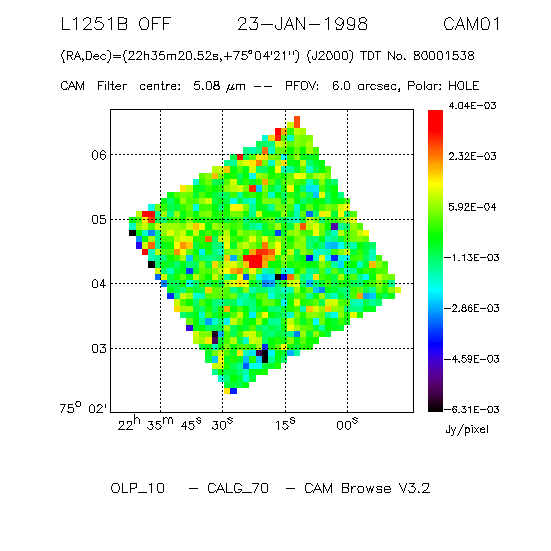
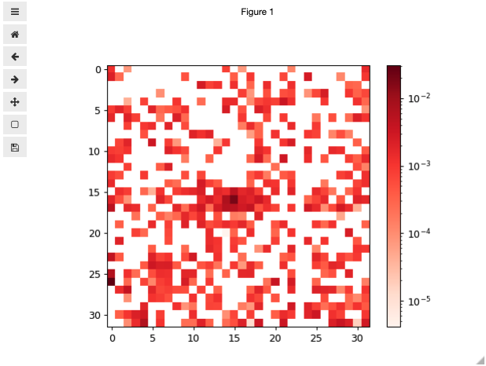
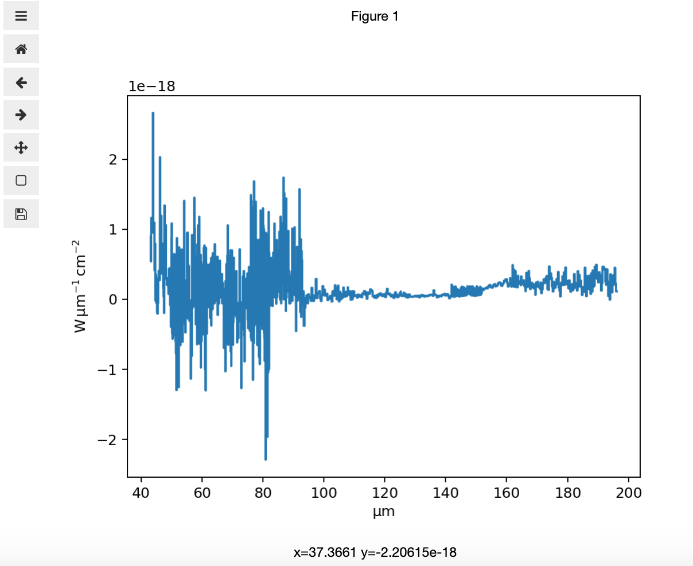

.. doctest-skip-all

.. _astroquery.esa.iso:

****************************************
ESA ISO Archive (`astroquery.esa.iso`)
****************************************
The Infrared Space Observatory (ISO) was a space telescope for infrared light designed and
operated by the European Space Agency (ESA), in cooperation with ISAS (now part of JAXA) and NASA.
The ISO was designed to study infrared light at wavelengths of 2.5 to 240 micrometres and operated
from 1995 to 1998.
The two spectrometers (SWS and LWS), a camera (ISOCAM) and an imaging photo-polarimeter (ISOPHOT)
jointly covered wavelengths from 2.5 to around 240 microns with spatial resolutions ranging from 1.5
arcseconds (at the shortest wavelengths) to 90 arcseconds (at the longer wavelengths). Its 60 cm diameter
telescope was cooled by superfluid liquid helium to temperatures of 2-4 K.

This package allows the access to the `ISO Data Archive <http://nida.esac.esa.int/nida-cl-web/>`__.
It has been developed by the ESAC Science Data Centre (ESDC) with requirements provided by the
ESA experts at ESAC.

========
Examples
========

------------------------------
1. Querying ISO data
------------------------------

.. code-block:: python

  >>> from astroquery.esa.iso import ISO
  >>> table=ISO.query_ida_tap(query="SELECT tdt,ra,dec,aotname,target " + 
  ...   "FROM ida.observations " + 
  ...   "WHERE INTERSECTS(CIRCLE('ICRS',10.68470833,41.26875,0.08333333333333333)," + 
  ...   "ida.observations.s_region_fov)=1")
  >>> table.pprint()
    tdt         ra         dec      aotname     target    
                h          deg                            
  -------- ----------- ------------ ------- --------------
  40001501     0.71278     41.26997    S01       M31_BULGE
  40001621 0.712304666     41.26917    C04             M31
  40001622 0.712304666     41.26916    C04             M31
  40001717 0.712305333     41.26917    C04             M31
  40001718    0.712306     41.26916    C04             M31
  40001847 0.712304666     41.26916    C04             M31
  40001945 0.712305333     41.26916    C04             M31
  40002013 0.712305333     41.26916    C04             M31
  40002014 0.712305333     41.26917    C04             M31
  40002151 0.712305333     41.26917    C04             M31
       ...         ...          ...     ...            ...
  58002001   0.7268883 41.156980827    C//        Near M31
  58002102 0.727339315 41.157998107    C//  Near M31_BULGE
  58302305     0.71225     41.26945    C01         M31_LW6
  58302402     0.71225     41.26945    C01         M31_LW2
  58302504     0.71225     41.26944    C01         M31_LW1
  58302603 0.719229923 41.047816169    C//       Near M31S
  58302703     0.71225     41.26945    C01         M31_LW3
  76100504 0.712055333        41.29    C03        M31 D395
  76100708 0.722799457 41.430336366    C//    Near M31_PAH
  76196300          --           --    C63                
  Length = 49 rows

'query_ida_tap' executes a TAP (Tabular Access Protocol) query to the ISO archive. In this case, 
the archive is queried to its main table ('ida.observations') for observations that overlaps the 
position ('ra=10.68470833, ec=41.26875' in degrees, that corresponds with M31).

The result of a query can be stored in a file by defining the output format and the output file name.

.. code-block:: python

  >>> from astroquery.esa.iso import ISO
  >>> table = ISO.query_ida_tap(query="select top 10 * from ida.observations", 
  >>>                       output_format='csv', output_file='results10.csv')

This will execute an ADQL query to query the first 10 observations in the ISO Data Archive. The result of
the query will be stored in the file 'results10.csv'. The result of this query can be printed by doing 
print(table).

Once we have the observations identifiers (TDT) we can invoke the data download. To discover the tables 
provided by this service, see section 'Getting Tables Details'.

------------------------------
2. Getting ISO data
------------------------------

.. code-block:: python

  >>> from astroquery.esa.iso import ISO
  >>> ISO.download_data('80000203', retrieval_type="OBSERVATION", 
  ...   product_level="DEFAULT_DATA_SET", 
  ...   filename="80000203", verbose=True)
  Created TAP+ (v1.2.1) - Connection:
	Host: nida.esac.esa.int
	Use HTTPS: False
	Port: 80
	SSL Port: 443
  INFO: http://nida.esac.esa.int/nida-sl-tap/data?retrieval_type=OBSERVATION&tdt=80000203&product_level=DEFAULT_DATA_SET [astroquery.esa.iso.core]
  INFO: Copying file to 80000203.tar... [astroquery.esa.iso.core]
  INFO: Wrote http://nida.esac.esa.int/nida-sl-tap/data?retrieval_type=OBSERVATION&tdt=80000203&product_level=DEFAULT_DATA_SET to 80000203.tar [astroquery.esa.iso.core]
  >>> import tarfile
  >>> tar = tarfile.open("80000203.tar")
  >>> tar.list()
  -rw-r--r-- idaops/0       1094 2005-12-23 12:02:55 ././ISO1601052542/EXTRAKON//pich80000203.gif 
  -rw-r--r-- idaops/0     266240 2005-12-23 12:02:54 ././ISO1601052542/EXTRAKON//C10480000203.tar 
  -rw-r--r-- idaops/0      14400 2005-12-23 12:02:55 ././ISO1601052542/EXTRAKON//psph80000203.fits 
  -rw-r--r-- idaops/0       5599 2005-12-23 12:02:55 ././ISO1601052542/EXTRAKON//ppch80000203.gif 
  -rw-r--r-- idaops/0     266240 2005-12-23 12:02:54 ././ISO1601052542/EXTRAKON//C10180000203.tar 
  >>> tar.extract("././ISO1601052542/EXTRAKON//psph80000203.fits")
  >>> tar.extractall()

'download_data' method invokes the data download of files from the ISO Data Archive, using the 
observation identifier (TDT) as input. There are different product levels:

* ALL
* FULLY_PROC: Set of coherent, instrument-independent measurements of images or spectra designed to get as close as possible by automatic means to what could be produced by an astronomer using an interactive analysis system.
* RAW_DATA: Unpacked telemetry in which no data reduction.
* BASIC_SCIENCE: Data have been processed further to an intermediate level (with the use of calibration files where necessary), often containing physical units.
* QUICK_LOOK: Fully reduced standard data sets, either FITS images or ASCII FITS tables, for survey-type work. Although these products contain fully reduced data, it must be emphasised that the processing is done in a standard and automatic way which does not involve any scientific judgement.
* HPDP: 'Highly Processed Data Products' (HPDP). These products include DATA (images, spectra etc.), which have been processed beyond the pipeline and/or using new, refined algorithms and therefore have been improved to any degree compared to the OLP 10 products, as well as any resulting CATALOGUES and ATLASES.
* DEFAULT_DATA_SET: This is the selected pack of products that better characterize the observation, either pipeline products or HPDP products.

There are two valid values for 'retrieval_type': OBSERVATION and STANDALONE. OBSERVATION is the one 
used commonly to download data from the archive and STANDALONE returns a Virtual Observatory 
product (if any).

For more info on the data products, please check 'http://nida.esac.esa.int/nida-cl-web/', 
"IDA USERS GUIDE" section.

Both query and download methods are designed to be used in coordination. For example, we can query 
for SWS observations with a certain target associated (not calibration) for the revolution 800 and 
we can loop on the observations to download the best products (DEFAULT_DATA_SET) in different tar files.

.. code-block:: python

  >>> from astroquery.esa.iso import ISO
  >>> table=ISO.query_ida_tap(query="SELECT tdt, revno, aotname, ra, dec  FROM " + 
  ...                               "ida.observations WHERE " + 
  ...                               "revno=800 and aotname like 'S%' and target != ''")
  >>> print(table)
    tdt    revno aotname      ra        dec   
                              h         deg   
  -------- ----- ------- ------------ --------
  80002504   800    S01       2.74033 55.18761
  80002450   800    S01      2.550044 58.03472
  80002304   800    S07   2.428013333 62.09789
  80002247   800    S07   2.428012666 62.09789
  80002014   800    S02   0.901055333 73.08528
  80000938   800    S01     21.691944 76.37833
  80000828   800    S02  21.035861333 68.15064
  80000104   800    S01  16.477365333 41.88163
  >>> for observation in table:
  >>>     ISO.download_data(str(observation['tdt']), retrieval_type="OBSERVATION", 
  ...        product_level="DEFAULT_DATA_SET", filename=str(observation['tdt']), verbose=True)
  INFO: http://nida.esac.esa.int/nida-sl-tap/data? 
  retrieval_type=OBSERVATION&tdt=80002504&product_level=DEFAULT_DATA_SET [astroquery.esa.iso.core]
  INFO: Copying file to 80002504.tar... [astroquery.esa.iso.core]
  INFO: Wrote http://nida.esac.esa.int/nida-sl-tap/data? 
  retrieval_type=OBSERVATION&tdt=80002504&product_level=DEFAULT_DATA_SET to 80002504.tar [astroquery.esa.iso.core]
  INFO: http://nida.esac.esa.int/nida-sl-tap/data? 
  retrieval_type=OBSERVATION&tdt=80002450&product_level=DEFAULT_DATA_SET [astroquery.esa.iso.core]
  INFO: Copying file to 80002450.tar... [astroquery.esa.iso.core]
  INFO: Wrote http://nida.esac.esa.int/nida-sl-tap/data? 
  retrieval_type=OBSERVATION&tdt=80002450&product_level=DEFAULT_DATA_SET to 80002450.tar [astroquery.esa.iso.core]
  ......
  INFO: http://nida.esac.esa.int/nida-sl-tap/data? 
  retrieval_type=OBSERVATION&tdt=80000104&product_level=DEFAULT_DATA_SET [astroquery.esa.iso.core]
  INFO: Copying file to 80000104.tar... [astroquery.esa.iso.core]
  INFO: Wrote http://nida.esac.esa.int/nida-sl-tap/data? 
  retrieval_type=OBSERVATION&tdt=80000104&product_level=DEFAULT_DATA_SET to 80000104.tar [astroquery.esa.iso.core]
  
  

-------------------------------
2. Getting ISO postcards
-------------------------------

.. code-block:: python

  >>> from astroquery.esa.iso import ISO
  >>> ISO.get_postcard('80001538', filename="postcard")
  
  >>> from IPython.display import Image
  >>> from IPython.core.display import HTML 
  >>> Image(filename = "postcard.png", width=400, height=100)
  
  Downloading URL http://nida.esac.esa.int/nida-sl-tap/data?&retrieval_type=POSTCARD&tdt=80001538 to 
  ~/.astropy/cache/astroquery/ISO/data?&retrieval_type=POSTCARD&tdt=80001538 ... [Done]
  INFO: Copying file to postcard.png... [astroquery.esa.iso.core]
  
  

   The resulting plot from the example above

This will download the ISO postcard for the observation '80001538' and it will stored in a PNG called
'postcard.png'. Then, we display the postcard inside the python interface.

------------------------------------------
3. Getting ISO Tables Details through TAP
------------------------------------------

.. code-block:: python

  >>> from astroquery.esa.iso import ISO
  >>> ISO.get_tables()
  
  INFO: Retrieving tables... [astroquery.utils.tap.core]
  INFO: Parsing tables... [astroquery.utils.tap.core]
  INFO: Done. [astroquery.utils.tap.core]
  ['hpdp.cam_sato', 'hpdp.cambendo', 'hpdp.chopc2i', 'hpdp.chopc2ii', 'hpdp.compkon', 
  'hpdp.evolkon', 'hpdp.extrakon', 'hpdp.kon3p6i', 'hpdp.kon3p6ii', 'hpdp.konkoly', 
  'hpdp.lwsasti', 'hpdp.lwsastii', 'hpdp.misckon', 'hpdp.p32_c200', 'hpdp.p32virgo',
  'hpdp.scanskon', 'hpdp.sloansws', 'hpdp.solarkon', 'hpdp.sws01hrd', 'hpdp.ysokon',
  'tap_config.coord_sys', 'ida.dqr', 'ida.dqrflags', 'ida.footprints', 'ida.fov_info', 
  'ida.iasd_line', 'ida.iso_wcs_info', 'ida.observers', 'ida.postcards', 'ida.proposals',
  'ida.usredata', 'ida.usredata_files', 'ida.object_type', 'ida.observations', 
  'tap_schema.columns', 'tap_schema.key_columns', 'tap_schema.keys', 'tap_schema.schemas', 
  'tap_schema.tables', 'ivoa.obscore',
  'ivoa.siap', 'ivoa.ssap']

This will show the available tables in ISO TAP service in the ISO Data Archive.

-------------------------------------
4. Getting columns details of ISO TAP
-------------------------------------

.. code-block:: python

  >>> from astroquery.esa.iso import ISO
  >>> ISO.get_columns('ida.observations')

  INFO: Retrieving tables... [astroquery.utils.tap.core]
  INFO: Parsing tables... [astroquery.utils.tap.core]
  INFO: Done. [astroquery.utils.tap.core]
  ['aotname', 'bp_valid', 'cal_flag', 'cam_par_flag', 'cdec', 'cra', 'croll', 'dec', 
  'default_vo_product', 'display', 'dist_status','ehalind', 'end_time', 'fov', 
  'hpdp_available', 'instid', 'instrument_mode', 'object_type', 'obsid', 'obsno', 
  'obsno_char', 'osn', 'ott', 'prodqlty', 'propid', 'qltyver', 'ra', 'revno', 's_region', 
  's_region_fov', 'start_time', 'target', 'targetno', 'tdt', 'tdt_char', 'type', 
  'usredata_available', 'utc_end', 'utc_start', 'wavelengths']

This will show the column details of the table 'ida.observations' in ISO TAP service 
in the ISO Data Archive.

-------------------------------------
4. Working with ISO VO tables
-------------------------------------

ISO provides Virtual Observatory compatible products and tables. Three different VO 
compatible tables are provided:

* ivoa.obscore: Compatible with the IVOA Obscore data model format
* ivoa.ssap: Table that provides spectra compatible with VO tools
* ivoa.siap: Table that provide images compatible with VO tools

All these tables can be queried using the TAP interface and allow geometrical queries.

.. code-block:: python

  >>> # First we obtain the coordinates of a certain object (M31) in degrees
  >>> from astropy import units as u
  >>> from astropy.coordinates import SkyCoord
  >>> from astroquery.simbad import Simbad
  >>> result_table = Simbad.query_object("M31")
  >>> print(result_table)
  >>> c = SkyCoord(result_table['RA'], result_table['DEC'], unit=(u.hourangle, u.deg),
  >>>              frame='icrs')
  >>> ra = str(c.ra.degree[0])
  >>> dec = str(c.dec.degree[0])

  MAIN_ID      RA          DEC      ... COO_WAVELENGTH     COO_BIBCODE    
            "h:m:s"      "d:m:s"    ...                                   
  ------- ------------ ------------ ... -------------- -------------------
    M  31 00 42 44.330 +41 16 07.50 ...              I 2006AJ....131.1163S

  >>> # Then we use these coordinates to discover spectral data
  >>> from astroquery.esa.iso import ISO
  >>> table=ISO.query_ida_tap(query="SELECT target_name, ra, dec, reference " + 
  >>>								"FROM ivoa.ssap WHERE " + 
  >>>                               "INTERSECTS(CIRCLE('ICRS'," + ra + "," + dec + 
  >>>								",0.08333333333333333)," + 
  >>>                               "s_region_fov)=1")
  >>> table.pprint_all()
                 target_name                   ra           dec                  reference                                     
  ------------------------------------      ------------ -------- -----------------------------------------------------------------------------------
   ISO LWS01 Spectrum Target: M31_BULGE     10.69170999  41.26998 http://nida.esac.esa.int/nida-sl-tap/data?RETRIEVAL_TYPE=STANDALONE&obsno=580021020
   ISO SWS01 Spectrum Target: M31_BULGE     10.6917      41.26997 http://nida.esac.esa.int/nida-sl-tap/data?RETRIEVAL_TYPE=STANDALONE&obsno=400015010
   ISO LWS01 Spectrum Target: M31           10.684999995 41.26902 http://nida.esac.esa.int/nida-sl-tap/data?RETRIEVAL_TYPE=STANDALONE&obsno=580020010
   ISO LWS01 Spectrum Target: M31N          10.80459     41.38386 http://nida.esac.esa.int/nida-sl-tap/data?RETRIEVAL_TYPE=STANDALONE&obsno=602020050
  
  

This query displays spectra with a field of view that overlaps with the central point of M31.

Same can be done to discover images M31 images:

.. code-block:: python

  >>> # We use again the coordinates to discover image data
  >>> table=ISO.query_ida_tap(query="SELECT image_title, ra, dec, access_url " +
  ...                               "FROM ivoa.siap WHERE " + 
  ...                               "INTERSECTS(CIRCLE('ICRS'," + ra + "," + dec + 
  ...                               ",0.08333333333333333)," + 
  ...                               "s_region_fov)=1")
  >>> table.pprint_all()

             image_title              ra      dec                                      access_reference                                 
                                     deg      deg                                                                                       
   ------------------------------- -------- -------- -----------------------------------------------------------------------------------
   ISO CAM01 Image Target: M31_LW2 10.68375 41.26945 http://nida.esac.esa.int/nida-sl-tap/data?RETRIEVAL_TYPE=STANDALONE&obsno=583024020
   ISO CAM01 Image Target: M31_LW1 10.68375 41.26944 http://nida.esac.esa.int/nida-sl-tap/data?RETRIEVAL_TYPE=STANDALONE&obsno=583025040
   ISO CAM01 Image Target: M31_LW6 10.68375 41.26945 http://nida.esac.esa.int/nida-sl-tap/data?RETRIEVAL_TYPE=STANDALONE&obsno=583023050
   ISO CAM01 Image Target: M31_LW3 10.68375 41.26945 http://nida.esac.esa.int/nida-sl-tap/data?RETRIEVAL_TYPE=STANDALONE&obsno=583027030

-------------------------------------
4. Working with ISO VO products
-------------------------------------
Either by invocation of the URL provided in every row of previous section or using the STANDALONE retrieval level, VO compatible products can be open using python astropy FITS module.

Images can be displayed by using the following code:

.. code-block:: python

  >>> #How to display an ISO image
  >>> from astroquery.esa.iso import ISO
  >>> ISO.download_data('80001538', retrieval_type="STANDALONE", 
  ...                   filename="80001538")
  >>> from astropy.io import fits
  >>> from matplotlib import pyplot as plt
  >>> f = fits.open('80001538.fits')  
  >>> f.info()

  INFO: Copying file to 80001538.fits... [astroquery.esa.iso.core]
  Filename: 80001538.fits
  No.    Name      Ver    Type      Cards   Dimensions   Format
    0  PRIMARY       1 PrimaryHDU      75   (32, 32)   float32   

  >>> # The image is in the primary extension
  >>> image_data = f[0].data
  >>> f.close()
  >>>
  >>> # Set up matplotlib and use a nicer set of plot parameters
  >>> %config InlineBackend.rc = {}
  >>> import matplotlib
  >>> import matplotlib.pyplot as plt
  >>> from matplotlib.colors import LogNorm
  >>> 
  >>> #We configure the plot to be interactive
  >>> %matplotlib widget
  >>> plt.ion()
  >>> plt.imshow(image_data, cmap='Reds')
  >>> plt.colorbar()

And spectra can be displayed by using the following code:

.. code-block:: python
  
  >>> # Search for M31 spectra
  >>> from astroquery.esa.iso import ISO
  >>> table=ISO.query_ida_tap(query="SELECT target_name, ra, dec, " + 
  ...                               "axes, units, reference FROM ivoa.ssap " +
  ...                               "WHERE " + 
  ...                               "INTERSECTS(CIRCLE('ICRS',10.68470833,41.26875," + 
  ...                               "0.08333333333333333)," + 
  ...                               "s_region_fov)=1")

  >>> table.pprint_all()
              target_name                   ra        dec       axes             units                                                reference                                     
  ------------------------------------ ------------ -------- --------- ------------------------- -----------------------------------------------------------------------------------
  ISO LWS01 Spectrum Target: M31_BULGE  10.69170999  41.26998 WAVE FLUX microns watts/cm^2/micron http://nida.esac.esa.int/nida-sl-tap/data?RETRIEVAL_TYPE=STANDALONE&obsno=580021020
  ISO SWS01 Spectrum Target: M31_BULGE  10.6917      41.26997 WAVE FLUX um Jy                     http://nida.esac.esa.int/nida-sl-tap/data?RETRIEVAL_TYPE=STANDALONE&obsno=400015010
  ISO LWS01 Spectrum Target: M31        10.684999995 41.26902 WAVE FLUX microns watts/cm^2/micron http://nida.esac.esa.int/nida-sl-tap/data?RETRIEVAL_TYPE=STANDALONE&obsno=580020010
  ISO LWS01 Spectrum Target: M31N       10.80459     41.38386 WAVE FLUX microns watts/cm^2/micron http://nida.esac.esa.int/nida-sl-tap/data?RETRIEVAL_TYPE=STANDALONE&obsno=602020050

  >>> # Download using the ISO astroquery module
  >>> ISO.download_data('58002102', retrieval_type="STANDALONE", filename="58002102")
  >>>
  >>> # Download using the SSAP table URL invocation (both are equivalent)
  >>> import urllib.request
  >>> urllib.request.urlretrieve('http://nida.esac.esa.int/nida-sl-tap/data?' + 
  ...                            'RETRIEVAL_TYPE=STANDALONE&obsno=580020010', 
  ...                            '58002102.fits')

  >>> # Opening the spectral fits file using astropy modules
  >>> from astropy.io import fits
  >>> from astropy import units as u
  >>> import numpy as np
  >>> from matplotlib import pyplot as plt
  >>> from astropy.visualization import quantity_support
  >>> quantity_support()
  >>> f = fits.open('58002102.fits')  
  >>> f.info()
  Filename: 58002102.fits
  No.    Name      Ver    Type      Cards   Dimensions   Format
  0    PRIMARY      1 PrimaryHDU      37   ()      
  1                 1 TableHDU        39   958R x 8C   [F8.4, E11.3, E11.3, I2, I2, I2, I2, A42]   
  2                 1 TableHDU        39   962R x 8C   [F8.4, E11.3, E11.3, I2, I2, I2, I2, A42]   
  3                 1 TableHDU        39   962R x 8C   [F8.4, E11.3, E11.3, I2, I2, I2, I2, A42]   
  4                 1 TableHDU        39   961R x 8C   [F8.4, E11.3, E11.3, I2, I2, I2, I2, A42]   
  5                 1 TableHDU        39   958R x 8C   [F8.4, E11.3, E11.3, I2, I2, I2, I2, A42]   
  6                 1 TableHDU        39   961R x 8C   [F8.4, E11.3, E11.3, I2, I2, I2, I2, A42]   
  7                 1 TableHDU        39   959R x 8C   [F8.4, E11.3, E11.3, I2, I2, I2, I2, A42]   
  8                 1 TableHDU        39   959R x 8C   [F8.4, E11.3, E11.3, I2, I2, I2, I2, A42]   
  9                 1 TableHDU        39   959R x 8C   [F8.4, E11.3, E11.3, I2, I2, I2, I2, A42]   
  10                1 TableHDU        39   962R x 8C   [F8.4, E11.3, E11.3, I2, I2, I2, I2, A42]   
  11                1 TableHDU        39   963R x 8C   [F8.4, E11.3, E11.3, I2, I2, I2, I2, A42]
  
  >>> # The spectrum is in the first HDU of this file.
  >>> specdata = f[1].data
  >>> f.close()
  >>> from specutils import Spectrum1D
  >>> lamb = specdata['WAVE']  * u.um
  >>> flux = specdata['FLUX']  * u.Unit('W cm-2 um-1')
  >>> spec = Spectrum1D(spectral_axis=lamb, flux=flux)
  >>> %matplotlib widget
  >>> plt.ion()
  >>> f, ax = plt.subplots()  
  >>> ax.step(spec.spectral_axis, spec.flux) 

Reference/API
=============

.. automodapi:: astroquery.esa.iso
    :no-inheritance-diagram:
