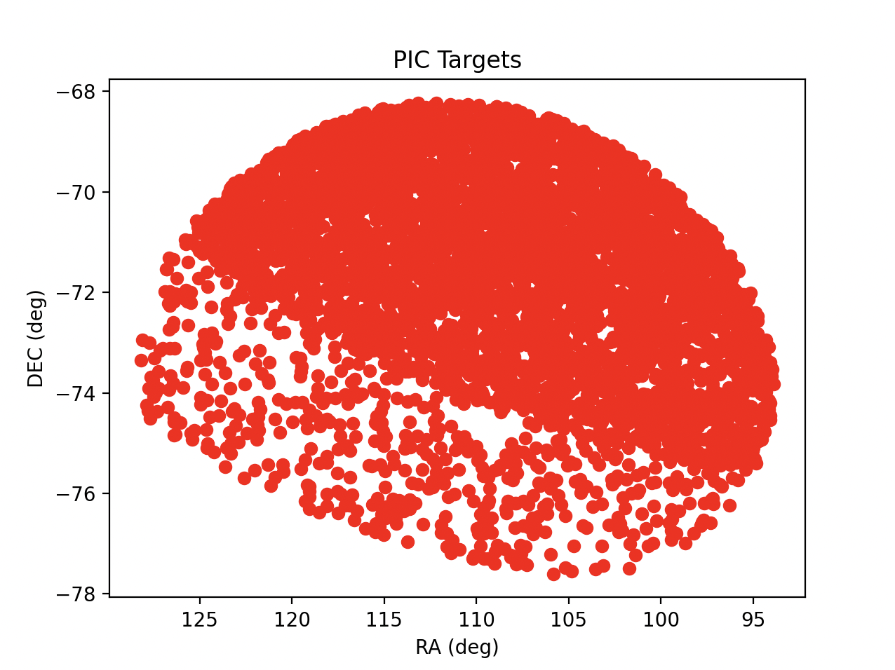
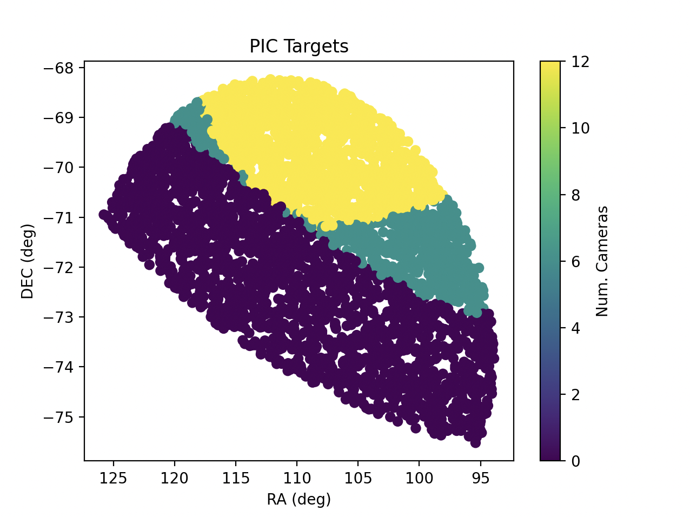

.. _astroquery.esa.plato:

*****************************************
ESA PLATO ArXive (`astroquery.esa.plato`)
*****************************************

The primary goal of PLATO (PLAnetary Transits and Oscillations of stars) is to open a new way in exoplanetary science
by detecting terrestrial exoplanets and characterising their bulk properties, including planets in the habitable zone
of Sun-like stars. PLATO will provide the key information (planet radii, mean densities, stellar irradiation,
and architecture of planetary systems) needed to determine the habitability of these unexpectedly diverse new worlds.
PLATO will answer the profound and captivating question: how common are worlds like ours and are they suitable for
the development of life?

Understanding planet habitability is a true multi-disciplinary endeavour. It requires knowledge of the planetary composition, to distinguish terrestrial planets from non-habitable gaseous mini-Neptunes, and of the atmospheric properties of planets.

PLATO will be leading this effort by combining:

+ planet detection and radii determination from photometric transits of planets in orbit around bright stars (V < 11),
+ determination of planet masses from ground-based radial velocity follow-up,
+ determination of accurate stellar masses, radii, and ages from asteroseismology, and
+ identification of bright targets for atmospheric spectroscopy.

The mission will characterise hundreds of rocky (including Earth twins), icy or giant planets by providing exquisite measurements of their radii (3 per cent precision), masses (better than 10 per cent precision) and ages (10 per cent precision). This will revolutionise our understanding of planet formation and the evolution of planetary systems.

PLATO will assemble the first catalogue of confirmed and characterised planets with known mean densities, compositions, and evolutionary ages/stages, including planets in the habitable zone of their host stars.

========
Examples
========

---------------
1. Login/Logout
---------------
Authentication is mandatory and is managed through the ``login()`` and ``logout()`` methods provided by the
PLATO Astroquery module.

.. doctest-remote-data::

  >>> from astroquery.esa.plato import PlatoClass
  >>> plato = PlatoClass()
  >>> plato.login() # doctest: +SKIP

  >>> plato.logout() # doctest: +SKIP

-----------------------------------
2. Get available tables and columns
-----------------------------------

PLATO Astroquery module allows users to explore the data structure of the TAP by listing available
tables and their columns. This is useful for understanding what data is accessible before running ADQL queries.

  >>> from astroquery.esa.plato import PlatoClass
  >>> plato = PlatoClass() # doctest: +SKIP
  >>> tables = plato.get_tables() # doctest: +SKIP

  >>> pic_target_table = plato.get_table(table='pic_go.pic_target_go') # doctest: +SKIP
  >>> pic_target_table.columns # doctest: +SKIP

----------------------------
3. ADQL Queries to PLATO TAP
----------------------------

The Query TAP functionality facilitates the execution of custom Table Access Protocol (TAP)
queries within the PLATO Science Legacy Archive. Results can be exported to a specified
file in the chosen format, and queries may be executed asynchronously.

.. doctest-remote-data::

  >>> from astroquery.esa.plato import PlatoClass
  >>> plato = PlatoClass()
  >>> plato.query_tap(query='select top 10 * from pic_go.pic_target_go')  # doctest: +SKIP
  <Table length=10>
     active_end_date       active_start_date             AG                 AKs          BOLnCameraObsNCAM_T BOLnCameraSatNCAM_T ...       Teff       tPICplanetFlag tPICscientificRanking tPICsourceFlagNCAM_BOL  VmagCalculated
                                                        mag                 mag                                                  ...        K                                                                           mag
          object                 object               float64             float64               int32               int32        ...     float64          int32             float64                int32              float64
  --------------------- ----------------------- ------------------- -------------------- ------------------- ------------------- ... ---------------- -------------- --------------------- ---------------------- ----------------
  9999-12-31T00:00:00.0 2026-02-05T14:04:43.678   0.118511503667862   0.0120064369426608                   0                   0 ... 6452.59731224531              0   0.00155243999324739                      4 12.9647220843443
  9999-12-31T00:00:00.0 2026-02-05T14:04:43.678 0.00319739622600106 0.000328237581132792                   0                   0 ... 6064.09004054152              2                   1.0                     51 7.15333662116065
  9999-12-31T00:00:00.0 2026-02-05T14:04:43.678   0.111406183470082   0.0119884246786291                   0                   0 ... 5257.10774608135              0  0.000892276002559811                      4 12.8432330623606
  9999-12-31T00:00:00.0 2026-02-05T14:04:43.678   0.117671118797919   0.0119420182132897                   0                   0 ... 6411.34274047572              0   0.00129307003226131                      4 12.6943213602032
  9999-12-31T00:00:00.0 2026-02-05T14:04:43.678  0.0744064119219777  0.00795330446071774                   0                   0 ... 5346.43374537458              0   0.00556798977777362                      4 12.5092805516452
  9999-12-31T00:00:00.0 2026-02-05T14:04:43.678   0.113209626327757   0.0114373241732229                   0                   0 ...  6514.1093105968              0   0.00160385004710406                      4 11.0127618006894
  9999-12-31T00:00:00.0 2026-02-05T14:04:43.678   0.111353362349635   0.0114880315158924                   0                   0 ... 6043.85529618795              0   0.00147032004315406                      4 12.5781580076992
  9999-12-31T00:00:00.0 2026-02-05T14:04:43.678  0.0824151366418965  0.00878801296984743                   0                   0 ... 5393.55915574524              0   0.00381073006428778                      4 12.1462587804849
  9999-12-31T00:00:00.0 2026-02-05T14:04:43.678  0.0969782812504503   0.0101950452596672                   0                   0 ... 5659.34012976861              0   0.00299305003136396                      4 12.3844392051627
  9999-12-31T00:00:00.0 2026-02-05T14:04:43.678  0.0910178678646904  0.00945415292450069                   0                   0 ... 5887.63652808232              0   0.00346793001517653                      4 11.7981844049229

-------------------------------------
4. Filtering the PIC Target Catalogue
-------------------------------------

Because the PLATO field is extremely large it is not feasible to download raw data directly. Instead, the spacecraft
generates light curves onboard for all targets. Only a small subset have their imagettes downloaded, which includes
all P1 targets and requires that the full target list be selected in advance.

The minimal content of the PLATO Input Catalog (PIC) includes the positions and basic parameters of the selected
dwarf and sub-giant stars with spectral types later than F5, around which planet transits will be searched for and
followed up. In addition, each target must have an associated table of contaminating sources to support the
optimization of photometric masks and improve exoplanet candidate validation. The PIC also provides parameters
that streamline the validation, confirmation, and follow-up of detected candidates, making these processes
more efficient and cost-effective.

This module contains a specific method to search in the PIC Targets, allowing users to filter for all the columns
available within this table. Together with search by ``target_name`` or ``coordinates`` and ``radius`` (if not defined,
the default radius is 1 arcmin), the catalogue can be filtered across all the columns available. To check the columns
available in this catalogue, the following method can be executed using ``get_metadata=True``:

.. doctest-remote-data::

  >>> from astroquery.esa.plato import PlatoClass
  >>> plato = PlatoClass()
  >>> plato.search_pic_target_go(get_metadata=True)  # doctest: +SKIP
  <Table masked=True length=80>
            Column                                      Description                                 Unit    Data Type  UCD   UType
            str26                                          object                                  object      str6   object object
  ------------------------- ------------------------------------------------------------------- ----------- --------- ------ ------
            active_end_date                                                                None        None      char   None   None
          active_start_date                                                                None        None      char   None   None
                       "AG"                                            Extinction in the G band         mag    double   None   None
                      "AKs"                                           Extinction in the Ks band         mag    double   None   None
      "BOLnCameraObsNCAM_T"      BOL number of NCAM cameras observing the star (Typical values)        None       int   None   None
      "BOLnCameraSatNCAM_T"               BOL number of saturated NCAM cameras (Typical values)        None       int   None   None
       "BOLrandomNSRNCAM_T"                BOL random NSR for NCAM, 24 cameras (Typical values) ppm/sqrt(h)    double   None   None
    "BOLrandomSysNSRNCAM_T"     BOL random+systematic NSR for NCAM, 24 cameras (Typical values) ppm/sqrt(h)    double   None   None
                    "BPmag"                  Corrected mean magnitude in the integrated BP band         mag    double   None   None
                 "caseFlag" Flag indicating basic inputs used to calculate the PLATO magnitudes        None       int   None   None
                        ...                                                                 ...         ...       ...    ...    ...
       "scientificPriority"            SGS PIC scheduling report (on board priority calculated)        None       int   None   None
  "scvPICscientificRanking"                               Scientific ranking for scvPIC targets        None       int   None   None
         "scvPICsourceFlag"      Bitmask indicating to which scvPIC sample an object belongs to        None       int   None   None
                 "StarName"  Star identifier in the catalogue from which the source is selected        None      char   None   None
         "targetStatusFlag"     Bitmask indicating the status of a target (current vs previous)        None       int   None   None
                     "Teff"                                       Stellar effective temperature           K    double   None   None
           "tPICplanetFlag"      Bitmask indicating the presence of confirmed/candidate planets        None       int   None   None
    "tPICscientificRanking"                                 Scientific ranking for tPIC targets        None    double   None   None
   "tPICsourceFlagNCAM_BOL"        Bitmask indicating to which tPIC sample an object belongs to        None       int   None   None
           "VmagCalculated"      Apparent magnitude in the Johnson-Cousin V filter (calculated)         mag    double   None   None

Once the columns of interest have been extracted, it is possible to execute the same function with the following
options, that can be combined to extract the required data:

+ Define the reference target or coordinates where a cone search will be executed.

.. doctest-remote-data::

  >>> from astroquery.esa.plato import PlatoClass
  >>> plato = PlatoClass()
  >>> plato.search_pic_target_go(target_name='Gaia DR3 5262913119040164480') # doctest: +SKIP
  Executed query:SELECT * FROM pic_go.pic_target_go WHERE 1=CONTAINS(POINT('ICRS', RAdeg, DEdeg),CIRCLE('ICRS', 111.43276923, -73.19124693, 0.016666666666666666))
  <Table length=1>
     active_end_date       active_start_date            AG               AKs         BOLnCameraObsNCAM_T BOLnCameraSatNCAM_T ...       Teff       tPICplanetFlag tPICscientificRanking tPICsourceFlagNCAM_BOL  VmagCalculated
                                                       mag               mag                                                 ...        K                                                                           mag
          object                 object              float64           float64              int32               int32        ...     float64          int32             float64                int32              float64
  --------------------- ----------------------- ----------------- ------------------ ------------------- ------------------- ... ---------------- -------------- --------------------- ---------------------- ----------------
  9999-12-31T00:00:00.0 2026-02-05T14:04:43.678 0.190095728139203 0.0201944720119584                   0                   0 ... 5532.92044505408              0   0.00102269998751581                      4 12.7033026175856

+ Retrieve only a specific set of columns.

.. doctest-remote-data::

  >>> from astroquery.esa.plato import PlatoClass
  >>> plato = PlatoClass()
  >>> plato.search_pic_target_go(target_name='Gaia DR3 5262913119040164480', columns=['DEdeg', 'RAdeg', 'PlatoMagNCAM'])  # doctest: +SKIP
  Executed query:SELECT DEdeg, RAdeg, PlatoMagNCAM FROM pic_go.pic_target_go WHERE 1=CONTAINS(POINT('ICRS', RAdeg, DEdeg),CIRCLE('ICRS', 111.43276923445, -73.19124693094, 0.016666666666666666))
  <Table length=1>
        DEdeg            RAdeg         PlatoMagNCAM
         deg              deg              mag
       float64          float64          float64
  ----------------- ---------------- ----------------
  -73.1911625699751 111.432509739341 12.2231114055724

+ Filter by any other column available in the previous method.

.. doctest-remote-data::

  >>> from astroquery.esa.plato import PlatoClass
  >>> plato = PlatoClass()
  >>> plato.search_pic_target_go(target_name='Gaia DR3 5262913119040164480', columns=['DEdeg', 'RAdeg', 'PlatoMagNCAM'], PlatoMagNCAM=('>', 12))  # doctest: +SKIP
  Executed query:SELECT DEdeg, RAdeg, PlatoMagNCAM FROM pic_go.pic_target_go  WHERE PlatoMagNCAM > 12 AND 1=CONTAINS(POINT('ICRS', RAdeg, DEdeg),CIRCLE('ICRS', 111.43276923445, -73.19124693094, 0.016666666666666666))
  <Table length=1>
        DEdeg            RAdeg         PlatoMagNCAM
         deg              deg              mag
       float64          float64          float64
  ----------------- ---------------- ----------------
  -73.1911625699751 111.432509739341 12.2231114055724

As it can be observed in the previous example, the numeric parameter has been defined using a predefined syntaxis.
Some additional examples and their correspondent ADQL transformation executed by this method are provided below:

+ Exact match: ``StarName='star1'`` -> ``StarName = 'star1'``

+ Wildcards with *: ``StarName='star*'`` -> ``StarName ILIKE 'star%'``

+ Wildcartds with %: ``StarName='star%'`` -> ``StarName ILIKE 'star%'``

+ String list: ``StarName=['star1', 'star2']`` -> ``StarName = 'star1' OR StarName = 'star2'``

+ Numeric comparison: ``ra=('>', 30)`` -> ``ra > 30``

+ Filter by numeric interval: ``ra=(20, 30)`` -> ``ra >= 20 AND ra <= 30``

---------------------------------
5. Filtering the PIC Contaminants
---------------------------------
Using this module, astronomical sources located in the vicinity of a target star that may contribute additional flux
within the PIC targets can be identified. The mechanism is analogous to the previous method: ``get_metadata=True`` can
be used to retrieve the list of available columns to be filtered and a search can be executed by target name,
coordinates (default radius is again 1 arcmin, but it can be defined by the user) or any other column available in
the table.

.. doctest-remote-data::

  >>> from astroquery.esa.plato import PlatoClass
  >>> plato = PlatoClass()
  >>> plato.search_pic_contaminant_go(target_name='Gaia DR3 5262913119040164480')  # doctest: +SKIP

By combining the previous commands, it is possible to identify the PIC contaminants associated to each of the targets
in the Plato Input Catalogue. As

  >>> from astroquery.esa.plato import PlatoClass
  >>> plato = PlatoClass()
  >>> pic_targets = plato.search_pic_target_go(coordinates='95.97064 -48.07963', radius=0.1) # doctest: +SKIP
  >>> pic_target_contaminants = {}
  >>> for target in pic_targets:
  ...       pic_name = target["PICname"]
  ...       pic_coordinates = f"{target['RAdeg']} {target['DEdeg']}"
  ...       contaminants = plato.search_pic_contaminant_go(coordinates=pic_coordinates)
  ...       pic_target_contaminants[pic_name] = contaminants # doctest: +SKIP

The parameter ``pic_target_contaminants`` now contains the list of PIC Names (that can be retrieved using
``pic_target_contaminants.keys()``), together with the associated contaminants at a distance of 1 arcmin (a different
radius can be defined when executing the command). Then, for each of the PIC Names, users can retrieve the individual
results for the contaminants using  ``pic_target_contaminants[PIC_Name]``.

------------------
6. Plot PLATO data
------------------
Once the required data has been extracted, it is possible to generate a chart to plot the required data:

  >>> from astroquery.esa.plato import PlatoClass
  >>> plato = PlatoClass()
  >>> results = plato.search_pic_target_go(target_name='Gaia DR3 5262913119040164480', radius=5) # doctest: +SKIP
  Executed query:SELECT * FROM pic_go.pic_target_go WHERE 1=CONTAINS(POINT('ICRS', RAdeg, DEdeg),CIRCLE('ICRS', 111.43276923445, -73.19124693094, 5.0))
  >>> plato.plot_plato_results(x=results['RAdeg'], y=results['DEdeg'], x_label='RA (deg)', y_label='DEC (deg)', plot_title='PIC Targets', color='red') # doctest: +SKIP

A third dimension can be drawn in the previous plot, assigning a value for the Z axis. This will generate the series with
a colormap showing this third list of values. Please bear in mind that the colormap shall be available within Matplotlib
collection.

  >>> from astroquery.esa.plato import PlatoClass
  >>> plato = PlatoClass()
  >>> results = plato.search_pic_target_go(target_name='Gaia DR3 5262913119040164480', radius=5) # doctest: +SKIP
  Executed query:SELECT * FROM pic_go.pic_target_go WHERE 1=CONTAINS(POINT('ICRS', RAdeg, DEdeg),CIRCLE('ICRS', 111.43276923445, -73.19124693094, 5.0))
  >>> plato.plot_plato_results(x=results['RAdeg'], y=results['DEdeg'], z=results['BOLnCameraObsNCAM_T'], x_label='RA (deg)', y_label='DEC (deg)', z_label='Num. Cameras', plot_title='PIC Targets', color='viridis') # doctest: +SKIP

This method also allows to define ``x_error`` and ``y_error`` series, that will be added to the previous plot. As a result of
this method, the ``fig`` and ``ax`` objects from Matplotlib are returned, allowing the user to modify the plot in the desired way or
maybe update the current one, as they can be used as input parameters.

Reference/API
=============

.. automodapi:: astroquery.esa.plato
    :no-inheritance-diagram:
