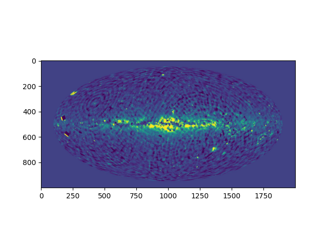
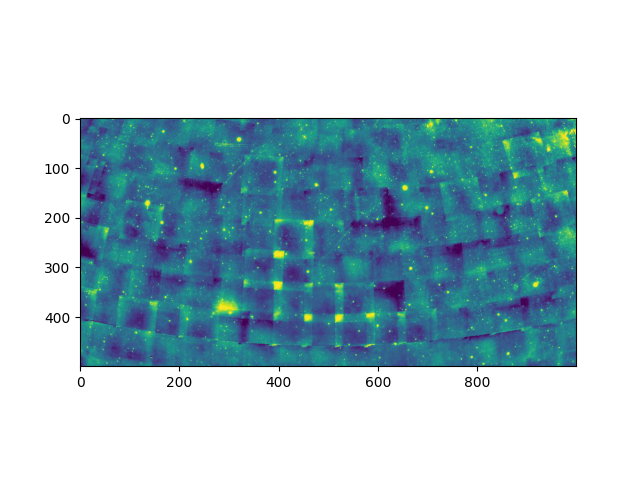

.. doctest-skip-all

.. _astroquery.hips2fits:

******************************************
HiPS2fits Service (`astroquery.hips2fits`)
******************************************

Getting started
===============

Query the `CDS hips2fits service <http://alasky.u-strasbg.fr/hips-image-services/hips2fits>`_

The `CDS hips2fits service <http://alasky.u-strasbg.fr/hips-image-services/hips2fits>`_ offers a way
to extract FITS images from HiPS sky maps. HiPS is an IVOA standard that combines individual images in
order to produce a progressive hierarchical sky map describing the whole survey. Please refer to the 
`IVOA paper <http://www.ivoa.net/documents/HiPS/20170519/REC-HIPS-1.0-20170519.pdf>`_ for more info.

Given an astropy user-defined WCS with a HiPS name,
hips2fits will return you the corresponding FITS image (JPG/PNG output formats are also implemented).

See the list of valid HiPS names hosted in CDS `here <http://aladin.unistra.fr/hips/list>`_. It is also
possible to use :meth:`astroquery.cds.CdsClass.find_datasets` to retrieve the list of HiPSes matching an expression
(e.g. \*HST\* will return the names of the HST surveys HiPSes).

This package implements two methods:

* :meth:`~astroquery.hips2fits.hips2fitsClass.query_with_wcs` extracting a FITS image from a HiPS and an astropy ``wcs.WCS``.
    See `here <http://aladin.unistra.fr/hips/list>`_ all the valid HiPS names hosted in CDS.
* :meth:`~astroquery.hips2fits.hips2fitsClass.query` extracting a FITS image from a HiPS given the output image pixel size, the center of projection, the type of projection and the field of view.
    See `here <http://aladin.unistra.fr/hips/list>`_ all the valid HiPS names hosted in CDS.

Examples
========

With a user defined astropy WCS
~~~~~~~~~~~~~~~~~~~~~~~~~~~~~~~

.. code-block:: python

    >>> from astroquery.hips2fits import hips2fits
    >>> import matplotlib.pyplot as plt
    >>> from matplotlib.colors import Colormap
    >>> from astropy import wcs as astropy_wcs
    >>> # Create a new WCS astropy object
    >>> w = astropy_wcs.WCS(header={
    ...     'NAXIS1': 2000,         # Width of the output fits/image
    ...     'NAXIS2': 1000,         # Height of the output fits/image
    ...     'WCSAXES': 2,           # Number of coordinate axes
    ...     'CRPIX1': 1000.0,       # Pixel coordinate of reference point
    ...     'CRPIX2': 500.0,        # Pixel coordinate of reference point
    ...     'CDELT1': -0.18,        # [deg] Coordinate increment at reference point
    ...     'CDELT2': 0.18,         # [deg] Coordinate increment at reference point
    ...     'CUNIT1': 'deg',        # Units of coordinate increment and value
    ...     'CUNIT2': 'deg',        # Units of coordinate increment and value
    ...     'CTYPE1': 'GLON-MOL',   # galactic longitude, Mollweide's projection
    ...     'CTYPE2': 'GLAT-MOL',   # galactic latitude, Mollweide's projection
    ...     'CRVAL1': 0.0,          # [deg] Coordinate value at reference point
    ...     'CRVAL2': 0.0,          # [deg] Coordinate value at reference point
    ... })
    >>> hips = 'CDS/P/DSS2/red'
    >>> result = hips2fits.query_with_wcs(
    ...    hips=hips,
    ...    wcs=w,
    ...    get_query_payload=False,
    ...    format='jpg',
    ...    min_cut=0.5,
    ...    max_cut=99.5,
    ...    cmap=Colormap('viridis'),
    ... )
    >>> im = plt.imshow(result)
    >>> plt.show(im)

Without WCS
~~~~~~~~~~~

    >>> from astroquery.hips2fits import hips2fits
    >>> import matplotlib.pyplot as plt
    >>> from matplotlib.colors import Colormap
    >>> import astropy.units as u
    >>> from astropy.coordinates import Longitude, Latitude, Angle
    >>> hips = 'CDS/P/DSS2/red'
    >>> result = hips2fits.query(
    ...    hips=hips,
    ...    width=1000,
    ...    height=500,
    ...    ra=Longitude(0 * u.deg),
    ...    dec=Latitude(20 * u.deg),
    ...    fov=Angle(80 * u.deg),
    ...    projection="AIT",
    ...    get_query_payload=False,
    ...    format='jpg',
    ...    min_cut=0.5,
    ...    max_cut=99.5,
    ...    cmap=Colormap('viridis'),
    ... )
    >>> im = plt.imshow(result)
    >>> plt.show(im)

Reference/API
=============

.. automodapi:: astroquery.hips2fits
    :no-inheritance-diagram:

.. _hips2fits: http://alasky.u-strasbg.fr/hips-image-services/hips2fits

