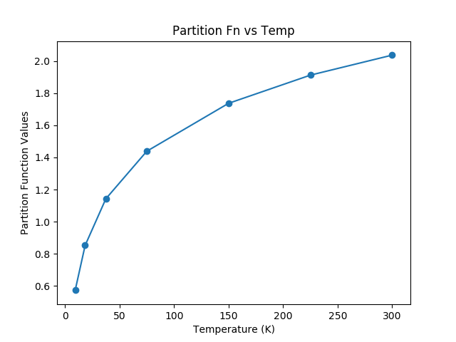
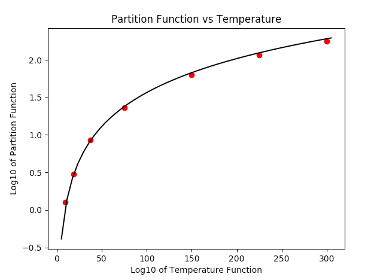

.. doctest-skip-all

.. _astroquery.jplspec:

*********************************************
JPL Spectroscopy Queries (astroquery.jplspec)
*********************************************

Getting Started
===============

The JPLSpec module provides a query interface for `JPL Molecular
Spectroscopy Catalog <https://spec.jpl.nasa.gov/home.html>`_. The
module outputs the results that would arise from the `browser form
<https://spec.jpl.nasa.gov/ftp/pub/catalog/catform.html>`_,
using similar search criteria as the ones found in the form, and presents
the output as a `~astropy.table.Table`.

Examples
========

Querying the catalog
--------------------

The default option to return the query payload is set to false, in the
following examples we have explicitly set it to False and True to show the
what each setting yields:

.. code-block:: python

   >>> from astroquery.jplspec import JPLSpec
   >>> import astropy.units as u
   >>> response = JPLSpec.query_lines(min_frequency=100 * u.GHz,
                                      max_frequency=1000 * u.GHz,
                                      min_strength=-500,
                                      molecule="28001 CO",
                                      max_lines = 7,
                                      get_query_payload=False)
   >>> print(response)
        FREQ     ERR    LGINT   DR   ELO    GUP  TAG   QNFMT QN' QN"
        MHz      MHz   MHz nm2      1 / cm
    ----------- ------ ------- --- -------- --- ------ ----- --- ---
    115271.2018 0.0005 -5.0105   2      0.0   3 -28001   101   1   0
    345795.9899 0.0005 -3.6118   2   11.535   7 -28001   101   3   2
    461040.7682 0.0005 -3.2657   2  23.0695   9 -28001   101   4   3
    576267.9305 0.0005 -3.0118   2  38.4481  11 -28001   101   5   4
    691473.0763 0.0005 -2.8193   2  57.6704  13 -28001   101   6   5
     806651.806  0.005 -2.6716   2  80.7354  15 -28001   101   7   6
       921799.7  0.005  -2.559   2 107.6424  17 -28001   101   8   7

The following example, with ``get_query_payload = True``, returns the payload:

.. code-block:: python

   >>> response = JPLSpec.query_lines(min_frequency=100 * u.GHz,
                                      max_frequency=1000 * u.GHz,
                                      min_strength=-500,
                                      molecule="28001 CO",
                                      max_lines = 7,
                                      get_query_payload=True)
   >>> print(response)
   {'MinNu': 100.0, 'MaxNu': 1000.0, 'Mol': '28001 CO', 'UnitNu': 'GHz',
   'StrLim': -500, 'MaxLines': 7}

The units of the columns of the query can be displayed by calling
``response.info``:

.. code-block:: python

   >>> response = JPLSpec.query_lines(min_frequency=100 * u.GHz,
                                      max_frequency=1000 * u.GHz,
                                      min_strength=-500,
                                      molecule="28001 CO",
                                      max_lines = 7,
                                      get_query_payload=True)
   >>> print(response.info)
      <Table length=7>
      name  dtype    unit
    ----- ------- -------
     FREQ float64     MHz
      ERR float64     MHz
    LGINT float64 MHz nm2
       DR   int64
      ELO float64  1 / cm
      GUP   int64
      TAG   int64
    QNFMT   int64
      QN'   int64
      QN"   int64

These come in handy for converting to other units easily, an example using a
simplified version of the data above is shown below:

.. code-block:: python

   >>> print (response)
       FREQ      ERR     ELO
       MHz       MHz    1 / cm
    ----------- ------- -------
    115271.2018  0.0005     0.0
    345795.9899  0.0005  11.535
    461040.7682  0.0005 23.0695
   >>> response['FREQ'].quantity
   <Quantity [115271.2018,345795.9899,461040.7682] MHz>
   >>> response['FREQ'].to('GHz')
   <Quantity [115.2712018,345.7959899,461.0407682] GHz>

The parameters and response keys are described in detail under the
Reference/API section.

Looking Up More Information from the catdir.cat file
------------------------------------------------------

If you have found a molecule you are interested in, the TAG field
in the results provides enough information to access specific
molecule information such as the partition functions at different
temperatures. Keep in mind that a negative TAG value signifies that
the line frequency has been measured in the laboratory

.. code-block:: python

   >>> import matplotlib.pyplot as plt
   >>> from astroquery.jplspec import JPLSpec
   >>> result = JPLSpec.get_species_table()
   >>> mol = result[result['TAG'] == 28001] #do not include signs of TAG for this
   >>> print(mol)
   TAG   NAME NLINE  QLOG1   QLOG2  ...  QLOG5   QLOG6   QLOG7  VER
   int64 str13 int64 float64 float64 ... float64 float64 float64 str2
   ----- ----- ----- ------- ------- ... ------- ------- ------- ----
   28001    CO    91  2.0369  1.9123 ...  1.1429  0.8526  0.5733   4*

You can also access the temperature of the partition function
through metadata:

.. code-block:: python

   >>> result['QLOG2'].meta
   {'Temperature (K)' : 225}
   >>> result.meta
   {'Temperature (K)': [300, 225, 150, 75, 37.5, 18.5,
                        9.375]}

One of the advantages of using JPLSpec is the availability in the catalog
of the partition function at different temperatures for the molecules. As a
continuation of the example above, an example that accesses and plots the
partition function against the temperatures found in the metadata is shown
below:

.. code-block:: python

   >>> temp = result.meta['Temperature (K)']
   >>> part = list(mol['QLOG1','QLOG2','QLOG3', 'QLOG4', 'QLOG5','QLOG6',
                       'QLOG7'][0])
   >>> plt.scatter(temp,part)
   >>> plt.xlabel('Temperature (K)')
   >>> plt.ylabel('Partition Function Value')
   >>> plt.title('Parititon Fn vs Temp')
   >>> plt.show()

   The resulting plot from the example above

For non-linear molecules like H2O, curve fitting methods can be used to
calculate production rates at different temperatures with the proportionality:
``a*T**(3./2.)``. Calling the process above for the H2O molecule (instead of
for the CO molecule) we can continue to determine the partition function at
other temperatures using curve fitting models:

.. code-block:: python

   >>> from scipy.optimize import curve_fit
   >>> def f(T,a):
           return np.log10(a*T**(1.5))
   >>> param, cov = curve_fit(f,temp,part)
   >>> print(param)
       array([0.03676998])
   >>> x = np.linspace(5,305)
   >>> y = f(x,0.03676998)
   >>> plt.scatter(temp,part,c='r')
   >>> plt.plot(x,y,'k')
   >>> plt.title('Partition Function vs Temperature')
   >>> plt.xlabel('Log10 of Temperature Function')
   >>> plt.ylabel('Log10 of Partition Function')
   >>> plt.show()

   The resulting plot from the example above

Querying the Catalog with Regexes and Relative names
----------------------------------------------------

Although you could print the species table and see what molecules you're
interested in, maybe you just want a general search of any H2O molecule,
or maybe you want a specific range of H2O molecules in your result. This
module allows you to enter a regular expression or string as a parameter
by adding the parameter ``parse_name_locally = True`` and returns the results
that the regex matched with by parsing through the local catalog file. It is
recommended that if you are using just the corresponding molecule number found
in the JPL query catalog or a string with the exact name found in the catalog,
that you do not set the local parse parameter since the module will be able
to query these directly.

.. code-block:: python

   >>> from astroquery.jplspec import JPLSpec
   >>> import astropy.units as u
   >>> response = JPLSpec.query_lines_async(min_frequency=100 * u.GHz,
                                            max_frequency=1000 * u.GHz,
                                            min_strength=-500,
                                            molecule="H2O",
                                            parse_name_locally=True)

Searches like these can lead to very broad queries. Since the table yields
extensive results, we will only show a dictionary of the tags that
went into the payload to create a response:

.. code-block:: python

    >>> {'CH2OO': 46014,
        'H2O': 18003,
        'H2O v2,2v2,v': 18005,
        'H2O-17': 19003,
        'H2O-18': 20003,
        'H2O2': 34004,
        'HCCCH2OD': 57003,
        'HCCCH2OH': 56010,
        'HCOCH2OH': 60006,
        'NH2CH2CH2OH': 61004}

As you can see, the 'H2O' string was processed as a regular expression,
and the search matched any molecule that contained the combination of
characters 'H20'.

A few examples that show the power of the regex option are the following:

.. code-block:: python

   >>> response = JPLSpec.query_lines_async(min_frequency=100 * u.GHz,
                                            max_frequency=1000 * u.GHz,
                                            min_strength=-500,
                                            molecule="H2O$",
                                            parse_name_locally=True)

The response:

.. code-block:: python

   >>> {'H2O': 18003}

As seen above, the regular expression "H2O$" yields only an exact match because
the special character $ matches the end of the line. This functionality allows
you to be as specific or vague as you want to allow the results to be:

.. code-block:: python

   >>> from astroquery.jplspec import JPLSpec
   >>> import astropy.units as u
   >>> response = JPLSpec.query_lines_async(min_frequency=100 * u.GHz,
                                            max_frequency=1000 * u.GHz,
                                            min_strength=-500,
                                            molecule="^H.O$",
                                            parse_name_locally=True)

This pattern matches any word that starts with an H, ends with an O, and
contains any character in between, it results in the following molecules
being queried:

   >>> {'H2O': 18003,
       'HDO': 19002
       'HCO': 29004
       'HNO': 31005 }

Another example of the functionality of this option is the option to obtain
results from a molecule and its isotopes, in this case H2O and HDO:

.. code-block:: python

   >>> from astroquery.jplspec import JPLSpec
   >>> import astropy.units as u
   >>> response = JPLSpec.query_lines_async(min_frequency=100 * u.GHz,
                                            max_frequency=1000 * u.GHz,
                                            min_strength=-500,
                                            molecule="^H[2D]O(-\d\d|)$",
                                            parse_name_locally=True)

This pattern matches any H2O and HDO isotopes and it results in the following
molecules being part of the payload:

   >>> {'H2O': 18003,
       'H2O-17': 19003,
       'H2O-18': 20003,
       'HDO': 19002,
       'HDO-18': 21001}

Remember to print your response to see the table of your results.

Reference/API
=============

.. automodapi:: astroquery.jplspec
    :no-inheritance-diagram:
