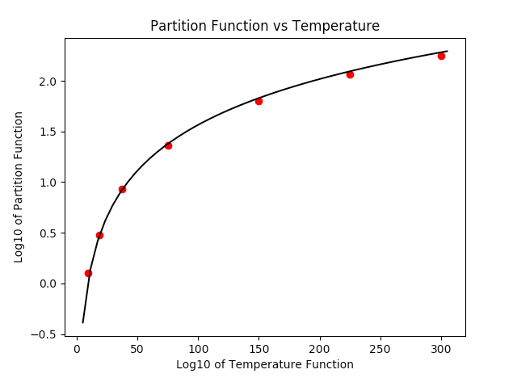

.. _astroquery.linelists.jplspec:

*******************************************************
JPL Spectroscopy Queries (astroquery.linelists.jplspec)
*******************************************************

Getting Started
===============

The JPLSpec module provides a query interface for `JPL Molecular
Spectroscopy Catalog <https://spec.jpl.nasa.gov/home.html>`_. The
module outputs the results that would arise from the `browser form
<https://spec.jpl.nasa.gov/ftp/pub/catalog/catform.html>`_,
using similar search criteria as the ones found in the form, and presents
the output as a `~astropy.table.Table`.

.. warning::
   Starting in mid-2025, the JPL web interface query tool went down for a
   prolonged period.  As of November 2025, it is still not up, but JPL staff are
   aware of and seeking solutions to the problem.  Until that web interface is
   restored, the astroquery.jplspec module relies on workarounds that involve
   downloading the full catalog files, which results in slightly larger data
   transfers and un-filtered full-table results.  Some metadata may also be
   different.  The examples and documents have been updated to show what to
   expect in the current, partially-functional state.

Examples
========

Querying the catalog
--------------------

The default option to return the query payload is set to false, in the
following examples we have explicitly set it to False and True to show the
what each setting yields:

.. doctest-remote-data::

   >>> from astroquery.linelists.jplspec import JPLSpec
   >>> import astropy.units as u
   >>> response = JPLSpec.query_lines(min_frequency=100 * u.GHz,
   ...                                max_frequency=1000 * u.GHz,
   ...                                min_strength=-500,
   ...                                molecule="28001 CO",
   ...                                get_query_payload=False)
   >>> response.pprint(max_lines=10)
       FREQ      ERR    LGINT    DR    ELO     GUP  TAG  QNFMT QN' QN"  Lab 
       MHz       MHz   nm2 MHz        1 / cm                                
   ------------ ------ -------- --- ---------- --- ----- ----- --- --- -----
    115271.2018 0.0005  -5.0105   2        0.0   3 28001   101   1   0  True
       230538.0 0.0005  -4.1197   2      3.845   5 28001   101   2   1  True
            ...    ...      ... ...        ... ...   ...   ... ... ...   ...
   9747448.9491 3.0112 -31.6588   2  14684.516 179 28001   101  89  88 False
   9845408.2504 3.1938 -32.4351   2 15009.6559 181 28001   101  90  89 False
   9942985.9145 3.3849 -33.2361   2 15338.0634 183 28001   101  91  90 False
   Length = 91 rows
   >>> response.meta
   {'TAG': 28001, 'NAME': 'CO', 'NLINE': 91, 'QLOG1': 2.0369, 'QLOG2': 1.9123, 'QLOG3': 1.737, 'QLOG4': 1.4386, 'QLOG5': 1.1429, 'QLOG6': 0.8526, 'QLOG7': 0.5733, 'VER': '4*', 'molecule_id': '28001 CO', 'molecule_name': {}}

The following example, with ``get_query_payload = True``, returns the payload:

.. doctest-remote-data::

   >>> response = JPLSpec.query_lines(min_frequency=100 * u.GHz,
   ...                                   max_frequency=1000 * u.GHz,
   ...                                   min_strength=-500,
   ...                                   molecule="28001 CO",
   ...                                   get_query_payload=True)
   >>> print(response)
   [('MinNu', 100.0), ('MaxNu', 1000.0), ('MaxLines', 2000), ('UnitNu', 'GHz'), ('StrLim', -500), ('Mol', '28001 CO')]

The units of the columns of the query can be displayed by calling
``response.info``:

.. doctest-remote-data::

   >>> response = JPLSpec.query_lines(min_frequency=100 * u.GHz,
   ...                                max_frequency=1000 * u.GHz,
   ...                                min_strength=-500,
   ...                                molecule="28001 CO")
   >>> print(response.info)
   <Table length=91>
    name  dtype    unit 
   ----- ------- -------
    FREQ float64     MHz
     ERR float64     MHz
   LGINT float64 nm2 MHz
      DR   int64        
     ELO float64  1 / cm
     GUP   int64        
     TAG   int64        
   QNFMT   int64        
     QN'   int64        
     QN"   int64        
     Lab    bool        
   <BLANKLINE>

These come in handy for converting to other units easily, an example using a
simplified version of the data above is shown below:

.. doctest-remote-data::

   >>> response['FREQ', 'ERR', 'ELO'].pprint(max_lines=10)
       FREQ      ERR      ELO    
       MHz       MHz     1 / cm  
   ------------ ------ ----------
    115271.2018 0.0005        0.0
       230538.0 0.0005      3.845
            ...    ...        ...
   9747448.9491 3.0112  14684.516
   9845408.2504 3.1938 15009.6559
   9942985.9145 3.3849 15338.0634
   Length = 91 rows
   >>> response['FREQ'][:10].quantity
   <Quantity [ 115271.2018,  230538.    ,  345795.9899,  461040.7682,
               576267.9305,  691473.0763,  806651.806 ,  921799.7   ,
              1036912.393 , 1151985.452 ] MHz>
   >>> response['FREQ'][:10].to('GHz')
   <Quantity [ 115.2712018,  230.538    ,  345.7959899,  461.0407682,
               576.2679305,  691.4730763,  806.651806 ,  921.7997   ,
              1036.912393 , 1151.985452 ] GHz>

The parameters and response keys are described in detail under the
Reference/API section.

Looking Up More Information from the catdir.cat file
----------------------------------------------------

If you have found a molecule you are interested in, the TAG field in the results
provides enough information to access specific molecule information such as the
partition functions at different temperatures. A negative TAG value signifies
that the line frequency has been measured in the laboratory.

.. doctest-remote-data::

   >>> import matplotlib.pyplot as plt
   >>> from astroquery.linelists.jplspec import JPLSpec
   >>> result = JPLSpec.get_species_table()
   >>> mol = result[result['TAG'] == 28001] #do not include signs of TAG for this
   >>> print(mol)
    TAG  NAME NLINE QLOG1  QLOG2  QLOG3 QLOG4  QLOG5  QLOG6  QLOG7  VER
   ----- ---- ----- ------ ------ ----- ------ ------ ------ ------ ---
   28001   CO    91 2.0369 1.9123 1.737 1.4386 1.1429 0.8526 0.5733  4*

You can also access the temperature of the partition function
through metadata:

.. doctest-remote-data::

   >>> result['QLOG2'].meta
   {'Temperature (K)': 225}
   >>> result.meta
   {'Temperature (K)': [300, 225, 150, 75, 37.5, 18.5,
                        9.375]}

JPLSpec catalogs the partition function at several temperatures for each
molecule.  This example accesses and plots the partition function against the
temperatures found in the metadata:

.. doctest-skip::

   >>> temp = result.meta['Temperature (K)']
   >>> part = list(mol['QLOG1','QLOG2','QLOG3', 'QLOG4', 'QLOG5','QLOG6',
   ...                 'QLOG7'][0])
   >>> plt.scatter(temp,part)
   >>> plt.xlabel('Temperature (K)')
   >>> plt.ylabel('Partition Function Value')
   >>> plt.title('Partition Fn vs Temp')
   >>> plt.show()

.. figure:: images/docplot_jplspec.png
   :scale: 50%
   :alt: Plot of Partition Function vs Temperature

   The resulting plot from the example above

For non-linear molecules like H2O, curve fitting methods can be used to
calculate production rates at different temperatures with the proportionality:
``a*T**(3./2.)``. Calling the process above for the H2O molecule (instead of
for the CO molecule) we can continue to determine the partition function at
other temperatures using curve fitting models:

.. doctest-skip::

   >>> from scipy.optimize import curve_fit
   >>> def f(T,a):
           return np.log10(a*T**(1.5))
   >>> param, cov = curve_fit(f,temp,part)
   >>> print(param)
   # array([0.03676998])
   >>> x = np.linspace(5,305)
   >>> y = f(x,0.03676998)
   >>> plt.scatter(temp,part,c='r')
   >>> plt.plot(x,y,'k')
   >>> plt.title('Partition Function vs Temperature')
   >>> plt.xlabel('Temperature')
   >>> plt.ylabel('Log10 of Partition Function')
   >>> plt.show()

   The resulting plot from the example above

Retrieving Complete Molecule Catalogs
-------------------------------------

If you need all spectral lines for a specific molecule without filtering by
frequency range or strength, you can use the ``get_molecule`` method. This
method retrieves the complete catalog file for a given molecule.  Starting in
2025, during a prolonged outage of the JPL web query tool, this is the only way
to retrieve data from JPLSpec via astroquery.

.. doctest-remote-data::

   >>> from astroquery.linelists.jplspec import JPLSpec
   >>> # Retrieve all lines for CO (molecule tag 28001)
   >>> table = JPLSpec.get_molecule(28001)
   >>> print(f"Retrieved {len(table)} lines for CO")
   Retrieved 91 lines for CO
   >>> table[:5].pprint()
       FREQ     ERR    LGINT   DR   ELO   GUP  TAG  QNFMT QN' QN" Lab 
       MHz      MHz   nm2 MHz      1 / cm                             
   ----------- ------ ------- --- ------- --- ----- ----- --- --- ----
   115271.2018 0.0005 -5.0105   2     0.0   3 28001   101   1   0 True
      230538.0 0.0005 -4.1197   2   3.845   5 28001   101   2   1 True
   345795.9899 0.0005 -3.6118   2  11.535   7 28001   101   3   2 True
   461040.7682 0.0005 -3.2657   2 23.0695   9 28001   101   4   3 True
   576267.9305 0.0005 -3.0118   2 38.4481  11 28001   101   5   4 True

The ``get_molecule`` method accepts either an integer or a zero-padded
6-character string as the molecule identifier:

.. doctest-remote-data::

   >>> # These are equivalent
   >>> table1 = JPLSpec.get_molecule(18003)      # H2O as integer
   >>> table2 = JPLSpec.get_molecule('018003')   # H2O as string
   >>> len(table1) == len(table2)
   True

.. _regex_querying_linelists:

Querying the Catalog with Regexes and Relative names
----------------------------------------------------

Although you could print the species table and see what molecules you're
interested in, maybe you just want a general search of any H2O molecule,
or maybe you want a specific range of H2O molecules in your result. This
module allows you to enter a regular expression or string as a parameter
by adding the parameter ``parse_name_locally = True`` and returns the results
that the regex matched with by parsing through the local catalog file. It is
recommended that if you are using just the corresponding molecule number found
in the JPL query catalog or a string with the exact name found in the catalog,
that you do not set the local parse parameter since the module will be able
to query these directly.

.. doctest-remote-data::

   >>> from astroquery.linelists.jplspec import JPLSpec
   >>> import astropy.units as u
   >>> result = JPLSpec.query_lines(min_frequency=100 * u.GHz,
   ...                              max_frequency=1000 * u.GHz,
   ...                              min_strength=-500,
   ...                              molecule="H2O",
   ...                              parse_name_locally=True)
   >>> result.pprint(max_lines=10)
       FREQ      ERR    LGINT    DR    ELO    GUP  TAG  QNFMT QN'1 QN"1 QN'2 QN"2 QN'3 QN"3 QN'4 QN"4  Lab 
       MHz       MHz   nm2 MHz        1 / cm                                                               
   ------------ ------ -------- --- --------- --- ----- ----- ---- ---- ---- ---- ---- ---- ---- ---- -----
      8006.5805  2.851 -18.6204   3 6219.6192  45 18003  1404   22   21    4    7   18   15    0    0 False
     12478.2535 0.2051 -13.1006   3 3623.7652  31 18003  1404   15   16    7    4    9   12    0    0 False
            ...    ...      ... ...       ... ...   ...   ...  ...  ...  ...  ...  ...  ...  ...  ...   ...
    9981215.769 6.1776 -12.0101   3 5271.3682  45 18003  1404   22   23    2    1   20   23    0    0 False
   9981323.7676 6.1773 -11.5329   3 5271.3682 135 18003  1404   22   23    3    0   20   23    0    0 False
   9992065.9213 0.0482   -5.528   3  882.8904  15 18003  1404    7    8    6    1    2    7    0    0 False
   Length = 1376 rows

Searches like these can lead to very broad queries, and may be limited in
response length:

.. doctest-remote-data::

   >>> # the 'comments' metadata field is only populated if the query tool is run
   >>> # the get-whole-table workaround (November 2025) will not populate it
   >>> print(result.meta['comments'])   # doctest:  +SKIP
   ['', '', '', '', '', 'form is currently limilted to 2000 lines. Please limit your search.']

Inspecting the returned molecules shows that the 'H2O' string was processed as a
regular expression, and the search matched any molecule that contained the
combination of characters 'H2O':

.. doctest-remote-data::

   >>> tags = set(abs(result['TAG']))  # discard negative signs
   >>> species = {species: tag
   ...            for (species, tag) in JPLSpec.lookup_ids.items()
   ...            if tag in tags}
   >>> print(species)
   {'H2O': 18003}

A few examples that show the power of the regex option are the following:

.. doctest-remote-data::

   >>> result = JPLSpec.query_lines(min_frequency=100 * u.GHz,
   ...                              max_frequency=1000 * u.GHz,
   ...                              min_strength=-500,
   ...                              molecule="H2O$",
   ...                              parse_name_locally=True)
   >>> tags = set(abs(result['TAG']))  # discard negative signs
   >>> species = {species: tag
   ...            for (species, tag) in JPLSpec.lookup_ids.items()
   ...            if tag in tags}
   >>> print(species)
   {'H2O': 18003}

As seen above, the regular expression "H2O$" yields only an exact match because
the special character $ matches the end of the line. This functionality allows
you to be as specific or vague as you want to allow the results to be:

.. doctest-remote-data::

   >>> result = JPLSpec.query_lines(min_frequency=100 * u.GHz,
   ...                              max_frequency=1000 * u.GHz,
   ...                              min_strength=-500,
   ...                              molecule="^H.O$",
   ...                              parse_name_locally=True)
   >>> tags = set(abs(result['TAG']))  # discard negative signs
   >>> species = {species: tag
   ...            for (species, tag) in JPLSpec.lookup_ids.items()
   ...            if tag in tags}
   >>> print(species)
   {'H2O': 18003, 'HDO': 19002, 'HCO': 29004, 'HNO': 31005}

This pattern matches any word that starts with an H, ends with an O, and
contains any character in between.

Another example of the functionality of this option is the option to obtain
results from a molecule and its isotopes, in this case H2O and HDO:

.. doctest-remote-data::

   >>> result = JPLSpec.query_lines(min_frequency=100 * u.GHz,
   ...                              max_frequency=1000 * u.GHz,
   ...                              min_strength=-500,
   ...                              molecule=r"^H[2D]O(-\d\d|)$",
   ...                              parse_name_locally=True)
   >>> tags = set(abs(result['TAG']))  # discard negative signs
   >>> species = {species: tag
   ...            for (species, tag) in JPLSpec.lookup_ids.items()
   ...            if tag in tags}
   >>> print(species)
   {'H2O': 18003, 'HDO': 19002, 'H2O-17': 19003, 'H2O-18': 20003, 'HDO-18': 21001}

This pattern matches any H2O and HDO isotopes.

Troubleshooting
===============

If you are repeatedly getting failed queries, or bad/out-of-date results, try clearing your cache:

.. code-block:: python

    >>> from astroquery.linelists.jplspec import JPLSpec
    >>> JPLSpec.clear_cache()

If this function is unavailable, upgrade your version of astroquery. 
The ``clear_cache`` function was introduced in version 0.4.7.dev8479.

Reference/API
=============

.. automodapi:: astroquery.linelists.jplspec
    :no-inheritance-diagram:
