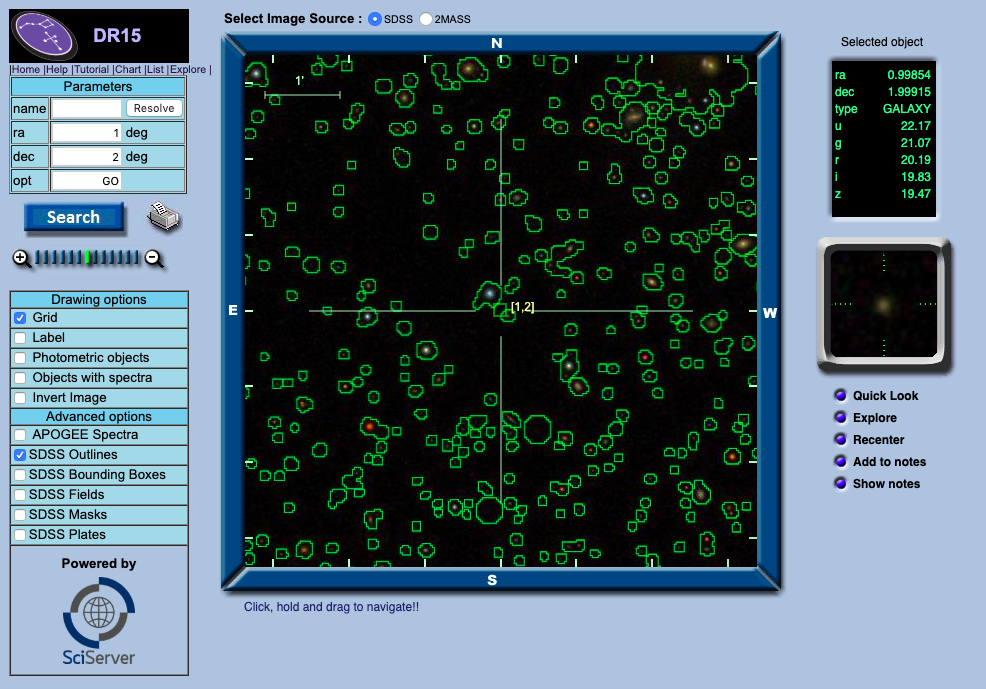
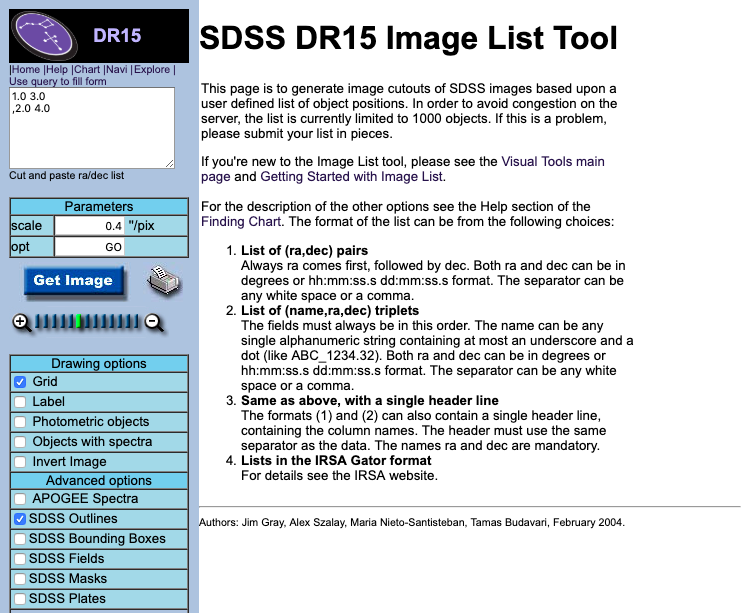
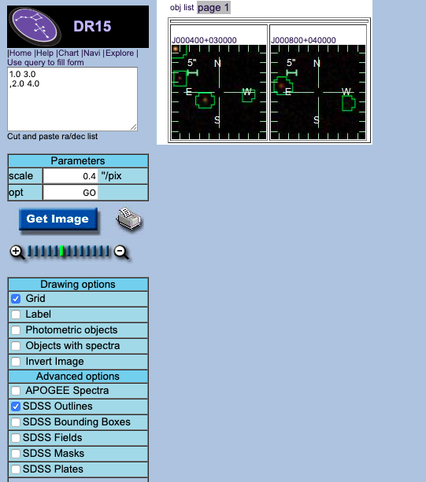

.. doctest-skip-all

.. _astroquery.sdss:

********************************
SDSS Queries (`astroquery.sdss`)
********************************

Getting started
===============

This example shows how to perform an object cross-ID with SDSS. We'll start
with the position of a source found in another survey, and search within a 5
arcsecond radius for optical counterparts in SDSS. Note use of the keyword
argument spectro, which requires matches to have spectroscopy, not just
photometry:

.. code-block:: python

    >>> from astroquery.sdss import SDSS
    >>> from astropy import coordinates as coords
    >>> pos = coords.SkyCoord('0h8m05.63s +14d50m23.3s', frame='icrs')
    >>> xid = SDSS.query_region(pos, spectro=True)
    >>> print(xid)
        ra         dec           objid        run  rerun camcol field    z    plate  mjd  fiberID     specobjid      specClass
    ---------- ----------- ------------------ ---- ----- ------ ----- ------- ----- ----- ------- ------------------ ---------
    2.02344483 14.83982059 587727221951234166 1739    40      3   315 0.04541   751 52251     160 211612124516974592         3

The result is an astropy.Table.

Downloading data
================
If we'd like to download spectra and/or images for our match, we have all
the information we need in the elements of "xid" from the above example.

.. code-block:: python

    >>> sp = SDSS.get_spectra(matches=xid)
    >>> im = SDSS.get_images(matches=xid, band='g')

The variables "sp" and "im" are lists of `~astropy.io.fits.HDUList` objects, one entry for
each corresponding object in xid.

Note that in SDSS, image downloads retrieve the entire plate, so further
processing will be required to excise an image centered around the point of
interest (*i.e.*, the object(s) returned by
`~astroquery.sdss.SDSSClass.query_region`).

Spectral templates
==================

.. warning::

    These templates are from the SDSS-I/II spectroscopic pipeline
    (DR7 and earlier). SDSS-III/IV (DR8 and later) spectroscopic processing
    pipelines use different templates.

It is also possible to download spectral templates from SDSS. To see what is
available, do

.. code-block:: python

    >>> from astroquery.sdss import SDSS
    >>> print(SDSS.AVAILABLE_TEMPLATES)

Then, to download your favorite template, do something like

.. code-block:: python

    >>> template = SDSS.get_spectral_template('qso')

The variable "template" is a list of `~astropy.io.fits.HDUList` objects
(same object as "sp" in the above example). In this case there is only one
result, but in a few cases there are multiple templates available to choose
from (*e.g.*, the "galaxy" spectral template will actually return 3 templates).

Image cutout query tools
========================
There is a pair of image cutout query tools the user can use to access the
SDSS "navigate" interface and "image list" interface with the ease of a few
command lines. So the first of these cases can be accessed by, for examnple,
something like 

.. code-block:: python

    >>> from astropy.coordinates import SkyCoord
    >>> from astropy import units as u
    >>> from astroquery.sdss import SDSS
    >>> sc = SkyCoord(1*u.deg, 2*u.deg)
    >>> SDSS.view_in_sdss_navigate(sc)

This will take the user to a new web browser tab in the SDSS "navigate" interface
at `http://skyserver.sdss.org/dr15/en/tools/chart/navi.aspx?ra=1&dec=2&opt=GO <http://skyserver.sdss.org/dr15/en/tools/chart/navi.aspx?ra=1&dec=2&opt=GO>`_.
So the new screen would look like the following:

On the other hand, the second tool can be used with the following:

.. code-block:: python

    >>> scs = SkyCoord([1, 2]*u.deg, [3,4]*u.deg)
    >>> SDSS.view_in_sdss_imagelist(scs)

This will then shows the user the "image list" tool at 
`http://skyserver.sdss.org/dr15/en/tools/chart/listinfo.aspx <http://skyserver.sdss.org/dr15/en/tools/chart/listinfo.aspx>`_. Upon pressing the "Get image" button on the left panel, the desired images would then pops up on the right panel. Some example screenshots are as follows:

After pressing "Get image" this is what you would get:

Reference/API
=============

.. automodapi:: astroquery.sdss
    :no-inheritance-diagram:
