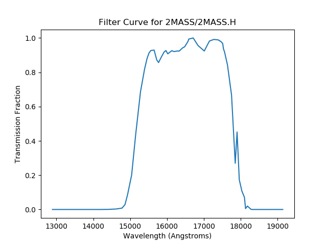

.. doctest-skip-all

.. _astroquery.svo_fps:

**********************************************************
SVO Filter Profile Service Queries (`astroquery.svo_fps`)
**********************************************************

Getting started
===============

This is a python interface for querying the Spanish Virtual Observatory's
Filter Profile Service (`SVO FPS <http://svo2.cab.inta-csic.es/theory/fps/>`_).
It allows to fetch filter data (index, transmission data, filter list, etc.)
from the service, as astropy tables.

Get index (master list) of all Filters
---------------------------------------

The filter index (all available filters with their properties) can be listed as:

.. code-block:: python

    >>> from astroquery.svo_fps import SvoFps
    >>> index = SvoFps.get_filter_index()
    >>> index.info
    <Table masked=True length=5139>
            name          dtype  unit
    -------------------- ------- ----
    FilterProfileService  object     
                filterID  object     
        WavelengthUnit  object     
        WavelengthUCD  object     
            PhotSystem  object     
            DetectorType  object     
                    Band  object     
            Instrument  object     
                Facility  object     
        ProfileReference  object     
    CalibrationReference  object     
            Description  object     
                Comments  object     
        WavelengthMean float32   AA
        WavelengthEff float32   AA
        WavelengthMin float32   AA
        WavelengthMax float32   AA
                WidthEff float32   AA
        WavelengthCen float32   AA
        WavelengthPivot float32   AA
        WavelengthPeak float32   AA
        WavelengthPhot float32   AA
                    FWHM float32   AA
            PhotCalID  object     
                MagSys  object     
            ZeroPoint float32   Jy
        ZeroPointUnit  object     
                    Mag0 float32     
        ZeroPointType  object     
            AsinhSoft float32     
        TrasmissionCurve  object     

Get transmission data for a specific Filter
-------------------------------------------

If you know the filterID of the filter, for which you wish to retrieve
transmission data, use this:

.. code-block:: python

    >>> data = SvoFps.get_transmission_data('2MASS/2MASS.H')
    >>> print(data)
    Wavelength Transmission
        AA                 
    ---------- ------------
    12890.0          0.0
    13150.0          0.0
    13410.0          0.0
    13680.0          0.0
    13970.0          0.0
    14180.0          0.0
    14400.0       0.0005
    14620.0       0.0028
    14780.0       0.0081
    14860.0       0.0287
        ...          ...
    18030.0       0.1077
    18100.0       0.0707
    18130.0       0.0051
    18180.0         0.02
    18280.0       0.0004
    18350.0          0.0
    18500.0        1e-04
    18710.0          0.0
    18930.0          0.0
    19140.0          0.0
    Length = 58 rows

This is the data that you will require to plot the transmission curve for filter
(or simply, filter curve):

.. code-block:: python

    >>> import matplotlib.pyplot as plt
    >>> plt.plot(data['Wavelength'], data['Transmission'])
    >>> plt.xlabel('Wavelength (Angstrong)')
    >>> plt.ylabel('Transmission [1]')
    >>> plt.title('Filter Curve for 2MASS/2MASS.H')
    >>> plt.show()

   The resulting plot from the example above

Get list of Filters under a specified Facilty and Instrument
-------------------------------------------------------------

This can be used to get all Filters for an arbitrary combination of Facility &
Instrument (Instrument is optional to specify).

.. code-block:: python

    >>> filter_list = SvoFps.get_filter_list('Keck', 'NIRC2')
    >>> filter_list.info

    <Table masked=True length=11>
            name          dtype  unit
    -------------------- ------- ----
    FilterProfileService  object     
                filterID  object     
        WavelengthUnit  object     
        WavelengthUCD  object     
            PhotSystem  object     
            DetectorType  object     
                    Band  object     
            Instrument  object     
                Facility  object     
        ProfileReference  object     
    CalibrationReference  object     
            Description  object     
                Comments  object     
        WavelengthMean float32   AA
        WavelengthEff float32   AA
        WavelengthMin float32   AA
        WavelengthMax float32   AA
                WidthEff float32   AA
        WavelengthCen float32   AA
        WavelengthPivot float32   AA
        WavelengthPeak float32   AA
        WavelengthPhot float32   AA
                    FWHM float32   AA
            PhotCalID  object     
                MagSys  object     
            ZeroPoint float32   Jy
        ZeroPointUnit  object     
                    Mag0 float32     
        ZeroPointType  object     
            AsinhSoft float32     
        TrasmissionCurve  object 

Reference/API
=============

.. automodapi:: astroquery.svo_fps
    :no-inheritance-diagram:
