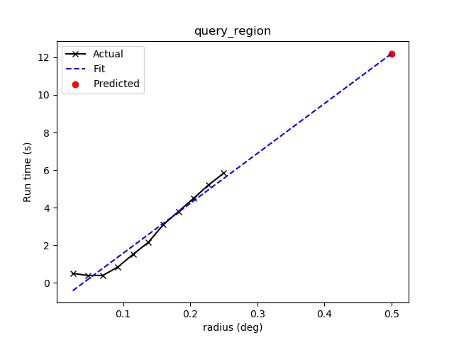
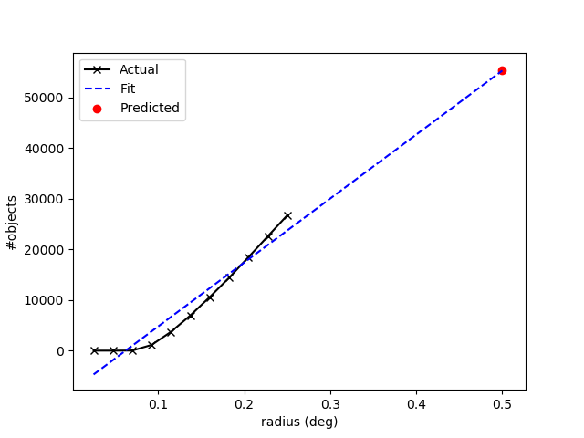

.. doctest-skip-all

Using "Client" API
==================

The "client" API contains modules supporting VO Cone Search's client-side
operations.

.. _vo-sec-client-cat-manip:

Catalog Manipulation
--------------------

You can manipulate a VO catalog using
`~astroquery.vo_conesearch.vos_catalog.VOSCatalog`,
which is basically a dictionary with added functionalities.

.. _vo-sec-client-cat-manip-examples:

Examples
^^^^^^^^

You can create a VO catalog from scratch with your own VO service by
providing its title and access URL, and optionally any other metadata
as key-value pairs:

>>> from astroquery.vo_conesearch.vos_catalog import VOSCatalog
>>> my_cat = VOSCatalog.create(
...     'My Own', 'http://ex.org/cgi-bin/cs.pl?',
...     description='My first VO service.', creator='J. Doe', year=2013)
>>> print(my_cat)
title: My Own
url: http://ex.org/cgi-bin/cs.pl?
>>> print(my_cat.dumps())
{
    "creator": "J. Doe",
    "description": "My first VO service.",
    "title": "My Own",
    "url": "http://ex.org/cgi-bin/cs.pl?",
    "year": 2013
}

You can modify and add fields:

>>> my_cat['year'] = 2014
>>> my_cat['new_field'] = 'Hello world'
>>> print(my_cat.dumps())
{
    "creator": "J. Doe",
    "description": "My first VO service.",
    "new_field": "Hello world",
    "title": "My Own",
    "url": "http://ex.org/cgi-bin/cs.pl?",
    "year": 2014
}

In addition, you can also delete an existing field, except the compulsory
title and access URL:

>>> my_cat.delete_attribute('description')
>>> print(my_cat.dumps())
{
    "creator": "J. Doe",
    "new_field": "Hello world",
    "title": "My Own",
    "url": "http://ex.org/cgi-bin/cs.pl?",
    "year": 2014
}

.. _vo-sec-client-db-manip:

Database Manipulation
---------------------

You can manipulate VO database using
`~astroquery.vo_conesearch.vos_catalog.VOSDatabase`,
which is basically a nested dictionary with added functionalities.

.. _vo-sec-client-db-manip-examples:

Examples
^^^^^^^^

You can choose to start with an empty database:

>>> from astroquery.vo_conesearch.vos_catalog import VOSDatabase
>>> my_db = VOSDatabase.create_empty()
>>> print(my_db.dumps())
{
    "__version__": 1,
    "catalogs": {}
}

Add the custom catalog from
:ref:`VO catalog examples <vo-sec-client-cat-manip-examples>` to database:

>>> my_db.add_catalog('My Catalog 1', my_cat)
>>> print(my_db)
My Catalog 1
>>> print(my_db.dumps())
{
    "__version__": 1,
    "catalogs": {
        "My Catalog 1": {
            "creator": "J. Doe",
            "new_field": "Hello world",
            "title": "My Own",
            "url": "http://ex.org/cgi-bin/cs.pl?",
            "year": 2014
        }
    }
}

You can write/read the new database to/from a JSON file:

>>> my_db.to_json('my_vo_database.json', overwrite=True)
>>> my_db = VOSDatabase.from_json('my_vo_database.json')

You can also load a database from a VO registry. The process is described in
:ref:`vo-sec-validator-build-db`, except that here, validation is not done,
so ``validate_xxx`` keys are not added. This might generate a lot of warnings,
especially if the registry has duplicate entries of similar services, so
here, we silently ignore all the warnings:

>>> import warnings
>>> from astroquery.vo_conesearch.validator import conf as validator_conf
>>> with warnings.catch_warnings():  # doctest: +REMOTE_DATA +IGNORE_OUTPUT
...     warnings.simplefilter('ignore')
...     registry_db = VOSDatabase.from_registry(
...         validator_conf.conesearch_master_list, encoding='binary',
...         cache=False)
Downloading http://vao.stsci.edu/regtap/tapservice.aspx/...
|==========================================|  44M/ 44M (100.00%)         0s
>>> len(registry_db)  # doctest: +REMOTE_DATA +IGNORE_OUTPUT
21326

Find catalog names containing ``'usno*a2'`` in the registry database:

>>> usno_a2_list = registry_db.list_catalogs(pattern='usno*a2')  # doctest: +REMOTE_DATA
>>> usno_a2_list  # doctest: +REMOTE_DATA
['ROSAT All-Sky Survey Bright Source Catalog USNO A2 Cross-Associations 1',
 'The USNO-A2.0 Catalogue (Monet+ 1998) 1',
 'USNO-A2 Catalogue 1']

Find access URLs containing ``'stsci'`` in the registry database:

>>> stsci_urls = registry_db.list_catalogs_by_url(pattern='stsci')  # doctest: +REMOTE_DATA
>>> stsci_urls  # doctest: +REMOTE_DATA +IGNORE_OUTPUT
['http://archive.stsci.edu/befs/search.php?',
 'http://archive.stsci.edu/euve/search.php?', ...,
 'http://gsss.stsci.edu/webservices/vo/ConeSearch.aspx?CAT=ultravista&',
 'http://gsss.stsci.edu/webservices/vo/ConeSearch.aspx?CAT=viking&']

Extract a catalog titled ``'USNO-A2 Catalogue 1'`` from the registry:

>>> usno_a2 = registry_db.get_catalog('USNO-A2 Catalogue 1')  # doctest: +REMOTE_DATA
>>> print(usno_a2)  # doctest: +REMOTE_DATA
title: 'USNO-A2 Catalogue'
url: http://www.nofs.navy.mil/cgi-bin/vo_cone.cgi?CAT=USNO-A2&

Extract a catalog by known access URL from the registry (the iterator version
of this functionality is
:func:`~astroquery.vo_conesearch.vos_catalog.VOSDatabase.get_catalogs_by_url`,
which is useful in the case of multiple entries with same access URL):

>>> gsc_url = 'http://vizier.u-strasbg.fr/viz-bin/conesearch/I/305/out?'
>>> gsc = registry_db.get_catalog_by_url(gsc_url)  # doctest: +REMOTE_DATA
>>> print(gsc)  # doctest: +REMOTE_DATA
title: 'The Guide Star Catalog, Version 2.3.2 (GSC2.3) (STScI, 2006)'
url: http://vizier.u-strasbg.fr/viz-bin/conesearch/I/305/out?

Add all ``'usno*a2'`` catalogs from registry to your database:

>>> for name, cat in registry_db.get_catalogs():  # doctest: +REMOTE_DATA
...     if name in usno_a2_list:
...         my_db.add_catalog(name, cat)
>>> my_db.list_catalogs()  # doctest: +REMOTE_DATA
['My Catalog 1',
 'ROSAT All-Sky Survey Bright Source Catalog USNO A2 Cross-Associations 1',
 'The USNO-A2.0 Catalogue (Monet+ 1998) 1',
 'USNO-A2 Catalogue 1']

You can delete a catalog from the database either by name or access URL:

>>> my_db.delete_catalog('USNO-A2 Catalogue 1')  # doctest: +REMOTE_DATA
>>> my_db.delete_catalog('The USNO-A2.0 Catalogue (Monet+ 1998) 1')  # doctest: +REMOTE_DATA
>>> my_db.delete_catalog_by_url(
...     'https://heasarc.gsfc.nasa.gov/cgi-bin/vo/cone/coneGet.pl?table=rassusnoid&')  # doctest: +REMOTE_DATA
>>> my_db.list_catalogs()  # doctest: +REMOTE_DATA
['My Catalog 1', 'The USNO-A2.0 Catalogue (Monet+ 1998) 1']

You can also merge two database together. In this example, the second database
contains a simple catalog that only has given name and access URL:

>>> other_db = VOSDatabase.create_empty()
>>> other_db.add_catalog_by_url(
...     'My Guide Star Catalogue',
...     'http://vizier.u-strasbg.fr/viz-bin/conesearch/I/305/out?')
>>> print(other_db.dumps())
{
    "__version__": 1,
    "catalogs": {
        "My Guide Star Catalogue": {
            "title": "My Guide Star Catalogue",
            "url": "http://vizier.u-strasbg.fr/viz-bin/conesearch/I/305/out?"
        }
    }
}
>>> merged_db = my_db.merge(other_db)
>>> merged_db.list_catalogs()
['My Catalog 1', 'My Guide Star Catalogue']

.. _vo-sec-client-vos:

General VO Services Access
--------------------------

`astroquery.vo_conesearch.vos_catalog` also contains common utilities for
accessing simple VO services already validated by STScI
(see :ref:`vo-sec-validator-validate`).

.. _vo-sec-vos-config:

Configurable Items
^^^^^^^^^^^^^^^^^^

These parameters are set via :ref:`astropy:astropy_config`:

* ``astroquery.vo_conesearch.conf.pedantic``
    Set strictness of VO table parser (``False`` is recommended).
* ``astroquery.vo_conesearch.conf.timeout``
    Timeout for remote service access.
* ``astroquery.vo_conesearch.conf.vos_baseurl``
    URL (or path) where VO Service database is stored.

Examples
^^^^^^^^

Get all catalogs from a database named ``'conesearch_good'`` (this contains
cone search services that cleanly passed daily validations;
also see :ref:`Cone Search Examples <vo-sec-scs-examples>`):

>>> from astroquery.vo_conesearch import vos_catalog
>>> my_db = vos_catalog.get_remote_catalog_db('conesearch_good')  # doctest: +REMOTE_DATA +IGNORE_OUTPUT
Downloading https://astroconda.org/aux/vo_databases/conesearch_good.json
|==========================================|  59k/ 59k (100.00%)         0s
>>> print(my_db)  # doctest: +REMOTE_DATA +IGNORE_OUTPUT
Guide Star Catalog 2.3 Cone Search 1
SDSS DR7 - Sloan Digital Sky Survey Data Release 7 1
# ...
Two Micron All Sky Survey (2MASS) 2

If you get timeout error, you need to use a custom timeout as follows:

>>> from astropy.utils import data
>>> with data.conf.set_temp('remote_timeout', 30):  # doctest: +REMOTE_DATA
...     my_db = vos_catalog.get_remote_catalog_db('conesearch_good')

To see validation warnings generated by :ref:`vo-sec-validator-validate`
for the one of the catalogs above:

>>> my_cat = my_db.get_catalog('Guide Star Catalog 2.3 Cone Search 1')  # doctest: +REMOTE_DATA
>>> for w in my_cat['validate_warnings']:  # doctest: +REMOTE_DATA +IGNORE_OUTPUT
...     print(w)
/.../vo.xml:136:0: W50: Invalid unit string 'pixel'

By default, pedantic is ``False``:

>>> from astroquery.vo_conesearch import conf
>>> conf.pedantic
False

To call a given VO service; In this case, a Cone Search
(also see :ref:`Cone Search Examples <vo-sec-scs-examples>`):

>>> from astropy import coordinates as coord
>>> from astropy import units as u
>>> c = coord.SkyCoord.from_name('47 Tuc')  # doctest: +REMOTE_DATA
>>> c  # doctest: +REMOTE_DATA
<SkyCoord (ICRS): (ra, dec) in deg
    (6.0223292, -72.0814444)>
>>> sr = 0.5 * u.degree
>>> sr
<Quantity 0.5 deg>
>>> result = vos_catalog.call_vo_service(
...     'conesearch_good',
...     kwargs={'RA': c.ra.degree, 'DEC': c.dec.degree, 'SR': sr.value},
...     catalog_db='Guide Star Catalog 2.3 Cone Search 1')  # doctest: +REMOTE_DATA +IGNORE_OUTPUT
Trying http://gsss.stsci.edu/webservices/vo/ConeSearch.aspx?CAT=GSC23&...
Downloading ...
WARNING: W50: ...: Invalid unit string 'pixel' [astropy.io.votable.tree]
>>> result  # doctest: +REMOTE_DATA +IGNORE_OUTPUT
<Table masked=True length=36184>
   _r      USNO-A1.0    RA_ICRS_   DE_ICRS_  ...   Bmag    Rmag   Epoch
  deg                     deg        deg     ...   mag     mag      yr
float64     bytes13     float64    float64   ... float64 float64 float64
-------- ------------- ---------- ---------- ... ------- ------- --------
0.499298 0150-00088188   4.403473 -72.124045 ...    20.6    19.4 1977.781
0.499075 0150-00088198   4.403906 -72.122762 ...    21.2    18.0 1977.778
0.499528 0150-00088210   4.404531 -72.045198 ...    16.2    15.4 1977.781
     ...           ...        ...        ... ...     ...     ...      ...
0.499917 0150-00226223   7.647400 -72.087600 ...    23.4    21.7 1975.829

Unlike :func:`~astroquery.vo_conesearch.conesearch.conesearch`,
:func:`~astroquery.vo_conesearch.vos_catalog.call_vo_service` is a low-level
function and returns `astropy.io.votable.tree.Table`. To convert it to
`astropy.table.Table`:

>>> tab = result.to_table()  # doctest: +REMOTE_DATA

To repeat the above and suppress *all* the screen outputs (not recommended):

>>> import warnings
>>> with warnings.catch_warnings():  # doctest: +REMOTE_DATA
...     warnings.simplefilter('ignore')
...     result = vos_catalog.call_vo_service(
...         'conesearch_good',
...         kwargs={'RA': c.ra.degree, 'DEC': c.dec.degree, 'SR': sr.value},
...         catalog_db='Guide Star Catalog 2.3 Cone Search 1',
...         verbose=False)

You can also use custom VO database, say, ``'my_vo_database.json'`` from
:ref:`VO database examples <vo-sec-client-db-manip-examples>`:

>>> import os
>>> with conf.set_temp('vos_baseurl', os.curdir):  # doctest: +SKIP
...     try:
...         result = vos_catalog.call_vo_service(
...             'my_vo_database',
...             kwargs={'RA': c.ra.degree, 'DEC': c.dec.degree,
...                     'SR': sr.value})
...     except Exception as e:
...         print(str(e))
Trying http://ex.org/cgi-bin/cs.pl?
WARNING: W25: ... failed with: <urlopen error timed out> [...]
None of the available catalogs returned valid results. (1 URL(s) timed out.)

.. _vo-sec-client-scs:

Simple Cone Search
------------------

`astroquery.vo_conesearch.conesearch` supports VO Simple Cone Search
capabilities.

Available databases are generated on the server-side hosted by STScI
using :ref:`vo-sec-validator-validate`. The database used is
controlled by ``astroquery.vo_conesearch.conf.conesearch_dbname``, which can be
changed in :ref:`vo-sec-scs-config` below. Here are the available options:

#. ``'conesearch_good'``
     Default. Passed validation without critical warnings and exceptions.
#. ``'conesearch_warn'``
     Has critical warnings but no exceptions. Use at your own risk.
#. ``'conesearch_exception'``
     Has some exceptions. *Never* use this.
#. ``'conesearch_error'``
     Has network connection error. *Never* use this.

In the default setting, it searches the good Cone Search services one by one,
stops at the first one that gives non-zero match(es), and returns the result.
Since the list of services are extracted from a Python dictionary, the search
order might differ from call to call.

There are also functions, both synchronously and asynchronously, available to
return *all* the Cone Search query results. However, this is not recommended
unless one knows what one is getting into, as it could potentially take up
significant run time and computing resources.

:ref:`vo-sec-scs-examples` below show how to use non-default search behaviors,
where the user has more control of which catalog(s) to search, et cetera.

.. note::

    Most services currently fail to parse when ``pedantic=True``.

.. warning::

    When Cone Search returns warnings, you should decide
    whether the results are reliable by inspecting the
    warning codes in `astropy.io.votable.exceptions`.

.. _vo-sec-scs-config:

Configurable Items
^^^^^^^^^^^^^^^^^^

These parameters are set via :ref:`astropy:astropy_config`:

* ``astroquery.vo_conesearch.conf.conesearch_dbname``
    Cone Search database name to query.

Also depends on
:ref:`General VO Services Access Configurable Items <vo-sec-vos-config>`.

.. _vo-sec-scs-examples:

Examples
^^^^^^^^

>>> from astroquery.vo_conesearch import conesearch

Shows a sorted list of Cone Search services to be searched:

>>> conesearch.list_catalogs()  # doctest: +REMOTE_DATA +IGNORE_OUTPUT
[Guide Star Catalog 2.3 Cone Search 1',
 'SDSS DR7 - Sloan Digital Sky Survey Data Release 7 1',
 'SDSS DR7 - Sloan Digital Sky Survey Data Release 7 2', ...,
 'Two Micron All Sky Survey (2MASS) 2']

To inspect them in detail, do the following and then refer to the examples in
:ref:`vo-sec-client-db-manip`:

>>> from astroquery.vo_conesearch import vos_catalog
>>> good_db = vos_catalog.get_remote_catalog_db('conesearch_good')  # doctest: +REMOTE_DATA

Select a catalog to search:

>>> my_catname = 'Guide Star Catalog 2.3 Cone Search 1'

By default, pedantic is ``False``:

>>> from astroquery.vo_conesearch import conf
>>> conf.pedantic
False

Perform Cone Search in the selected catalog above for 0.01 degree radius
around 47 Tucanae with minimum verbosity, if supported.
The ``catalog_db`` keyword gives control over which catalog(s) to use.
If running this for the first time, a copy of the catalogs database will be
downloaded to local cache. To run this again without using cached data,
set ``cache=False``:

>>> from astropy import coordinates as coord
>>> from astropy import units as u
>>> c = coord.SkyCoord.from_name('47 Tuc')  # doctest: +REMOTE_DATA
>>> c  # doctest: +REMOTE_DATA
<SkyCoord (ICRS): (ra, dec) in deg
    (6.0223292, -72.0814444)>
>>> sr = 0.01 * u.degree
>>> sr
<Quantity 0.01 deg>
>>> result = conesearch.conesearch(c, sr, catalog_db=my_catname)  # doctest: +REMOTE_DATA +IGNORE_OUTPUT
Trying http://gsss.stsci.edu/webservices/vo/ConeSearch.aspx?CAT=GSC23&
Downloading ...
WARNING: W50: ...: Invalid unit string 'pixel' [astropy.io.votable.tree]

To run the command above using custom timeout of
60 seconds for each Cone Search service query:

>>> with conf.set_temp('timeout', 60):  # doctest: +REMOTE_DATA
...     result = conesearch.conesearch(c, sr, catalog_db=my_catname)

To suppress *all* the screen outputs (not recommended):

>>> import warnings
>>> with warnings.catch_warnings():  # doctest: +REMOTE_DATA
...     warnings.simplefilter('ignore')
...     result = conesearch.conesearch(c, sr, catalog_db=my_catname,
...                                    verbose=False)

If the query is successful, result is returned as `astropy.table.Table` and
can be manipulated further as such:

>>> result  # doctest: +REMOTE_DATA +IGNORE_OUTPUT
<Table length=70>
    objID           gsc2ID      gsc1ID ... multipleFlag compassGSC2id   Mag
                                       ...                              mag
    int64           object      object ...    int32         int64     float32
-------------- ---------------- ------ ... ------------ ------------- -------
23323176818483 00240514-7204542        ...            0 3392500290739   9.317
23323176818639 00240573-7204494        ...            0 3392500290895  10.637
23323176818627 00240399-7204512        ...            0 3392500290883  10.303
23323176818661 00240462-7204462        ...            0 3392500290917   9.688
23323176818631 00240697-7204506        ...            0 3392500290887  10.697
23323176818667 00240628-7204452        ...            0 3392500290923   8.427
           ...              ...    ... ...          ...           ...     ...
23323176818820 00240446-7204201        ...            0 3392500291076  10.614
20102011262474   S0102011262474        ...            0 3392500262474  22.314
23323176818777 00241049-7204275        ...            0 3392500291033  13.057
23323176818696 00235824-7204410        ...            0 3392500290952  10.203
23323176818177 00240143-7205238        ...            0 3392500290433   9.067
23323176818825 00240370-7204181        ...            0 3392500291081   9.984
>>> result.colnames  # doctest: +REMOTE_DATA +IGNORE_OUTPUT
['objID',
 'gsc2ID',
 'gsc1ID',
 'hstID',
 'ra',
 'dec',
 'epoch',
 ...,
 'Mag']

For example, you can select only objects with 10 mag or brighter. Then, you
can calculate angular separation for those objects and sort them in
descending order by separation:

>>> from astropy.table import Column
>>> bright_ones = result[result['Mag'] <= 10]  # doctest: +REMOTE_DATA
>>> bright_skycoord = coord.SkyCoord(bright_ones['ra'], bright_ones['dec'])  # doctest: +REMOTE_DATA
>>> angular_sep = Column(name='ang_sep', data=c.separation(bright_skycoord))  # doctest: +REMOTE_DATA
>>> bright_ones.add_column(angular_sep)  # doctest: +REMOTE_DATA
>>> bright_ones.sort('ang_sep', reverse=True)  # doctest: +REMOTE_DATA
>>> bright_ones  # doctest: +REMOTE_DATA +IGNORE_OUTPUT
<Table length=34>
    objID           gsc2ID      gsc1ID ...   Mag          ang_sep
                                       ...   mag            deg
    int64           object      object ... float32        float64
-------------- ---------------- ------ ... ------- ----------------------
23323176818825 00240370-7204181        ...   9.984   0.009972117338396163
23323176818177 00240143-7205238        ...   9.067    0.00988160278196351
23323176818497 00241238-7204519        ...   8.571   0.009016872507840567
23323176818800 00240774-7204233        ...    9.58   0.008849138901697263
23323176818403 00235917-7205064        ...   9.958   0.008732143392583538
23323176818385 00241116-7205093        ...   8.234   0.008684087872339485
           ...              ...    ... ...     ...                    ...
23323176818688 00240544-7204421        ...   8.628  0.0030771767133611246
23323176818478 00240305-7204554        ...   8.277  0.0030253920512680397
23323176818630 00240317-7204507        ...   8.377   0.002884701330619627
23323176818667 00240628-7204452        ...   8.427  0.0025032267406569163
23323176818661 00240462-7204462        ...   9.688  0.0021564610200608928
23323176818483 00240514-7204542        ...   9.317 0.00040921297020182925

Perform the same Cone Search as above but asynchronously using
`~astroquery.vo_conesearch.conesearch.AsyncConeSearch`. Queries to
individual Cone Search services are still governed by
``astroquery.vo_conesearch.conf.timeout``. Cone Search is forced to run
in silent mode asynchronously, but warnings are still controlled by
:py:mod:`warnings`:

>>> async_search = conesearch.AsyncConeSearch(c, sr, catalog_db=my_catname)  # doctest: +REMOTE_DATA

Check asynchronous search status:

>>> async_search.running()  # doctest: +REMOTE_DATA +IGNORE_OUTPUT
False
>>> async_search.done()  # doctest: +REMOTE_DATA +IGNORE_OUTPUT
True

Get search results after a 30-second wait (not to be confused with
``astroquery.vo_conesearch.conf.timeout`` that governs individual Cone
Search queries). If search is still not done after 30 seconds,
``TimeoutError`` is raised. Otherwise, Cone Search result is returned
and can be manipulated as above. If no ``timeout`` keyword given, it
waits until completion:

>>> async_result = async_search.get(timeout=30)  # doctest: +REMOTE_DATA
>>> async_result  # doctest: +REMOTE_DATA +IGNORE_OUTPUT
<Table length=70>
    objID           gsc2ID      gsc1ID ... multipleFlag compassGSC2id   Mag
                                       ...                              mag
    int64           object      object ...    int32         int64     float32
-------------- ---------------- ------ ... ------------ ------------- -------
23323176818483 00240514-7204542        ...            0 3392500290739   9.317
23323176818639 00240573-7204494        ...            0 3392500290895  10.637
23323176818627 00240399-7204512        ...            0 3392500290883  10.303
23323176818661 00240462-7204462        ...            0 3392500290917   9.688
23323176818631 00240697-7204506        ...            0 3392500290887  10.697
23323176818667 00240628-7204452        ...            0 3392500290923   8.427
           ...              ...    ... ...          ...           ...     ...
23323176818820 00240446-7204201        ...            0 3392500291076  10.614
20102011262474   S0102011262474        ...            0 3392500262474  22.314
23323176818777 00241049-7204275        ...            0 3392500291033  13.057
23323176818696 00235824-7204410        ...            0 3392500290952  10.203
23323176818177 00240143-7205238        ...            0 3392500290433   9.067
23323176818825 00240370-7204181        ...            0 3392500291081   9.984

Estimate the execution time and the number of objects for a Cone Search
service URL. Estimation only makes sense for a query that would
return a huge amount of matches. The prediction naively assumes a linear model,
which might not be accurate for some cases.
It also uses the normal Cone Search, not the asynchronous version.
This example uses a custom timeout of 30 seconds and runs silently
(except for warnings):

>>> url_to_time = 'http://vizier.u-strasbg.fr/viz-bin/conesearch/I/305/out?'
>>> t_est, n_est = conesearch.predict_search(
...     url_to_time, c, 0.5 * u.deg, verbose=False, plot=True)  # doctest: +REMOTE_DATA +IGNORE_OUTPUT
>>> t_est  # Predicted execution time  # doctest: +REMOTE_DATA +IGNORE_OUTPUT
12.193151943611374
>>> n_est  # Predicted number of objects  # doctest: +REMOTE_DATA +IGNORE_OUTPUT
55322

For debugging purpose, one can obtain the actual execution time
and number of objects, and compare them with the predicted values
above. The INFO message shown in controlled by `astropy.logger`.
Keep in mind that running this for every prediction
would defeat the purpose of the prediction itself:

>>> t_real, tab = conesearch.conesearch_timer(
...     c,  0.5 * u.deg, catalog_db=url_to_time, verbose=False)  # doctest: +REMOTE_DATA +IGNORE_OUTPUT
INFO: conesearch_timer took 9.93050742149353 s on AVERAGE for 1 call(s). [...]
>>> t_real  # Actual execution time  # doctest: +REMOTE_DATA +IGNORE_OUTPUT
9.93050742149353
>>> len(tab)  # Actual number of objects  # doctest: +REMOTE_DATA +IGNORE_OUTPUT
50000

One can also search in a list of catalogs instead of a single one.
In this example, we look for all catalogs containing ``'guide*star'`` in their
titles and only perform Cone Search using those services.
The first catalog in the list to successfully return non-zero result is used.
Therefore, the order of catalog names given in ``catalog_db`` is important:

>>> gsc_cats = conesearch.list_catalogs(pattern='guide*star')  # doctest: +REMOTE_DATA
>>> gsc_cats  # doctest: +REMOTE_DATA +IGNORE_OUTPUT
['Guide Star Catalog 2.3 Cone Search 1',
 'The HST Guide Star Catalog, Version 1.1 (Lasker+ 1992) 1',
 'The HST Guide Star Catalog, Version 1.2 (Lasker+ 1996) 1',
 'The HST Guide Star Catalog, Version GSC-ACT (Lasker+ 1996-99) 1']
>>> gsc_result = conesearch.conesearch(c, 0.05 * u.deg, catalog_db=gsc_cats)  # doctest: +REMOTE_DATA +IGNORE_OUTPUT
Trying http://gsss.stsci.edu/webservices/vo/ConeSearch.aspx?CAT=GSC23&
>>> len(gsc_result)  # doctest: +REMOTE_DATA +IGNORE_OUTPUT
1444
>>> gsc_result.url  # doctest: +REMOTE_DATA +IGNORE_OUTPUT
'http://gsss.stsci.edu/webservices/vo/ConeSearch.aspx?CAT=GSC23'

To repeat the Cone Search above with the services listed in a
different order:

>>> gsc_cats_reordered = [gsc_cats[i] for i in (3, 1, 2, 0)]  # doctest: +REMOTE_DATA
>>> gsc_cats_reordered  # doctest: +REMOTE_DATA +IGNORE_OUTPUT
['The HST Guide Star Catalog, Version GSC-ACT (Lasker+ 1996-99) 1',
 'The HST Guide Star Catalog, Version 1.1 (Lasker+ 1992) 1',
 'The HST Guide Star Catalog, Version 1.2 (Lasker+ 1996) 1',
 'Guide Star Catalog 2.3 Cone Search 1']
>>> gsc_result = conesearch.conesearch(c, 0.05 * u.deg, catalog_db=gsc_cats_reordered)  # doctest: +REMOTE_DATA +IGNORE_OUTPUT
Trying http://vizier.u-strasbg.fr/viz-bin/conesearch/I/255/out?
WARNING: NoResultsWarning: Catalog server ... returned 0 result [...]
Trying http://vizier.u-strasbg.fr/viz-bin/conesearch/I/220/out?
WARNING: NoResultsWarning: Catalog server ... returned 0 result [...]
Trying http://vizier.u-strasbg.fr/viz-bin/conesearch/I/254/out?
>>> len(gsc_result)  # doctest: +REMOTE_DATA +IGNORE_OUTPUT
1
>>> gsc_result.url  # doctest: +REMOTE_DATA +IGNORE_OUTPUT
'http://vizier.u-strasbg.fr/viz-bin/conesearch/I/254/out?'

To obtain results from *all* the services above:

>>> all_gsc_results = conesearch.search_all(c, 0.05 * u.deg, catalog_db=gsc_cats)  # doctest: +REMOTE_DATA +IGNORE_OUTPUT
Trying http://gsss.stsci.edu/webservices/vo/ConeSearch.aspx?CAT=GSC23&
Trying http://vizier.u-strasbg.fr/viz-bin/conesearch/I/220/out?
WARNING: NoResultsWarning: Catalog server ... returned 0 result [...]
Trying http://vizier.u-strasbg.fr/viz-bin/conesearch/I/254/out?
Trying http://vizier.u-strasbg.fr/viz-bin/conesearch/I/255/out?
WARNING: NoResultsWarning: Catalog server ... returned 0 result [...]
>>> len(all_gsc_results)  # doctest: +REMOTE_DATA +IGNORE_OUTPUT
2
>>> for url in sorted(all_gsc_results):  # doctest: +REMOTE_DATA +IGNORE_OUTPUT
...     tab = all_gsc_results[url]
...     print('{} has {} results'.format(url, len(tab)))
http://gsss.stsci.edu/webservices/vo/ConeSearch.aspx?CAT=GSC23 has 1444 results
http://vizier.u-strasbg.fr/viz-bin/conesearch/I/254/out? has 1 results

To repeat the above asynchronously:

>>> async_search_all = conesearch.AsyncSearchAll(
...     c, 0.05 * u.deg, catalog_db=gsc_cats)  # doctest: +REMOTE_DATA +IGNORE_OUTPUT
>>> async_search_all.running()  # doctest: +REMOTE_DATA +IGNORE_OUTPUT
False
>>> async_search_all.done()  # doctest: +REMOTE_DATA +IGNORE_OUTPUT
True
>>> all_gsc_results = async_search_all.get()  # doctest: +REMOTE_DATA
>>> for url in sorted(all_gsc_results):  # doctest: +REMOTE_DATA +IGNORE_OUTPUT
...     tab = all_gsc_results[url]
...     print('{} has {} results'.format(url, len(tab)))
http://gsss.stsci.edu/webservices/vo/ConeSearch.aspx?CAT=GSC23 has 1444 results
http://vizier.u-strasbg.fr/viz-bin/conesearch/I/254/out? has 1 results

If one is unable to obtain any desired results using the default
Cone Search database, ``'conesearch_good'``, that only contains
sites that cleanly passed validation, one can use :ref:`astropy:astropy_config`
to use another database, ``'conesearch_warn'``, containing sites with
validation warnings. One should use these sites with caution:

>>> from astroquery.vo_conesearch import conf
>>> conf.conesearch_dbname = 'conesearch_warn'
>>> conesearch.list_catalogs()  # doctest: +REMOTE_DATA +IGNORE_OUTPUT
Downloading http://astroconda.org/aux/vo_databases/conesearch_warn.json
|==========================================|  20k/ 20k (100.00%)         0s
['Gaia DR2 (Gaia Collaboration, 2018) 2',
 'The USNO-B1.0 Catalog (Monet+ 2003) 1']
>>> result = conesearch.conesearch(c, sr)  # doctest: +REMOTE_DATA +IGNORE_OUTPUT
Trying http://vizier.u-strasbg.fr/viz-bin/conesearch/I/345/gaia2?
>>> len(result)  # doctest: +REMOTE_DATA +IGNORE_OUTPUT
81

You can also use custom Cone Search database, say, ``'my_vo_database.json'``
from :ref:`VO database examples <vo-sec-client-db-manip-examples>`:

>>> import os
>>> from astroquery.vo_conesearch import conf
>>> conf.vos_baseurl = os.curdir
>>> conf.conesearch_dbname = 'my_vo_database'
>>> conesearch.list_catalogs()
['My Catalog 1']
>>> result = conesearch.conesearch(c, sr)  # doctest: +SKIP
Trying http://ex.org/cgi-bin/cs.pl?
WARNING: NoResultsWarning: None of the available catalogs returned valid results. (1 URL(s) timed out.) [...]
