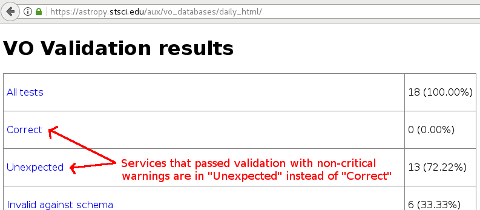
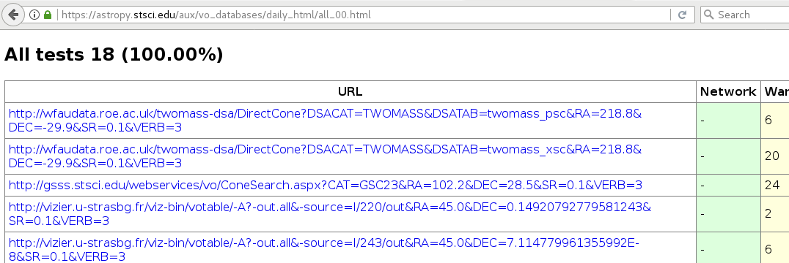
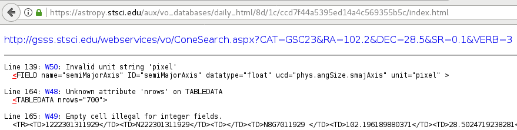
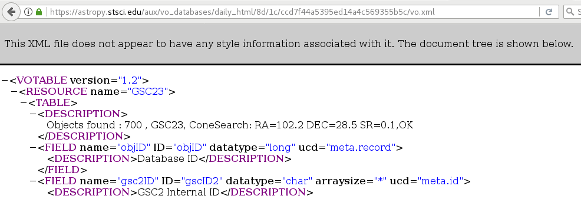

.. doctest-skip-all

Using "Server" API
==================

The "server" API contains modules supporting VO Cone Search's server-side
operations, particularly to validate external Cone Search services for
:ref:`vo-sec-client-scs`.

A typical user should not need the validator. However, this could be used by
VO service providers to validate their services. Currently, any service
to be validated has to be registered in STScI VAO Registry.

.. _vo-sec-validator-validate:

Validation for Simple Cone Search
---------------------------------

`astroquery.vo_conesearch.validator.validate` validates VO services.
Currently, only Cone Search validation is done using
:func:`~astroquery.vo_conesearch.validator.validate.check_conesearch_sites`,
which utilizes underlying `astropy.io.votable.validator` library.

A master list of all available Cone Search services is obtained from
``astroquery.vo_conesearch.validator.conf.conesearch_master_list``,
which is a URL query to STScI VAO Registry by default. However, by default,
only the ones in ``astroquery.vo_conesearch.validator.conf.conesearch_urls``
are validated (also see :ref:`vo-sec-default-scs-services`), while the rest are
skipped. There are also options to validate a user-defined list of
services or all of them.

All Cone Search queries are done using RA, Dec, and SR given by
``testQuery`` fields in the registry, and maximum verbosity.
In an uncommon case where ``testQuery`` is not defined for a service,
it uses a default search for ``RA=0&DEC=0&SR=0.1``.

The results are separated into 4 groups below. Each group
is stored as a JSON file of
`~astroquery.vo_conesearch.vos_catalog.VOSDatabase`:

#. ``conesearch_good.json``
     Passed validation without critical warnings and exceptions.
     This database residing in ``astroquery.vo_conesearch.conf.vos_baseurl``
     is the one used by :ref:`vo-sec-client-scs` by default.
#. ``conesearch_warn.json``
     Has critical warnings but no exceptions. Users can manually set
     ``astroquery.vo_conesearch.conf.conesearch_dbname`` to use this at their
     own risk.
#. ``conesearch_exception.json``
     Has some exceptions. *Never* use this.
     For informational purpose only.
#. ``conesearch_error.json``
     Has network connection error. *Never* use this.
     For informational purpose only.

HTML pages summarizing the validation results are stored in
``'results'`` sub-directory, which also contains downloaded XML
files from individual Cone Search queries.

Warnings and Exceptions
^^^^^^^^^^^^^^^^^^^^^^^

A subset of `astropy.io.votable.exceptions` that is considered
non-critical is defined by
``astroquery.vo_conesearch.validator.conf.noncritical_warnings``,
which will not be flagged as bad by the validator.
However, this does not change the behavior of
``astroquery.vo_conesearch.conf.pedantic``, which still needs to
be set to ``False`` for them not to be thrown out by
:func:`~astroquery.vo_conesearch.conesearch.conesearch`. Despite being
listed as non-critical, user is responsible to check whether the
results are reliable; They should not be used blindly.

Some `units recognized by VizieR <http://cdsarc.u-strasbg.fr/vizier/Units.htx>`_
are considered invalid by Cone Search standards. As a result,
they will give the warning ``'W50'``, which is non-critical by default.

User can also modify
``astroquery.vo_conesearch.validator.conf.noncritical_warnings``
to include or exclude any warnings or exceptions, as desired.
However, this should be done with caution. Adding exceptions to
non-critical list is not recommended.

.. _vo-sec-validator-build-db:

Building the Database from Registry
^^^^^^^^^^^^^^^^^^^^^^^^^^^^^^^^^^^

Each Cone Search service is a
`~astroquery.vo_conesearch.vos_catalog.VOSCatalog` in a
`~astroquery.vo_conesearch.vos_catalog.VOSDatabase`
(see :ref:`vo-sec-client-cat-manip` and :ref:`vo-sec-client-db-manip`).

In the master registry, there are duplicate catalog titles with
different access URLs, duplicate access URLs with different titles,
duplicate catalogs with slightly different descriptions, etc.

A Cone Search service is really defined by its access URL
regardless of title, description, etc. By default,
:func:`~astroquery.vo_conesearch.vos_catalog.VOSDatabase.from_registry` ensures
each access URL is unique across the database.
However, for user-friendly catalog listing, its title will be
the catalog key, not the access URL.

In the case of two different access URLs sharing the same title,
each URL will have its own database entry, with a sequence number
appended to their titles (e.g., 'Title 1' and 'Title 2'). For
consistency, even if the title does not repeat, it will still be
renamed to 'Title 1'.

In the case of the same access URL appearing multiple times in
the registry, the validator will store the first catalog with
that access URL and throw out the rest. However, it will keep
count of the number of duplicates thrown out in the
``'duplicatesIgnored'`` dictionary key of the catalog kept in the database.

All the existing catalog tags will be copied over as dictionary
keys, except ``'access_url'`` that is renamed to ``'url'`` for simplicity.
In addition, new keys from validation are added:

* ``validate_expected``
    Expected validation result category, e.g., "good".
* ``validate_network_error``
    Indication for connection error.
* ``validate_nexceptions``
    Number of exceptions found.
* ``validate_nwarnings``
    Number of warnings found.
* ``validate_out_db_name``
    Cone Search database name this entry belongs to.
* ``validate_version``
    Version of validation software.
* ``validate_warning_types``
    List of warning codes.
* ``validate_warnings``
    Descriptions of the warnings.
* ``validate_xmllint``
    Indication of whether ``xmllint`` passed.
* ``validate_xmllint_content``
    Output from ``xmllint``.

Configurable Items
^^^^^^^^^^^^^^^^^^

These parameters are set via :ref:`astropy:astropy_config`:

* ``astroquery.vo_conesearch.validator.conf.conesearch_master_list``
    VO registry query URL that should return a VO table with all the desired
    VO services.
* ``astroquery.vo_conesearch.validator.conf.conesearch_urls``
    Subset of Cone Search access URLs to validate.
* ``astroquery.vo_conesearch.validator.conf.noncritical_warnings``
    List of VO table parser warning codes that are considered non-critical.

Also depends on properties in
:ref:`Simple Cone Search Configurable Items <vo-sec-scs-config>`.

.. _vo-sec-validate-examples:

Examples
^^^^^^^^

Validate default Cone Search sites with multiprocessing and write results
in the current directory. Reading the master registry can be slow, so the
default timeout is internally set to 60 seconds for it.
In addition, all VO table warnings from the registry are suppressed because
we are not trying to validate the registry itself but the services it contains:

>>> from astroquery.vo_conesearch.validator import validate
>>> validate.check_conesearch_sites()
Downloading http://vao.stsci.edu/regtap/tapservice.aspx/...
|==========================================|  44M/ 44M (100.00%)         0s
INFO: Only 18/17832 site(s) are validated [...]
# ...
WARNING: 2 not found in registry! Skipped:
# ...
INFO: good: 13 catalog(s) [astroquery.vo_conesearch.validator.validate]
INFO: warn: 2 catalog(s) [astroquery.vo_conesearch.validator.validate]
INFO: excp: 0 catalog(s) [astroquery.vo_conesearch.validator.validate]
INFO: nerr: 2 catalog(s) [astroquery.vo_conesearch.validator.validate]
INFO: total: 17 out of 19 catalog(s) [...]
INFO: check_conesearch_sites took 16.862793922424316 s on AVERAGE...
(16.862793922424316, None)

Validate only Cone Search access URLs hosted by ``'stsci.edu'`` without verbose
outputs (except warnings that are controlled by :py:mod:`warnings`) or
multiprocessing, and write results in ``'subset'`` sub-directory instead of the
current directory. For this example, we use ``registry_db`` from
:ref:`VO database examples <vo-sec-client-db-manip-examples>`:

>>> urls = registry_db.list_catalogs_by_url(pattern='stsci.edu')
>>> urls
['http://archive.stsci.edu/befs/search.php?',
 'http://archive.stsci.edu/euve/search.php?', ..,
 'http://gsss.stsci.edu/webservices/vo/ConeSearch.aspx?CAT=viking&']
>>> validate.check_conesearch_sites(
...     destdir='./subset', verbose=False, parallel=False, url_list=urls)
# ...
INFO: check_conesearch_sites took 64.51968932151794 s on AVERAGE...
(64.51968932151794, None)

Add ``'W24'`` from `astropy.io.votable.exceptions` to the list of
non-critical warnings to be ignored and re-run default validation.
This is *not* recommended unless you know exactly what you are doing:

>>> from astroquery.vo_conesearch.validator import conf as validator_conf
>>> new_warns = validator_conf.noncritical_warnings + ['W24']
>>> with validator_conf.set_temp('noncritical_warnings', new_warns):
...     validate.check_conesearch_sites()

Validate *all* Cone Search services in the master registry
(this will take a while) and write results in ``'all'`` sub-directory:

>>> validate.check_conesearch_sites(destdir='./all', url_list=None)

To look at the HTML pages of the validation results in the current
directory using Firefox browser (images shown are from STScI server
but your own results should look similar)::

    firefox results/index.html

When you click on 'All tests' from the page above, you will see all the
Cone Search services validated with a summary of validation results:

When you click on any of the listed URLs from above, you will see
detailed validation warnings and exceptions for the selected URL:

When you click on the URL on top of the page above, you will see
the actual VO Table returned by the Cone Search query:

.. _vo-sec-validator-inspect:

Inspection of Validation Results
--------------------------------

`astroquery.vo_conesearch.validator.inspect` inspects results from
:ref:`vo-sec-validator-validate`. It reads in JSON files of
`~astroquery.vo_conesearch.vos_catalog.VOSDatabase`
residing in ``astroquery.vo_conesearch.conf.vos_baseurl``, which
can be changed to point to a different location.

Configurable Items
^^^^^^^^^^^^^^^^^^

This parameter is set via :ref:`astropy:astropy_config`:

* ``astroquery.vo_conesearch.conf.vos_baseurl``

Examples
^^^^^^^^

>>> from astroquery.vo_conesearch.validator import inspect

Load Cone Search validation results from
``astroquery.vo_conesearch.conf.vos_baseurl``
(by default, the one used by :ref:`vo-sec-client-scs`):

>>> r = inspect.ConeSearchResults()
Downloading http://.../conesearch_good.json
...
Downloading http://.../conesearch_warn.json
...
Downloading http://.../conesearch_exception.json
...
Downloading http://.../conesearch_error.json
...

Print tally. In this example, there are 16 Cone Search services that
passed validation with non-critical warnings, 2 with critical warnings,
0 with exceptions, and 0 with network error:

>>> r.tally()
good: 16 catalog(s)
warn: 2 catalog(s)
exception: 0 catalog(s)
error: 0 catalog(s)
total: 18 catalog(s)

Print a list of good Cone Search catalogs, each with title, access URL,
warning codes collected, and individual warnings:

>>> r.list_cats('good')
Guide Star Catalog v2 1
http://gsss.stsci.edu/webservices/vo/ConeSearch.aspx?CAT=GSC23&
W48,W50
.../vo.xml:136:0: W50: Invalid unit string 'pixel'
.../vo.xml:155:0: W48: Unknown attribute 'nrows' on TABLEDATA
# ...
USNO-A2 Catalogue 1
http://www.nofs.navy.mil/cgi-bin/vo_cone.cgi?CAT=USNO-A2&
W17,W21,W42
.../vo.xml:4:0: W21: vo.table is designed for VOTable version 1.1 and 1.2...
.../vo.xml:4:0: W42: No XML namespace specified
.../vo.xml:15:15: W17: VOTABLE element contains more than one DESCRIPTION...

List Cone Search catalogs with warnings, excluding warnings that were
ignored in ``astroquery.vo_conesearch.validator.conf.noncritical_warnings``,
and writes the output to a file named ``'warn_cats.txt'`` in the current
directory. This is useful to see why the services failed validations:

>>> with open('warn_cats.txt', 'w') as fout:
...     r.list_cats('warn', fout=fout, ignore_noncrit=True)

List the titles of all good Cone Search catalogs:

>>> r.catkeys['good']
['Guide Star Catalog v2 1',
 'SDSS DR8 - Sloan Digital Sky Survey Data Release 8 1', ...,
 'USNO-A2 Catalogue 1']

Print the details of catalog titled ``'USNO-A2 Catalogue 1'``:

>>> r.print_cat('USNO-A2 Catalogue 1')
{
    # ...
    "cap_type": "conesearch",
    "content_level": "research",
    # ...
    "waveband": "optical",
    "wsdl_url": ""
}
Found in good

Load Cone Search validation results from a local directory named ``'subset'``.
This is useful if you ran your own :ref:`vo-sec-validator-validate`
and wish to inspect the output databases. This example reads in
validation of STScI Cone Search services done in
:ref:`Validation for Simple Cone Search Examples <vo-sec-validate-examples>`:

>>> from astroquery.vo_conesearch import conf
>>> with conf.set_temp('vos_baseurl', './subset/'):
>>>     r = inspect.ConeSearchResults()
>>> r.tally()
good: 11 catalog(s)
warn: 3 catalog(s)
exception: 15 catalog(s)
error: 0 catalog(s)
total: 29 catalog(s)
>>> r.catkeys['good']
[u'Berkeley Extreme and Far-UV Spectrometer 1',
 u'Copernicus Satellite 1', ...,
 u'Wisconsin Ultraviolet Photo-Polarimeter Experiment 1']
