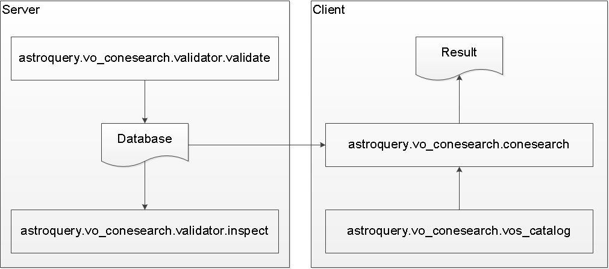

.. doctest-skip-all

.. _astroquery.voconesearch:

****************************************************
VO Simple Cone Search (``astroquery.vo_conesearch``)
****************************************************

Astroquery offers Simple Cone Search Version 1.03 as defined in IVOA
Recommendation (February 22, 2008). Cone Search queries an
area encompassed by a given radius centered on a given RA and DEC and returns
all the objects found within the area in the given catalog.

This was ported from ``astropy.vo``:

* ``astropy.vo.client.conesearch`` is now `astroquery.vo_conesearch.conesearch`
* ``astropy.vo.validator`` is now ``astroquery.vo_conesearch.validator``

``astroquery.vo_conesearch.ConeSearch`` is a Cone Search API that adheres to
Astroquery standards but unlike Astropy's version, it only queries one given
service URL, which defaults to HST Guide Star Catalog. This default is
controlled by ``astroquery.vo_conesearch.conf.fallback_url``.

.. _vo-sec-default-scs-services:

Default Cone Search Services
============================

For the "classic" API ported from Astropy, the default Cone Search services
used are a subset of those found in the STScI VAO Registry.
They were hand-picked to represent commonly used catalogs below:

* 2MASS All-Sky
* HST Guide Star Catalog (also default for "new" Astroquery-style API)
* SDSS Data Release 7
* SDSS-III Data Release 8
* USNO A1
* USNO A2
* USNO B1

This subset undergoes daily validations hosted by STScI using
:ref:`vo-sec-validator-validate`. Those that pass without critical
warnings or exceptions are used by :ref:`vo-sec-client-scs` by
default. They are controlled by
``astroquery.vo_conesearch.conf.conesearch_dbname``:

#. ``'conesearch_good'``
   Default. Passed validation without critical warnings and exceptions.
#. ``'conesearch_warn'``
   Has critical warnings but no exceptions. Use at your own risk.
#. ``'conesearch_exception'``
   Has some exceptions. *Never* use this.
#. ``'conesearch_error'``
   Has network connection error. *Never* use this.

If you are a Cone Search service provider and would like to include your
service in the list above, please open a
`GitHub issue on Astroquery <https://github.com/astropy/astroquery/issues>`_.

Caching
=======

Caching of downloaded contents is controlled by `astropy.utils.data`.
To use cached data, some functions in this package have a ``cache``
keyword that can be set to ``True``.

Getting Started
===============

This section only contains minimal examples showing how to perform
basic Cone Search.

Query STScI Guide Star Catalog using "new" Astroquery-style API
around M31 with a 0.1-degree search radius:

>>> from astropy.coordinates import SkyCoord
>>> from astroquery.vo_conesearch import ConeSearch
>>> ConeSearch.URL
'http://gsss.stsci.edu/webservices/vo/ConeSearch.aspx?CAT=GSC23&'
>>> c = SkyCoord.from_name('M31')
>>> c.ra, c.dec
(<Longitude 10.6847929 deg>, <Latitude 41.269065 deg>)
>>> result = ConeSearch.query_region(c, '0.1 deg')
>>> result
<Table masked=True length=4027>
    objID           gscID2      GSC1ID ... multipleFlag compassGSC2id    Mag
                                       ...                               mag
    int64           object      object ...    object        object     float32
-------------- ---------------- ------ ... ------------ ------------- ---------
23323175812944 00424433+4116085        ...            0 6453800072293        --
23323175812933 00424455+4116103        ...            0 6453800072282        --
23323175812939 00424464+4116092        ...            0 6453800072288        --
23323175812931 00424464+4116106        ...            0 6453800072280        --
23323175812948 00424403+4116069        ...            0 6453800072297        --
23323175812930 00424403+4116108        ...            0 6453800072279        --
           ...              ...    ... ...          ...           ...       ...
 1330012210212    N330012210212        ...            0 6453800010212 20.276699
23323175812087 00425926+4121267        ...            0 6453800071571        --
 1330012231849    N330012231849        ...            0 6453800031849   20.2869
 1330012244053    N330012244053        ...            0 6453800044053        --
 1330012243728    N330012243728        ...            0 6453800043728        --
  133001228698     N33001228698        ...            0 6453800008698 20.563999

List the available Cone Search catalogs that passed daily validation:

>>> from astroquery.vo_conesearch import conesearch
>>> conesearch.list_catalogs()
Downloading https://astropy.stsci.edu/aux/vo_databases/conesearch_good.json
|==========================================|  37k/ 37k (100.00%)         0s
['Guide Star Catalog v2 1',
 'SDSS DR8 - Sloan Digital Sky Survey Data Release 8 1',
 'SDSS DR8 - Sloan Digital Sky Survey Data Release 8 2',
 'The HST Guide Star Catalog, Version 1.1 (Lasker+ 1992) 1',
 'The HST Guide Star Catalog, Version 1.2 (Lasker+ 1996) 1',
 'The HST Guide Star Catalog, Version GSC-ACT (Lasker+ 1996-99) 1',
 'The PMM USNO-A1.0 Catalogue (Monet 1997) 1',
 'The USNO-A2.0 Catalogue (Monet+ 1998) 1',
 'USNO-A2 Catalogue 1']

Query the HST Guide Star Catalog around M31 with a 0.1-degree search radius.
This is the same query as above but using "classic" Astropy-style API:

>>> from astropy import units as u
>>> my_catname = 'Guide Star Catalog v2 1'
>>> result = conesearch.conesearch(c, 0.1 * u.degree, catalog_db=my_catname)
Trying http://gsss.stsci.edu/webservices/vo/ConeSearch.aspx?CAT=GSC23&
>>> result
<Table masked=True length=4027>
    objID           gscID2      GSC1ID ... multipleFlag compassGSC2id    Mag
                                       ...                               mag
    int64           object      object ...    object        object     float32
-------------- ---------------- ------ ... ------------ ------------- ---------
23323175812944 00424433+4116085        ...            0 6453800072293        --
23323175812933 00424455+4116103        ...            0 6453800072282        --
23323175812939 00424464+4116092        ...            0 6453800072288        --
23323175812931 00424464+4116106        ...            0 6453800072280        --
23323175812948 00424403+4116069        ...            0 6453800072297        --
23323175812930 00424403+4116108        ...            0 6453800072279        --
           ...              ...    ... ...          ...           ...       ...
 1330012210212    N330012210212        ...            0 6453800010212 20.276699
23323175812087 00425926+4121267        ...            0 6453800071571        --
 1330012231849    N330012231849        ...            0 6453800031849   20.2869
 1330012244053    N330012244053        ...            0 6453800044053        --
 1330012243728    N330012243728        ...            0 6453800043728        --
  133001228698     N33001228698        ...            0 6453800008698 20.563999
>>> result.url
'http://gsss.stsci.edu/webservices/vo/ConeSearch.aspx?CAT=GSC23&'

Get the number of matches and returned column names:

>>> result.array.size
4027
>>> result.array.dtype.names
(objID',
 'gscID2',
 'GSC1ID',
 'hstID',
 'ra',
 'dec', ...,
 'Mag')

Extract RA and DEC of the matches:

>>> result.array['ra']
masked_array(data = [10.684737 10.685657 10.686026 ..., 10.8028268814087],
             mask = [False False False ..., False],
       fill_value = 1e+20)
>>> result.array['dec']
masked_array(data = [41.269035 41.26955 41.269226 ..., 41.2230453491211],
             mask = [False False False ..., False],
       fill_value = 1e+20)

Using ``astroquery.vo_conesearch``
==================================

This package has four main components across two categories:

.. toctree::
   :maxdepth: 2

   client
   validator

They are designed to be used in a work flow as illustrated below:

The one that a typical user needs is the :ref:`vo-sec-client-scs` component
(see :ref:`Cone Search Examples <vo-sec-scs-examples>`).

See Also
========

- `Simple Cone Search Version 1.03, IVOA Recommendation (22 February 2008) <http://www.ivoa.net/Documents/REC/DAL/ConeSearch-20080222.html>`_

- `STScI VAO Registry <http://vao.stsci.edu/directory/NVORegInt.asmx?op=VOTCapabilityPredOpt>`_

- `STScI VO Databases <https://astropy.stsci.edu/aux/vo_databases/>`_

Reference/API
=============

.. automodapi:: astroquery.vo_conesearch.core

.. automodapi:: astroquery.vo_conesearch.vos_catalog
   :no-inheritance-diagram:

.. automodapi:: astroquery.vo_conesearch.conesearch
   :no-inheritance-diagram:

.. automodapi:: astroquery.vo_conesearch.vo_async
   :no-inheritance-diagram:

.. automodapi:: astroquery.vo_conesearch.exceptions

.. automodapi:: astroquery.vo_conesearch.validator.validate
   :no-inheritance-diagram:

.. automodapi:: astroquery.vo_conesearch.validator.inspect
   :no-inheritance-diagram:

.. automodapi:: astroquery.vo_conesearch.validator.exceptions
